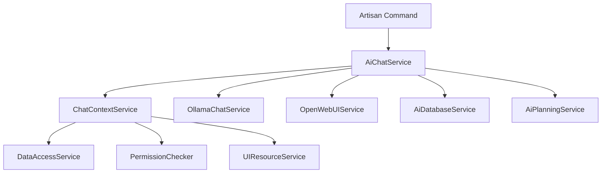
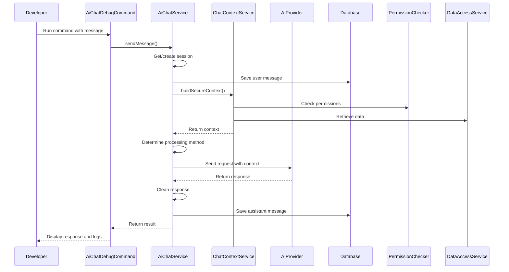

# AI Chat Debugging Feature Design

## Overview

This document outlines the design for an Artisan command-based debugging tool for the AI chat system. The feature will allow developers to test and debug AI chat functionality directly from the command line, using the same services, methods, and helpers as the web-based chat interface.

## Requirements Analysis

### User Requirements
1. Developers need to debug AI chat functionality without using the web interface
2. The debugging tool should use the same services and methods as the web-based chat
3. Comprehensive logging is required for debugging purposes
4. The tool should support all AI providers (Ollama, OpenWebUI) available in the system
5. The tool should support the same context building and data access mechanisms as the web interface
6. Session management should work the same way as in the web interface

### Technical Requirements
1. Use existing `AiChatService` and related services
2. Support authentication context (user/company scoping)
3. Implement comprehensive logging for debugging
4. Support all configuration options from `chat.php`
5. Maintain consistency with web-based chat behavior

## Architecture

### Component Structure


### Key Components
1. **Artisan Command (`AiChatDebugCommand`)**: Main entry point for debugging
2. **AiChatService**: Core chat orchestration service (same as web interface)
3. **ChatContextService**: Context building with secure data access
4. **OllamaChatService/OpenWebUIService**: AI provider integration
5. **AiDatabaseService**: Database access for business data
6. **AiPlanningService**: PRR methodology implementation

## Command Design

### Command Signature
```
php artisan ai:chat-debug {message} {--user= : User ID to simulate} {--provider= : AI provider (ollama|openwebui)} {--model= : AI model to use} {--session= : Session ID to continue} {--context-type= : Context type} {--no-context : Disable context building} {--debug : Enable detailed logging} {--verbose : Enable verbose output}
```

### Command Options
| Option | Description | Default |
|--------|-------------|---------|
| `--user` | User ID to simulate for authentication context | First user in database |
| `--provider` | AI provider to use (ollama, openwebui) | From config |
| `--model` | Specific AI model to use | From config |
| `--session` | Continue an existing chat session | Create new session |
| `--context-type` | Type of context to build | 'general' |
| `--no-context` | Disable context building | false |
| `--debug` | Enable detailed logging | false |
| `--verbose` | Enable verbose output | false |

## Implementation Plan

### Phase 1: Basic Command Structure
1. Create `AiChatDebugCommand` class
2. Implement argument parsing and validation
3. Set up authentication context simulation
4. Integrate with `AiChatService`

### Phase 2: Service Integration
1. Connect to existing AI services
2. Implement session management
3. Add context building support
4. Handle AI provider selection

### Phase 3: Logging and Debugging
1. Implement comprehensive logging
2. Add performance metrics tracking
3. Include context and data access logging
4. Add error handling and reporting

### Phase 4: Advanced Features
1. Add interactive mode
2. Implement session listing and management
3. Add response analysis tools
4. Include data access verification

## Data Flow

### Message Processing Flow


## Service Integration Details

### AiChatService Integration
The command will use the same `AiChatService` as the web interface:
- Session management (create/retrieve)
- Message processing and storage
- Context building coordination
- AI provider integration
- Response processing and validation

### Context Building
The command will use the same context building mechanism:
- Secure data access based on user permissions
- UI resource context when needed
- Caching mechanisms
- Context type selection

### AI Provider Integration
Support for both Ollama and OpenWebUI:
- Provider selection based on config or option
- Model selection
- Error handling and fallback mechanisms
- Response processing

## Logging and Debugging Features

### Log Levels
1. **Info**: Basic operation information
2. **Debug**: Detailed processing information
3. **Verbose**: Comprehensive data and context information

### Logged Information
1. **Session Management**:
   - Session creation/retrieval
   - Session metadata
   - Activity updates

2. **Message Processing**:
   - Message saving
   - Processing time
   - Token count

3. **Context Building**:
   - Context type and filters
   - Data access permissions
   - Retrieved data summary
   - Context size

4. **AI Provider Interaction**:
   - Request payload
   - Response handling
   - Error conditions

5. **Performance Metrics**:
   - Processing time breakdown
   - Context building time
   - AI response time

## Security Considerations

1. **Authentication Context**:
   - Proper user simulation
   - Company scoping
   - Permission validation

2. **Data Access**:
   - Same permission checking as web interface
   - Secure context building
   - No bypass of security mechanisms

3. **Command Access**:
   - Limited to developers/administrators
   - No exposure of sensitive data in logs by default

## Recommended Additional Features

### 1. Interactive Mode
```
php artisan ai:chat-debug --interactive
```
- Maintain session across multiple messages
- Simulate conversation flow
- Real-time context updates

### 2. Session Management Commands
```
php artisan ai:chat-sessions {--list} {--delete=} {--info=}
```
- List active sessions
- Delete sessions
- Show session details

### 3. Context Inspection
```
php artisan ai:chat-debug --inspect-context
```
- Show exactly what context is being sent
- Display data access permissions
- Validate context building

### 4. Provider Status Check
```
php artisan ai:chat-status
```
- Check AI provider connectivity
- List available models
- Show configuration status

### 5. Response Analysis
```
php artisan ai:chat-debug --analyze
```
- Analyze response quality
- Check for thinking artifacts
- Validate data accuracy

### 6. Performance Testing
```
php artisan ai:chat-debug --benchmark
```
- Run multiple requests
- Measure performance metrics
- Generate performance reports

## Testing Strategy

### Unit Tests
1. Command argument parsing
2. Service integration
3. Session management
4. Context building
5. Error handling

### Integration Tests
1. Full message processing flow
2. AI provider integration
3. Database operations
4. Permission validation

### Manual Testing
1. Different user contexts
2. Various message types
3. Error conditions
4. Performance under load

## Implementation Considerations

### Consistency with Web Interface
1. Use identical services and methods
2. Maintain same configuration options
3. Preserve error handling behavior
4. Match response processing

### Performance
1. Avoid unnecessary database queries
2. Use caching where appropriate
3. Optimize context building
4. Limit log output in production

### Error Handling
1. Graceful degradation
2. Clear error messages
3. Logging of error conditions
4. Recovery mechanisms

## Configuration

The command will use the same configuration as the web interface:
- `config/chat.php` settings
- Environment variables
- Database configuration
- Cache settings

## Future Enhancements

1. **Automated Testing Integration**: Integration with test suites for regression testing
2. **Load Testing**: Simulate multiple concurrent users
3. **Export/Import**: Save/load chat sessions for testing
4. **Mock Providers**: Simulate AI providers for testing without external dependencies
5. **Analytics**: Collect debugging session data for improvement
