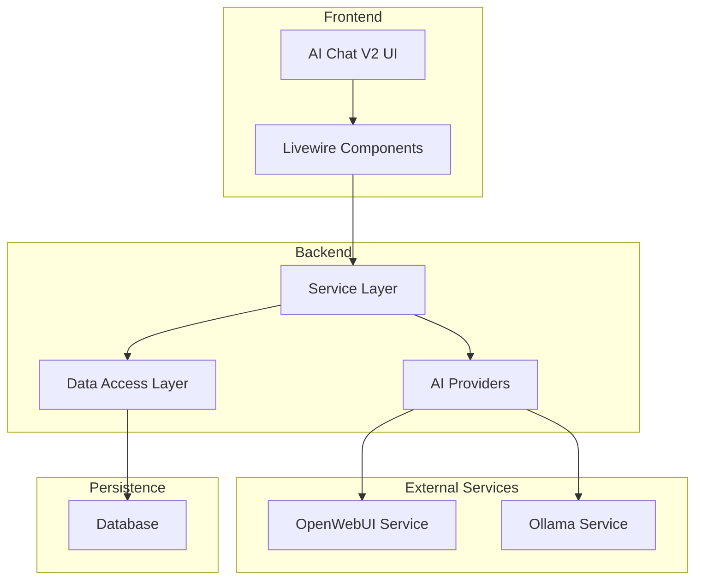
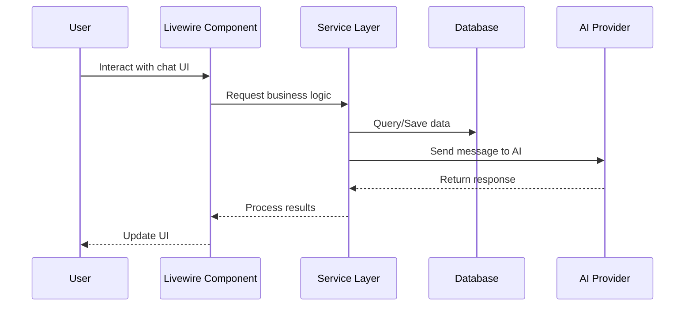
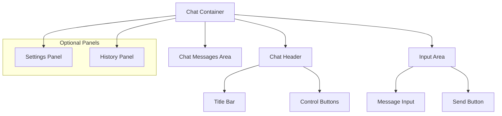
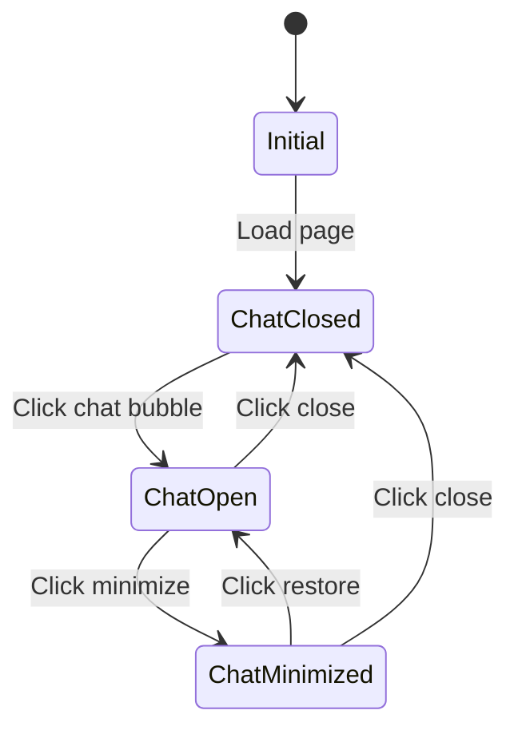
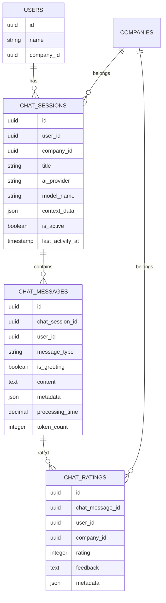
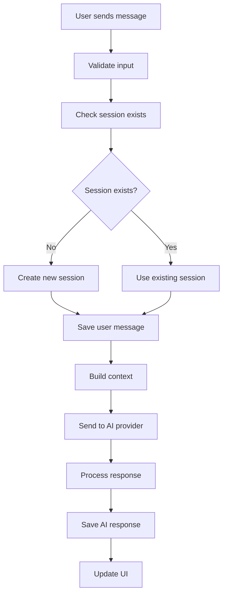
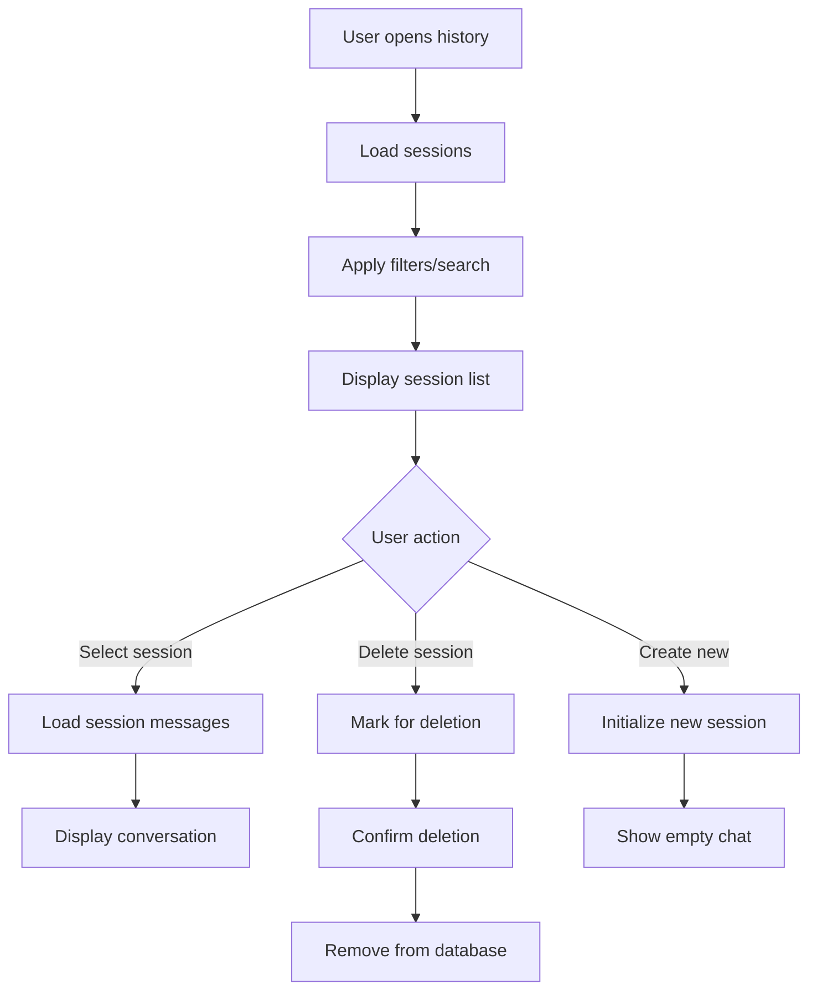

# AI Chat V2 Feature Design Document

## 1. Overview

This document outlines the design for a new AI Chat feature (V2) that builds upon the existing implementation with significant improvements in UI simplicity, stability, and maintainability. The new feature will be developed in a separate folder structure to avoid disrupting the existing functionality while leveraging the same database and configuration systems.

### 1.1 Objectives

- Simplify the UI blade templates to reduce complexity
- Improve stability by minimizing the impact of small changes
- Implement a settings panel with LLM provider and model selection
- Add chat history access and search functionality
- Create a modular, scalable code structure
- Separate UI components from business logic
- Ensure compatibility with existing systems

### 11.2 Key Improvements Over V1

| Aspect | V1 Implementation | V2 Improvements |
|--------|-------------------|-----------------|
| UI Complexity | Highly complex nested components | Simplified, modular structure |
| Stability | Prone to breaking with small changes | Resilient component architecture |
| Configuration | Limited provider/model selection | Full settings panel with options |
| History Management | Basic session handling | Enhanced history access and search |
| Code Structure | Tightly coupled components | Modular, separated concerns |
| Maintainability | Difficult to modify | Well-documented, scalable design |

## 2. Architecture

The AI Chat V2 follows a modular architecture that separates concerns between UI components, business logic, and data access layers. This design ensures scalability and maintainability while leveraging existing Laravel and Livewire patterns.

### 2.1 High-Level Architecture



### 2.2 Component Structure

```
app/AiChatV2/
├── Components/          # Reusable UI components
├── Contracts/           # Interface definitions
├── DTOs/                # Data Transfer Objects
├── Livewire/            # Livewire components
├── Models/              # Eloquent models (extends existing)
├── Providers/           # Service providers
└── Services/            # Business logic services

resources/views/livewire/ai-chat-v2/
├── partials/            # Reusable blade partials
├── chat-interface.blade.php
├── session-list.blade.php
└── settings-panel.blade.php
```

### 2.3 Data Flow



## 3. Component Architecture

### 3.1 Livewire Components

#### 3.1.1 AiChatV2 Component
- **Purpose**: Main chat interface controller
- **Responsibilities**:
  - Manage chat state (open/closed, minimized, loading)
  - Handle message sending and receiving
  - Coordinate with services for business logic
  - Manage UI state transitions

#### 3.1.2 ChatSettings Component
- **Purpose**: Settings panel controller
- **Responsibilities**:
  - Manage provider and model selection
  - Handle configuration changes
  - Validate settings before applying

#### 3.1.3 ChatHistory Component
- **Purpose**: History management controller
- **Responsibilities**:
  - Load and display chat sessions
  - Implement search functionality
  - Handle session selection and deletion

### 3.2 Services

#### 3.2.1 AiChatV2Service
- **Purpose**: Core chat functionality orchestration
- **Key Methods**:
  - `sendMessage()`: Process user messages and get AI responses
  - `createSession()`: Create new chat sessions
  - `loadHistory()`: Retrieve chat history with filtering
  - `deleteSession()`: Remove chat sessions

#### 3.2.2 ProviderService
- **Purpose**: AI provider management
- **Key Methods**:
  - `getAvailableProviders()`: List enabled providers
  - `getAvailableModels()`: List models for a provider
  - `validateProviderConfig()`: Check provider connectivity

#### 3.2.3 HistoryService
- **Purpose**: Chat history management
- **Key Methods**:
  - `searchSessions()`: Search sessions by criteria
  - `getSessionDetails()`: Get detailed session information
  - `cleanupOldSessions()`: Remove expired sessions

### 3.3 Models

The V2 implementation will extend existing models to maintain data consistency:

- **ChatSession**: Extends existing model with additional V2-specific methods
- **ChatMessage**: Uses existing model with enhanced querying capabilities
- **ChatRating**: Leverages existing rating system

## 4. UI/UX Design

### 4.1 Simplified UI Structure

The V2 UI adopts a simplified, modular approach:



### 4.2 Key UI Components

#### 4.2.1 Chat Interface
- Clean, minimal design with focus on conversation
- Prominent message input area
- Clear visual distinction between user and AI messages
- Responsive design for all screen sizes

#### 4.2.2 Settings Panel
- Provider selection dropdown (OpenWebUI/Ollama)
- Model selection based on chosen provider
- Real-time validation of provider connectivity
- Configuration persistence

#### 4.2.3 History Panel
- Session list with titles and timestamps
- Search functionality with filters
- Quick session switching
- Session management (delete/archive)

### 4.3 State Management



## 5. API Integration

### 5.1 Internal APIs

The V2 implementation will use existing service classes with enhanced interfaces:

#### 5.1.1 Message Sending
```
POST /ai-chat-v2/send-message
Content-Type: application/json

{
  "message": "User message content",
  "session_id": "uuid",
  "provider": "openwebui|ollama",
  "model": "model_name",
  "context_type": "general|livestock_management|..."
}
```

#### 5.1.2 Session Management
```
GET /ai-chat-v2/sessions?search=query&limit=20
Authorization: Bearer {token}

Response:
{
  "sessions": [
    {
      "id": "uuid",
      "title": "Session title",
      "created_at": "timestamp",
      "last_activity": "timestamp",
      "message_count": 15
    }
  ]
}
```

### 5.2 External AI Provider APIs

The system will integrate with the same AI providers as V1:

1. **OpenWebUI Integration**
   - REST API communication
   - Configurable base URL and authentication
   - Model selection support

2. **Ollama Integration**
   - Direct API calls to Ollama service
   - Support for local model hosting
   - Configurable endpoint

## 6. Data Models & Database

### 6.1 Existing Schema Utilization

The V2 implementation will utilize the existing database schema:

#### 6.1.1 Chat Sessions Table
```sql
CREATE TABLE chat_sessions (
  id UUID PRIMARY KEY,
  user_id UUID,
  company_id UUID,
  title VARCHAR,
  ai_provider ENUM('openwebui', 'ollama'),
  model_name VARCHAR,
  context_data JSON,
  is_active BOOLEAN,
  last_activity_at TIMESTAMP,
  created_at TIMESTAMP,
  updated_at TIMESTAMP,
  deleted_at TIMESTAMP
);
```

#### 6.1.2 Chat Messages Table
```sql
CREATE TABLE chat_messages (
  id UUID PRIMARY KEY,
  chat_session_id UUID,
  user_id UUID,
  message_type ENUM('user', 'assistant', 'system'),
  is_greeting BOOLEAN,
  content TEXT,
  metadata JSON,
  processing_time DECIMAL,
  token_count INTEGER,
  created_at TIMESTAMP,
  updated_at TIMESTAMP,
  deleted_at TIMESTAMP
);
```

### 6.2 Data Relationships



## 7. Business Logic

### 7.1 Core Workflows

#### 7.1.1 Message Processing Flow


#### 7.1.2 Session Management Flow


### 7.2 Error Handling

The system implements comprehensive error handling:

1. **Network Errors**: Retry mechanisms with exponential backoff
2. **Validation Errors**: Clear user feedback with correction guidance
3. **Provider Errors**: Fallback to alternative providers when configured
4. **Database Errors**: Graceful degradation with local state preservation

### 7.3 Security Considerations

1. **Authentication**: All API calls require authenticated users
2. **Authorization**: Users can only access their own chat sessions
3. **Data Sanitization**: All user inputs are sanitized before processing
4. **Rate Limiting**: Configurable rate limits to prevent abuse
5. **Audit Trail**: All chat interactions are logged for compliance

## 8. Configuration & Environment

### 8.1 Configuration Structure

The system uses the existing `config/chat.php` with V2-specific additions:

```php
'v2' => [
    'ui' => [
        'simplified_mode' => env('CHAT_V2_SIMPLIFIED_UI', true),
        'auto_scroll' => env('CHAT_V2_AUTO_SCROLL', true),
        'enable_animations' => env('CHAT_V2_ANIMATIONS', true),
    ],
    'providers' => [
        'openwebui' => [
            // Inherits from main config
        ],
        'ollama' => [
            // Inherits from main config
        ]
    ],
    'history' => [
        'default_limit' => env('CHAT_V2_HISTORY_LIMIT', 50),
        'search_depth_days' => env('CHAT_V2_SEARCH_DAYS', 30),
    ]
]
```

### 8.2 Environment Variables

Key environment variables for V2:

| Variable | Description | Default |
|----------|-------------|---------|
| `CHAT_V2_ENABLED` | Enable V2 chat feature | `true` |
| `CHAT_V2_SIMPLIFIED_UI` | Use simplified UI mode | `true` |
| `CHAT_V2_HISTORY_LIMIT` | Default history items to load | `50` |
| `CHAT_V2_SEARCH_DAYS` | Days to search in history | `30` |

## 9. Testing Strategy

### 9.1 Unit Testing

Components to be tested:
- Service layer methods
- Data validation logic
- Provider integration functions
- History search algorithms

### 9.2 Integration Testing

Scenarios to test:
- End-to-end message flow
- Provider switching functionality
- Session management operations
- Error recovery mechanisms

### 9.3 UI Testing

Areas to validate:
- Component rendering and state changes
- Responsive design across devices
- Accessibility compliance
- Performance under load

## 10. Deployment & Maintenance

### 10.1 Deployment Process

1. **Code Deployment**: Standard Laravel deployment process
2. **Database Migrations**: None required (using existing schema)
3. **Configuration**: Update `.env` with V2-specific variables
4. **Testing**: Validate functionality in staging environment

### 10.2 Monitoring & Logging

- All chat interactions logged for audit purposes
- Performance metrics collected for optimization
- Error tracking integrated with existing logging system
- Usage analytics for feature improvement

### 10.3 Maintenance Considerations

- Regular cleanup of expired sessions
- Provider connectivity monitoring
- Performance optimization of history queries
- Backward compatibility with V1 data
