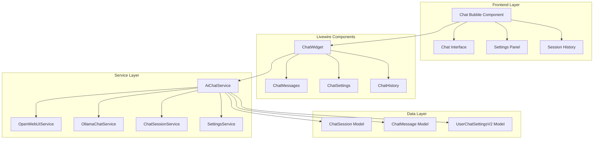
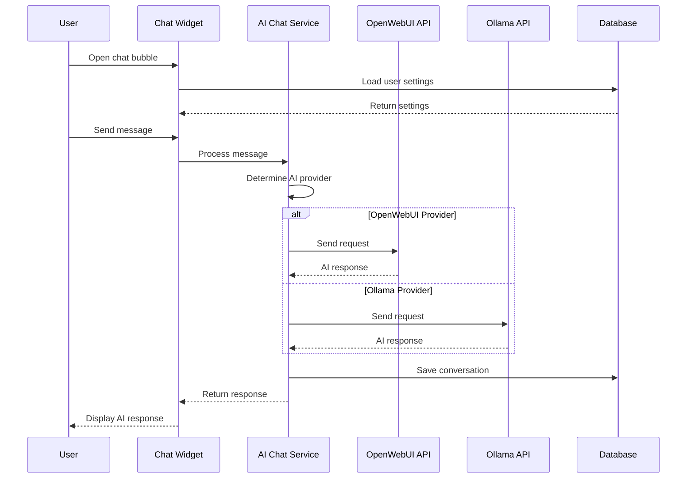
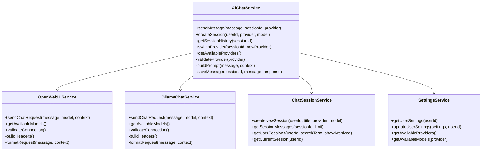
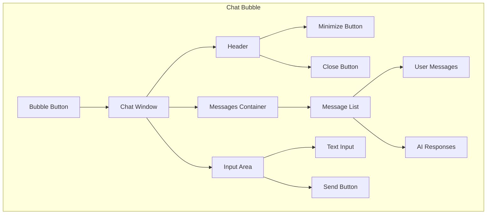

# AI Chat Improvement Feature Design

## Overview

This document outlines the design for implementing an improved AI chat feature with a simplified user interface and enhanced system stability for the XiMoPet Laravel application. The new feature will be implemented in a separate directory to avoid modifying the existing version while leveraging the existing database infrastructure and configuration.

## Technology Stack & Dependencies

### Backend Framework
- **Laravel 11**: Core framework for backend services and API management
- **Livewire 3**: Real-time chat component and UI state management
- **Laravel Sanctum**: API authentication and security
- **Guzzle HTTP**: External API communication with OpenWebUI and Ollama

### Frontend Technologies
- **Bootstrap 5**: UI framework for responsive chat interface
- **Alpine.js**: JavaScript framework for interactive behaviors
- **Tailwind CSS**: Utility-first CSS framework for simplified styling
- **Font Awesome**: Icons for chat interface

### Existing Dependencies (Utilized)
- **OpenWebUIService**: Existing service for OpenWebUI integration
- **OllamaChatService**: Existing service for Ollama integration
- **ChatSessionService**: Existing service for session management
- **SettingsService**: Existing service for user settings management

## Architecture

### Component Architecture



### System Integration Flow



## Data Models & ORM Mapping

### ChatSession Model
The existing `ChatSession` model will be used with minimal changes:
```php
class ChatSession extends Model
{
    protected $fillable = [
        'user_id',
        'company_id', 
        'title',
        'ai_provider',
        'model_name',
        'context_data',
        'is_active',
        'last_activity_at'
    ];
    
    protected $casts = [
        'context_data' => 'array',
        'last_activity_at' => 'datetime'
    ];
}
```

### ChatMessage Model
The existing `ChatMessage` model will be used with minimal changes:
```php
class ChatMessage extends Model 
{
    protected $fillable = [
        'chat_session_id',
        'user_id',
        'message_type', // 'user', 'assistant', 'system'
        'is_greeting', // New field for greeting messages
        'content',
        'metadata',
        'processing_time',
        'token_count'
    ];
    
    protected $casts = [
        'metadata' => 'array',
        'is_greeting' => 'boolean'
    ];
}
```

### UserChatSettingsV2 Model
The existing `UserChatSettingsV2` model will be used:
```php
class UserChatSettingsV2 extends Model
{
    protected $fillable = [
        'user_id',
        'settings',
        'version'
    ];
    
    protected $casts = [
        'settings' => 'array'
    ];
}
```

## Business Logic Layer

### Simplified AiChatService Architecture



### Core Service Methods

#### AiChatService::sendMessage()
- Validates input message and session
- Determines appropriate AI provider
- Builds context-aware prompt
- Sends request to provider API
- Saves conversation to database
- Returns formatted response

#### ChatSessionService::createNewSession()
- Creates a new chat session with user settings
- Sets default provider and model based on user preferences
- Updates session activity timestamp

#### SettingsService::getUserSettings()
- Retrieves user-specific settings from database
- Falls back to default settings if none exist
- Returns structured settings array

## API Endpoints Reference

### Chat Management Endpoints

| Method | Endpoint | Description | Authentication |
|--------|----------|-------------|----------------|
| GET | `/api/ai-chat-v2/sessions` | List user chat sessions | Bearer Token |
| POST | `/api/ai-chat-v2/sessions` | Create new chat session | Bearer Token |
| GET | `/api/ai-chat-v2/sessions/{id}` | Get session details | Bearer Token |
| DELETE | `/api/ai-chat-v2/sessions/{id}` | Delete chat session | Bearer Token |
| POST | `/api/ai-chat-v2/sessions/{id}/messages` | Send message | Bearer Token |
| GET | `/api/ai-chat-v2/sessions/{id}/messages` | Get message history | Bearer Token |

### Settings Endpoints

| Method | Endpoint | Description | Authentication |
|--------|----------|-------------|----------------|
| GET | `/api/ai-chat-v2/settings` | Get user settings | Bearer Token |
| PUT | `/api/ai-chat-v2/settings` | Update user settings | Bearer Token |
| POST | `/api/ai-chat-v2/settings/reset` | Reset to default settings | Bearer Token |

### Request/Response Schema

#### Send Message Request
```json
{
    "message": "What is the average weight of my chickens?",
    "stream": false
}
```

#### Send Message Response
```json
{
    "success": true,
    "data": {
        "message_id": "uuid",
        "response": "Based on your farm data...",
        "processing_time": 1.23,
        "token_count": 150
    }
}
```

## Frontend Components

### ChatWidget Livewire Component

#### Component Properties
```php
class ChatWidget extends Component
{
    public $isOpen = false;
    public $isMinimized = false;
    public $currentSessionId = null;
    public $messages = [];
    public $newMessage = '';
    public $isLoading = false;
    public $settings = [];
    public $error = null;
}
```

#### Component Methods
- `toggleChat()`: Initialize and show/hide chat widget
- `minimizeChat()`: Minimize chat widget
- `sendMessage()`: Process user message
- `loadSettings()`: Load user settings
- `loadSessionMessages()`: Load chat history

### Simplified Chat UI Structure



### UI Simplification Features

#### Minimalist Design
- Reduced visual complexity with clean, flat design
- Limited color palette with primary accent colors
- Simplified typography with consistent sizing
- Streamlined spacing and padding

#### Reduced Component Complexity
- Consolidated settings into a single dropdown panel
- Simplified message bubbles with minimal styling
- Removed unnecessary animations and transitions
- Streamlined input area with clear focus states

#### Improved Stability Features
- Isolated UI state management to prevent cascading effects
- Centralized error handling with graceful degradation
- Modular component structure with clear separation of concerns
- Robust event handling with proper cleanup

## Settings Panel Features

### Provider Selection
- Simple dropdown for selecting between OpenWebUI and Ollama
- Automatic model list population based on selected provider
- Connection status indicator with test functionality

### Model Selection
- Dropdown showing available models for the selected provider
- Default model selection based on provider configuration
- Clear labeling of model capabilities and requirements

## Session History Management

### Search and Filter
- Simple search input for finding sessions by title or content
- Date-based filtering for organizing sessions
- Clear session management with archive/restore options

### Session Display
- Clean list view with essential session information
- Timestamps for session activity
- Visual indicators for active vs archived sessions

## Middleware & Interceptors

### ChatAuthMiddleware
```php
class ChatAuthMiddleware
{
    public function handle($request, Closure $next)
    {
        // Verify user authentication
        // Check chat permissions
        // Validate session ownership
        return $next($request);
    }
}
```

### ChatRateLimitMiddleware
- Implements per-user rate limiting
- Tracks API usage quotas
- Prevents abuse of AI services
- Configurable limits per provider

## Configuration Management

### Simplified Chat Configuration
```php
return [
    'providers' => [
        'openwebui' => [
            'enabled' => env('OPENWEBUI_ENABLED', false),
            'base_url' => env('OPENWEBUI_BASE_URL'),
            'api_key' => env('OPENWEBUI_API_KEY'),
            'default_model' => env('OPENWEBUI_DEFAULT_MODEL', 'llama3.2:3b'),
            'timeout' => 30,
        ],
        'ollama' => [
            'enabled' => env('OLLAMA_ENABLED', true),
            'base_url' => env('OLLAMA_BASE_URL', 'http://localhost:11434'),
            'default_model' => env('OLLAMA_DEFAULT_MODEL', 'llama2'),
            'timeout' => 60,
        ]
    ],
    'chat' => [
        'max_sessions_per_user' => 10,
        'context_size_limit' => 4000,
        'auto_delete_sessions_after_days' => 30,
        'rate_limit_per_minute' => 20,
    ],
    'ui' => [
        'simplified_mode' => true,
        'default_position' => 'bottom-right',
        'default_size' => 'medium',
        'theme' => 'light',
    ]
];
```

## Integration Points

### Existing System Integration

#### Company Scoping
- All chat sessions scoped to user's company
- Context data filtered by company access
- Provider configurations per company

#### Permission System
- Integration with Laravel Permission package
- Chat access controlled by user roles
- Provider access based on company settings

### Data Context Integration

#### Farm Data Context
- Livestock status and performance
- Feed inventory and usage
- Supply chain information
- Financial summaries

## Testing Strategy

### Unit Testing Areas
- AiChatService message processing
- Provider authentication and connection
- Session management functionality
- Settings persistence and retrieval

### Integration Testing Scenarios
- End-to-end chat conversations
- Provider switching functionality
- Session history management
- Settings persistence across sessions

### Test Data Requirements
- Mock chat sessions
- Sample AI responses
- Test provider configurations
- User settings scenarios

## Security & Privacy Considerations

### Data Protection
- Encrypt sensitive chat data
- Sanitize user inputs
- Validate context data access
- Implement audit logging

### API Security
- Secure API key management
- Rate limiting and abuse prevention
- Connection timeout handling

### Privacy Controls
- User consent for AI processing
- Data retention policies
- Export and deletion capabilities

### Access Control
- Role-based chat access
- Company-level provider restrictions
- Session ownership validation

## Performance Optimization

### Caching Strategy
- Cache provider model lists
- Cache frequent context queries
- Session data caching

### Database Optimization
- Index chat session queries
- Optimize context data retrieval
- Implement soft deletes

### API Performance
- Connection pooling for providers
- Asynchronous message processing
- Error retry mechanisms

### Frontend Optimization
- Lazy load chat history
- Debounce user inputs
- Optimize re-renders