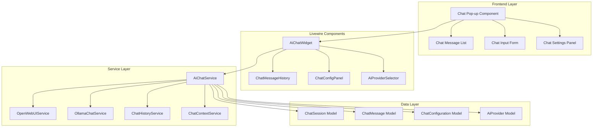
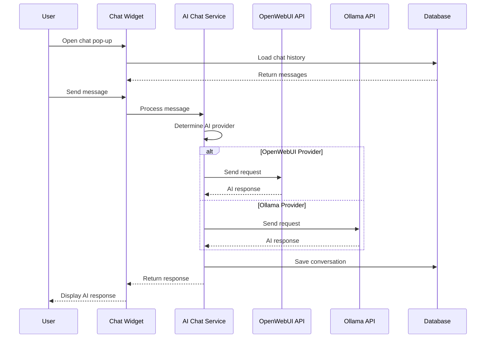
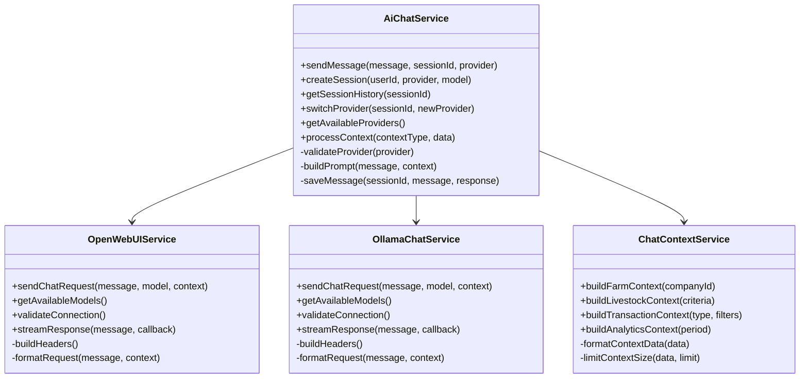
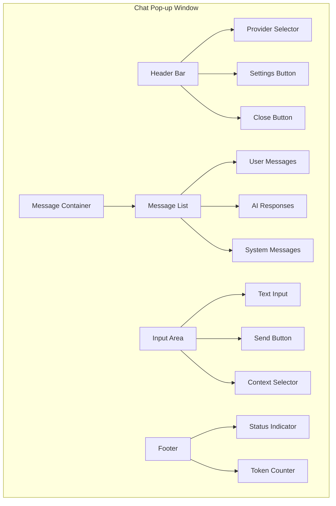

# AI Chat Integration Feature Design

## Overview

This document outlines the design for implementing an AI chat integration feature with pop-up support for the demo51 Laravel application. The feature will support both OpenWebUI and Ollama APIs, providing users with intelligent assistance for farm management tasks.

## Technology Stack & Dependencies

### Backend Framework
- **Laravel 11**: Core framework for backend services and API management
- **Livewire 3**: Real-time chat component and UI state management
- **Laravel Sanctum**: API authentication and security
- **Guzzle HTTP**: External API communication with OpenWebUI and Ollama

### Frontend Technologies
- **Bootstrap 5**: UI framework for responsive chat interface
- **Alpine.js**: JavaScript framework for interactive behaviors
- **SweetAlert2**: Enhanced notification and modal system
- **Font Awesome**: Icons for chat interface

### Existing Dependencies (Utilized)
- **OllamaChatService**: Existing service for Ollama integration (will be extended)
- **OllamaChatContextHelper**: Context management for AI conversations
- **OllamaChatQueryHelper**: Query processing and data retrieval

## Architecture

### Component Architecture



### System Integration Flow



## Data Models & ORM Mapping

### ChatSession Model
```php
class ChatSession extends Model
{
    protected $fillable = [
        'user_id',
        'company_id', 
        'title',
        'ai_provider',
        'model_name',
        'context_data',
        'is_active',
        'last_activity_at'
    ];
    
    protected $casts = [
        'context_data' => 'array',
        'last_activity_at' => 'datetime'
    ];
}
```

### ChatMessage Model
```php
class ChatMessage extends Model 
{
    protected $fillable = [
        'chat_session_id',
        'user_id',
        'message_type', // 'user', 'assistant', 'system'
        'content',
        'metadata',
        'processing_time',
        'token_count'
    ];
    
    protected $casts = [
        'metadata' => 'array'
    ];
}
```

### AiProvider Model
```php
class AiProvider extends Model
{
    protected $fillable = [
        'name',
        'type', // 'openwebui', 'ollama'
        'base_url',
        'api_key',
        'default_model',
        'available_models',
        'is_active',
        'company_id'
    ];
    
    protected $casts = [
        'available_models' => 'array'
    ];
}
```

## Business Logic Layer

### AiChatService Architecture



### Core Service Methods

#### AiChatService::sendMessage()
- Validates input message and session
- Determines appropriate AI provider
- Builds context-aware prompt
- Sends request to provider API
- Saves conversation to database
- Returns formatted response

#### ChatContextService::buildFarmContext()
- Retrieves relevant farm data
- Formats livestock statistics
- Includes recent transactions
- Builds analytics summary
- Respects context size limits

#### OpenWebUIService::sendChatRequest()
- Authenticates with OpenWebUI API
- Formats request payload
- Handles streaming responses
- Manages rate limiting
- Processes error responses

## API Endpoints Reference

### Chat Management Endpoints

| Method | Endpoint | Description | Authentication |
|--------|----------|-------------|----------------|
| GET | `/api/chat/sessions` | List user chat sessions | Bearer Token |
| POST | `/api/chat/sessions` | Create new chat session | Bearer Token |
| GET | `/api/chat/sessions/{id}` | Get session details | Bearer Token |
| DELETE | `/api/chat/sessions/{id}` | Delete chat session | Bearer Token |
| POST | `/api/chat/sessions/{id}/messages` | Send message | Bearer Token |
| GET | `/api/chat/sessions/{id}/messages` | Get message history | Bearer Token |

### AI Provider Endpoints

| Method | Endpoint | Description | Authentication |
|--------|----------|-------------|----------------|
| GET | `/api/chat/providers` | List available providers | Bearer Token |
| GET | `/api/chat/providers/{type}/models` | Get provider models | Bearer Token |
| POST | `/api/chat/providers/test` | Test provider connection | Bearer Token |

### Request/Response Schema

#### Send Message Request
```json
{
    "message": "What is the average weight of my chickens?",
    "context_type": "livestock",
    "context_filters": {
        "status": "active",
        "type": "chicken"
    },
    "stream": false
}
```

#### Send Message Response
```json
{
    "success": true,
    "data": {
        "message_id": "uuid",
        "response": "Based on your farm data...",
        "processing_time": 1.23,
        "token_count": 150,
        "context_used": "livestock_analytics"
    }
}
```

## Frontend Components

### AiChatWidget Livewire Component

#### Component Properties
```php
class AiChatWidget extends Component
{
    public $isOpen = false;
    public $currentSession = null;
    public $messages = [];
    public $newMessage = '';
    public $selectedProvider = 'ollama';
    public $selectedModel = '';
    public $isLoading = false;
    public $contextType = 'general';
}
```

#### Component Methods
- `openChat()`: Initialize and show chat widget
- `closeChat()`: Hide chat widget
- `sendMessage()`: Process user message
- `switchProvider()`: Change AI provider
- `loadHistory()`: Load chat session history
- `exportChat()`: Export conversation

### Chat Widget UI Structure



### Chat Component Features

#### Responsive Design
- Collapsible popup window
- Mobile-friendly interface
- Adjustable window size
- Persistent position memory

#### Message Types
- **User Messages**: User input with timestamp
- **AI Responses**: Formatted AI responses with typing animation
- **System Messages**: Connection status, errors, context changes
- **Context Messages**: Data context summaries

#### Interactive Elements
- Real-time typing indicators
- Message reactions/feedback
- Copy message content
- Regenerate AI response
- Context data preview

## Middleware & Interceptors

### ChatAuthMiddleware
```php
class ChatAuthMiddleware
{
    public function handle($request, Closure $next)
    {
        // Verify user authentication
        // Check chat permissions
        // Validate session ownership
        // Rate limiting
        return $next($request);
    }
}
```

### ChatRateLimitMiddleware
- Implements per-user rate limiting
- Tracks API usage quotas
- Prevents abuse of AI services
- Configurable limits per provider

### ChatContextMiddleware
- Injects company context
- Validates context permissions
- Filters sensitive data
- Applies context size limits

## Configuration Management

### Chat Configuration Structure
```php
return [
    'providers' => [
        'openwebui' => [
            'enabled' => env('OPENWEBUI_ENABLED', false),
            'base_url' => env('OPENWEBUI_BASE_URL'),
            'api_key' => env('OPENWEBUI_API_KEY'),
            'default_model' => env('OPENWEBUI_DEFAULT_MODEL', 'gpt-3.5-turbo'),
            'timeout' => 30,
            'max_tokens' => 1000,
        ],
        'ollama' => [
            'enabled' => env('OLLAMA_ENABLED', true),
            'base_url' => env('OLLAMA_BASE_URL', 'http://localhost:11434'),
            'default_model' => env('OLLAMA_DEFAULT_MODEL', 'llama2'),
            'timeout' => 60,
            'max_tokens' => 2000,
        ]
    ],
    'chat' => [
        'max_sessions_per_user' => 10,
        'max_messages_per_session' => 100,
        'context_size_limit' => 4000,
        'auto_delete_sessions_after_days' => 30,
        'rate_limit_per_minute' => 20,
    ],
    'ui' => [
        'default_position' => 'bottom-right',
        'default_size' => 'medium',
        'enable_sounds' => true,
        'enable_animations' => true,
        'theme' => 'auto', // 'light', 'dark', 'auto'
    ]
];
```

### Environment Variables
```env
# OpenWebUI Configuration
OPENWEBUI_ENABLED=true
OPENWEBUI_BASE_URL=https://your-openwebui-instance.com
OPENWEBUI_API_KEY=your-api-key

# Ollama Configuration  
OLLAMA_ENABLED=true
OLLAMA_BASE_URL=http://localhost:11434
OLLAMA_DEFAULT_MODEL=llama2

# Chat Settings
CHAT_RATE_LIMIT_PER_MINUTE=20
CHAT_MAX_SESSIONS_PER_USER=10
CHAT_CONTEXT_SIZE_LIMIT=4000
```

## Integration Points

### Existing System Integration

#### Company Scoping
- All chat sessions scoped to user's company
- Context data filtered by company access
- Provider configurations per company

#### Permission System
- Integration with Laravel Permission package
- Chat access controlled by user roles
- Provider access based on company settings

#### Notification Integration
- Chat notifications through existing system
- Real-time message delivery
- Mobile push notifications for offline messages

#### Analytics Integration
- Chat usage tracking
- AI response quality metrics
- Context effectiveness analysis

### Data Context Integration

#### Farm Data Context
- Livestock status and performance
- Feed inventory and usage
- Supply chain information
- Financial summaries

#### Real-time Context
- Current operations status
- Recent transactions
- Alert notifications
- System health metrics

## Testing Strategy

### Unit Testing Areas
- AiChatService message processing
- Provider authentication and connection
- Context building and validation
- Rate limiting functionality
- Message persistence and retrieval

### Integration Testing Scenarios
- End-to-end chat conversations
- Provider failover handling
- Context data accuracy
- Performance under load
- Multi-user concurrent usage

### Test Data Requirements
- Mock chat sessions
- Sample AI responses
- Test provider configurations
- Dummy farm data context
- Rate limiting scenarios

### Testing Configuration
```php
// TestCase setup for AI Chat testing
protected function setUp(): void
{
    parent::setUp();
    
    // Mock AI providers
    Http::fake([
        'ollama-test.local/*' => Http::response(['response' => 'Test response']),
        'openwebui-test.com/*' => Http::response(['choices' => [['message' => ['content' => 'Test']]]])
    ]);
    
    // Create test data
    $this->user = User::factory()->create();
    $this->company = Company::factory()->create();
    $this->chatSession = ChatSession::factory()->create(['user_id' => $this->user->id]);
}
```

## Security & Privacy Considerations

### Data Protection
- Encrypt sensitive chat data
- Sanitize user inputs
- Validate context data access
- Implement audit logging

### API Security
- Secure API key management
- Request signing for external APIs
- Rate limiting and abuse prevention
- Connection timeout handling

### Privacy Controls
- User consent for AI processing
- Data retention policies
- Export and deletion capabilities
- Third-party provider disclosures

### Access Control
- Role-based chat access
- Company-level provider restrictions
- Context data permissions
- Session ownership validation

## Performance Optimization

### Caching Strategy
- Cache provider model lists
- Cache frequent context queries
- Session data caching
- Response template caching

### Database Optimization
- Index chat session queries
- Partition message tables by date
- Optimize context data retrieval
- Implement soft deletes

### API Performance
- Connection pooling for providers
- Asynchronous message processing
- Streaming response handling
- Error retry mechanisms

### Frontend Optimization
- Lazy load chat history
- Debounce user inputs
- Optimize re-renders
- Implement virtual scrolling
