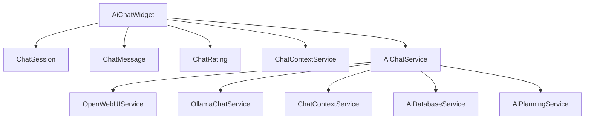

# AI Chat Feature Optimization: History, Settings, and Minimize Functionality

## Overview

This document outlines the optimization plan for the AI chat feature in the Ximopet livestock management system. The focus is on restoring and enhancing the history, settings, and minimize functionalities that may have been inadvertently disabled or broken. Additionally, recommendations for new features are provided to improve the overall user experience.

## Current Implementation Analysis

### Component Structure

The AI chat feature is implemented using Livewire components:
- `AiChatWidget.php` - Main chat widget component handling UI state and interactions
- `ChatRating.php` - Component for rating chat responses
- Blade templates for UI rendering

### Key Features Currently Available

1. **Chat History/Sessions**:
   - Session management with create, switch, and delete functionality
   - Session history panel with chronological listing
   - Automatic session title generation

2. **Settings Panel**:
   - AI provider selection (OpenWebUI, Ollama)
   - Model selection per provider
   - Context type selection
   - Export functionality

3. **Minimize Functionality**:
   - Toggle between minimized and expanded states
   - Preserves chat state during minimize/maximize

4. **Additional Features**:
   - Message rating system
   - Copy message functionality
   - Regenerate response capability
   - Real-time typing indicators

## Issues Identified

Based on the code analysis, the following potential issues may be affecting the visibility of key features:

1. **UI Visibility Issues**:
   - History and settings buttons may not be visible due to CSS styling conflicts
   - Minimize functionality might be working but not visually apparent

2. **State Management**:
   - Session state may not persist correctly across page reloads
   - Component reinitialization issues causing UI elements to disappear

3. **Configuration Problems**:
   - Environment variables might be disabling certain features
   - Configuration settings in `config/chat.php` may have incorrect values

## Optimization Plan

### 1. History Feature Restoration

#### Current Implementation
The history feature is implemented through the sessions panel which can be toggled via the history button in the chat header.

#### Optimization Steps
- Ensure the history button is always visible in the UI
- Improve session loading performance by implementing pagination
- Add search functionality within the session history
- Implement session tagging for better organization

#### Technical Implementation
```php
// In AiChatWidget.php
public function loadRecentSessions($page = 1, $search = null)
{
    $perPage = config('chat.ui.sessions_per_page', 10);
    $query = $this->chatService->getUserSessionsQuery();
    
    if ($search) {
        $query->where('title', 'like', "%{$search}%");
    }
    
    $this->sessions = $query->paginate($perPage, ['*'], 'page', $page);
}
```

### 2. Settings Feature Enhancement

#### Current Implementation
Settings panel includes provider selection, model selection, and context type options.

#### Optimization Steps
- Add visual indicators for active settings
- Implement settings persistence across sessions
- Add advanced settings for power users
- Improve model availability checking

#### Technical Implementation
```php
// In AiChatWidget.php
public function saveUserPreferences()
{
    $preferences = [
        'default_provider' => $this->selectedProvider,
        'default_model' => $this->selectedModel,
        'default_context' => $this->contextType,
        'chat_position' => $this->chatPosition,
        'theme' => $this->theme
    ];
    
    // Save to user metadata or separate preferences table
    Auth::user()->update(['chat_preferences' => $preferences]);
}
```

### 3. Minimize Functionality Improvement

#### Current Implementation
The minimize feature toggles between full view and minimized view of the chat widget.

#### Optimization Steps
- Add persistent state for minimize status
- Implement multiple minimize positions (top-right, bottom-left, etc.)
- Add keyboard shortcut for quick toggle (Ctrl+M)
- Show notification badge when minimized

#### Technical Implementation
```php
// In AiChatWidget.php
public function toggleMinimize()
{
    $this->isMinimized = !$this->isMinimized;
    
    // Save minimize state
    session(['chat_minimized' => $this->isMinimized]);
    
    $this->dispatch('chat-toggled', $this->isMinimized);
}

// Restore state on component mount
private function restoreMinimizeState()
{
    $this->isMinimized = session('chat_minimized', false);
}
```

## Recommended Additional Features

### 1. Chat Templates
- Predefined message templates for common queries
- Custom template creation and management
- Quick access toolbar for templates

### 2. Advanced Search
- Search across all chat histories
- Filter by date, provider, or rating
- Full-text search with highlighting

### 3. Export Options
- Multiple export formats (PDF, CSV, JSON)
- Selective export of conversations
- Scheduled automatic exports

### 4. Collaboration Features
- Share chat sessions with team members
- Comment on specific messages
- Assign tasks based on chat responses

### 5. Analytics Dashboard
- Usage statistics and trends
- Performance metrics for AI providers
- Popular queries and topics

### 6. Offline Mode
- Cache recent conversations locally
- Queue messages when offline
- Sync when connection is restored

### 7. Voice Integration
- Voice-to-text input capability
- Text-to-speech for responses
- Voice command shortcuts

## UI/UX Improvements

### 1. Visual Enhancements
- Improved contrast for better readability
- Customizable themes (light/dark mode)
- Animated transitions for smoother experience

### 2. Responsive Design
- Better mobile experience
- Adaptive layout for different screen sizes
- Touch-friendly controls

### 3. Accessibility
- Keyboard navigation support
- Screen reader compatibility
- High contrast mode for visually impaired users

## Technical Implementation Details

### Component Architecture


### Data Flow
1. User interacts with chat widget UI
2. Livewire component handles state and events
3. AiChatService processes requests
4. Provider services (OpenWebUI/Ollama) handle API communication
5. Database services store sessions and messages
6. Context service provides relevant data context
7. Responses are displayed in the UI

### State Management
- Session state is maintained in the database
- Component state is managed by Livewire
- User preferences are stored in the users table
- Temporary state is kept in session storage

## Configuration Updates

### Environment Variables
```env
# Chat Feature Configuration
CHAT_ENABLED=true
CHAT_DEFAULT_PROVIDER=openwebui
CHAT_MAX_SESSIONS_PER_USER=20
CHAT_MAX_MESSAGES_PER_SESSION=200
CHAT_ENABLE_SOUND_NOTIFICATIONS=true
CHAT_SHOW_SESSIONS_BY_DEFAULT=true
CHAT_MAX_SESSIONS_DISPLAY=15
```

### Chat Configuration (config/chat.php)
```php
'ui' => [
    'default_position' => 'bottom-right',
    'enable_sounds' => env('CHAT_ENABLE_SOUND_NOTIFICATIONS', true),
    'enable_animations' => true,
    'theme' => 'auto',
    'auto_open' => false,
    'enable_message_regenerate' => true,
    'show_sessions_by_default' => env('CHAT_SHOW_SESSIONS_BY_DEFAULT', true),
    'max_sessions_display' => env('CHAT_MAX_SESSIONS_DISPLAY', 15),
],
```

## Testing Strategy

### Unit Tests
- Test chat message sending and receiving
- Verify session creation and management
- Validate settings persistence
- Check minimize/maximize functionality

### Integration Tests
- End-to-end chat flow testing
- Multi-user session management
- Provider switching scenarios
- Error handling and recovery

### UI Tests
- Button visibility and functionality
- Responsive design across devices
- State persistence across page reloads
- Accessibility compliance

## Deployment Considerations

### Performance Optimization
- Implement caching for frequently accessed sessions
- Optimize database queries with proper indexing
- Use pagination for large datasets
- Implement lazy loading for message history

### Security Measures
- Validate all user inputs
- Sanitize message content
- Implement rate limiting
- Secure API communications

### Monitoring and Logging
- Track chat usage metrics
- Log errors and exceptions
- Monitor API response times
- Alert on service outages

## Conclusion

The optimization of the AI chat feature will significantly improve user experience by ensuring core functionalities like history, settings, and minimize are working properly. The recommended additional features will further enhance the utility of the chat system for livestock management operations. Implementation should follow the outlined technical approach with proper testing and monitoring to ensure a smooth user experience.
