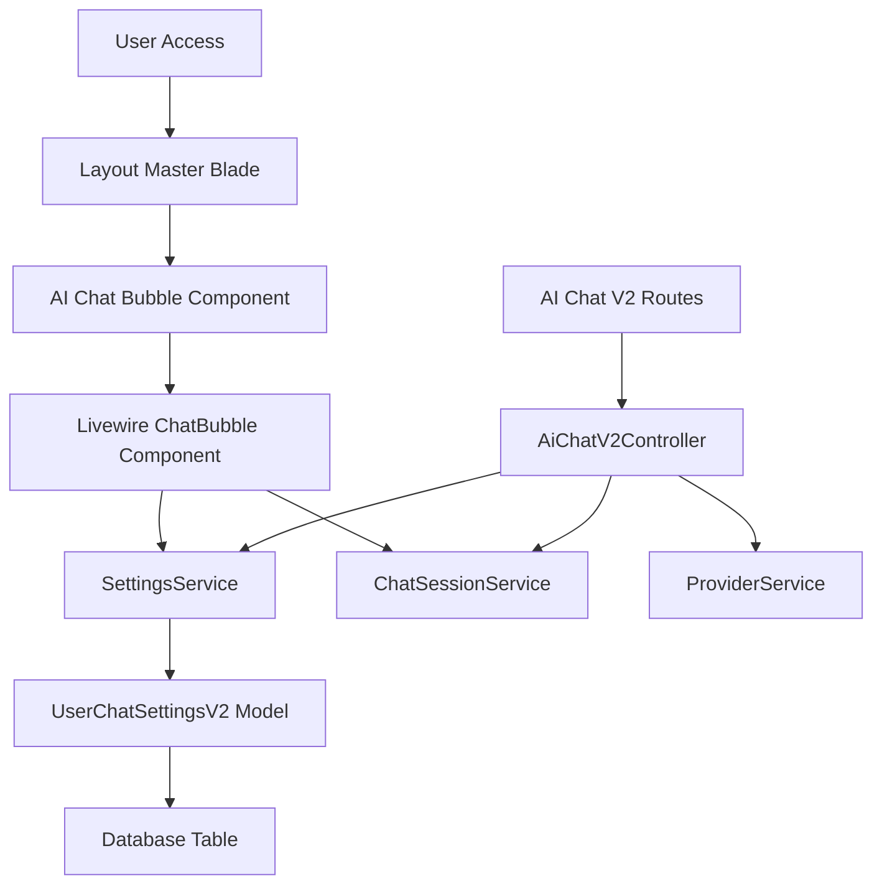

# AI Chat V2 Bubble Display and Error Fix Design

## Overview

This document outlines the design and implementation plan to fix the AI Chat V2 feature where:
1. The chat bubble is not appearing on the UI
2. There's a type mismatch error when accessing `/ai-chat-v2`: `App\AiChatV2\Services\SettingsService::getUserSettings(): Argument #1 ($userId) must be of type int, string given`

## Problem Analysis

### 1. Type Mismatch Issue
The primary issue is a type mismatch between the User model and the SettingsService:
- The User model uses UUIDs (strings) as primary keys (`HasUuids` trait)
- The SettingsService expects integer user IDs in several methods
- The UserChatSettingsV2 model migration defines `user_id` as `char(36)` (UUID format)

### 2. Chat Bubble Not Displaying
The chat bubble component is properly included in the layout but may not be rendering due to:
- JavaScript errors preventing proper initialization
- Livewire component failing to mount due to the type error
- CSS issues hiding the component

## Architecture

## Solution Design

### 1. Fix Type Mismatch in SettingsService

#### Changes to SettingsService.php:
- Update method signatures to accept string user IDs instead of int
- Update type hints in related models and services
- Fix scope definitions in UserChatSettingsV2 model

#### Key Methods to Update:
- `getUserSettings(string $userId): array`
- `updateUserSettings(array $settings, string $userId = null): bool`
- `resetToDefault(string $userId): bool`
- `exportSettings(string $userId): array`
- `importSettings(string $userId, array $settingsData): bool`

### 2. Update UserChatSettingsV2 Model

#### Changes to UserChatSettingsV2.php:
- Update scope method signature: `scopeForUser($query, string $userId)`
- Ensure proper relationship definitions for UUID foreign keys

### 3. Update AiChatV2Controller

#### Changes to AiChatV2Controller.php:
- Ensure proper type handling when passing user IDs to services
- Add proper error handling for type conversion if needed

### 4. Fix Chat Bubble Component

#### Changes to ChatBubble.php:
- Add proper error handling in mount method
- Ensure component gracefully handles service failures
- Add debugging information for troubleshooting

## Data Models

### UserChatSettingsV2 Model Changes

| Field | Type | Description |
|-------|------|-------------|
| id | bigint (auto-increment) | Primary key |
| user_id | char(36) | UUID foreign key to users table |
| settings | json | User's chat settings |
| version | varchar(10) | Settings version |
| created_at | timestamp | Creation timestamp |
| updated_at | timestamp | Last update timestamp |

## API Endpoints

### Fixed Routes
- `GET /ai-chat-v2` - Main chat interface
- `GET /ai-chat-v2/popup` - Popup chat window
- `GET /ai-chat-v2/api/session/{sessionId}` - Get session data
- `POST /ai-chat-v2/api/session` - Create new session
- `POST /ai-chat-v2/api/message` - Send message

## Business Logic Layer

### SettingsService Modifications
The SettingsService will be updated to handle string-based UUIDs consistently:

1. **getUserSettings**: Accept string user ID, return user settings array
2. **updateUserSettings**: Accept string user ID, update user settings
3. **resetToDefault**: Accept string user ID, reset to default settings
4. **exportSettings**: Accept string user ID, export settings data
5. **importSettings**: Accept string user ID, import settings data

### ChatBubble Component Improvements
1. Add error boundaries to prevent component failure
2. Implement graceful degradation when services are unavailable
3. Add logging for debugging purposes

## Middleware & Interceptors

No changes required to middleware. The authentication middleware will continue to work as expected since the issue is in the service layer type handling.

## Testing

### Unit Tests
1. Test SettingsService with string user IDs
2. Test UserChatSettingsV2 model with UUID relationships
3. Test AiChatV2Controller with authenticated users
4. Test ChatBubble component mounting and rendering

### Integration Tests
1. Test complete flow from UI interaction to database storage
2. Test error handling scenarios
3. Test chat bubble visibility and functionality

## Implementation Plan

### Phase 1: Backend Fixes
1. Update SettingsService method signatures
2. Update UserChatSettingsV2 model
3. Update AiChatV2Controller
4. Run unit tests

### Phase 2: Frontend Fixes
1. Update ChatBubble component error handling
2. Verify chat bubble rendering
3. Test UI functionality

### Phase 3: Testing & Validation
1. Run integration tests
2. Manual testing of chat functionality
3. Verify error resolution

## Rollback Plan

If issues occur after deployment:
1. Revert SettingsService changes
2. Restore UserChatSettingsV2 model
3. Restore AiChatV2Controller
4. Monitor application logs for any residual errors
