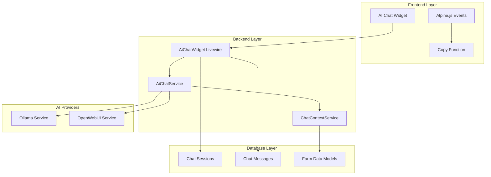
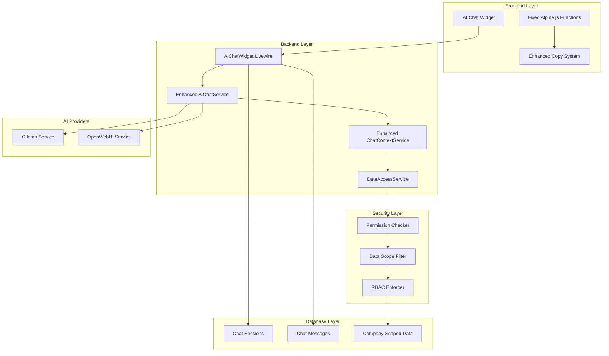
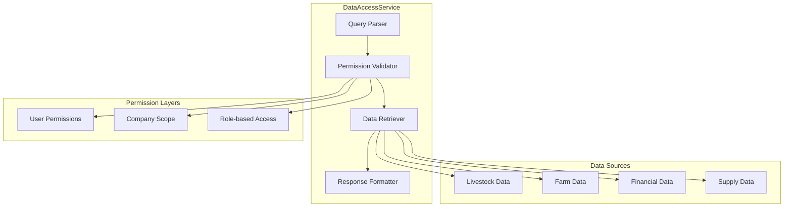
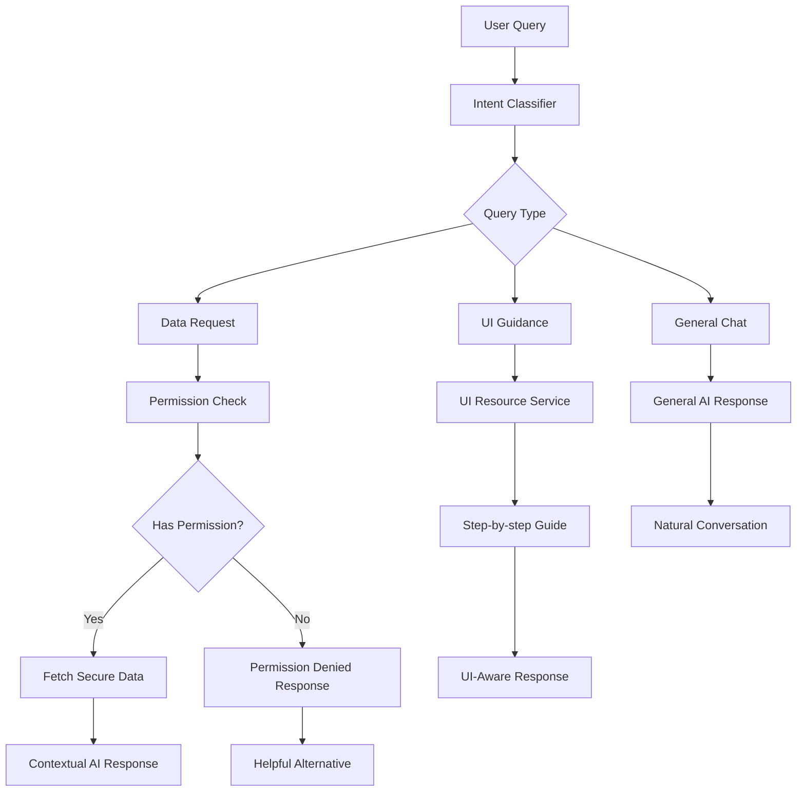

# AI Chat System Optimization Design

## Overview

This design document outlines comprehensive optimizations for the AI chat application to address critical issues:
1. Fix copy message functionality that currently throws Alpine.js errors
2. Implement secure database access for AI responses with proper RBAC enforcement
3. Enhance context awareness to eliminate generic/irrelevant responses

The optimization maintains the existing Laravel 11 + Livewire architecture while strengthening security and user experience.

## Architecture

### Current System Architecture



### Optimized Architecture with Security



## Copy Function Fix

### Current Issue Analysis

The Alpine.js error occurs because `copyMessageToClipboard` function is not properly scoped within the Alpine component context:

```javascript
// Current problematic implementation
@click="copyMessageToClipboard($event, '{{ $loop->index }}')"
```

Error: `Alpine Expression Error: copyMessageToClipboard is not defined`

### Solution: Proper Alpine.js Function Scope

```javascript
// Fixed Alpine.js component with proper function scope
{
    // ... existing Alpine data and methods
    
    copyMessageToClipboard(event, messageIndex) {
        const button = event.target.closest('button');
        const messageContent = button.dataset.messageContent;
        
        if (navigator.clipboard && messageContent) {
            navigator.clipboard.writeText(messageContent).then(() => {
                this.showToast('Message copied to clipboard!', 'success');
            }).catch(err => {
                console.error('Failed to copy text:', err);
                this.showToast('Failed to copy message', 'error');
            });
        } else {
            // Fallback for older browsers
            this.fallbackCopy(messageContent);
        }
    },
    
    fallbackCopy(text) {
        const textArea = document.createElement('textarea');
        textArea.value = text;
        document.body.appendChild(textArea);
        textArea.select();
        try {
            document.execCommand('copy');
            this.showToast('Message copied to clipboard!', 'success');
        } catch (err) {
            console.error('Failed to copy text:', err);
            this.showToast('Failed to copy message', 'error');
        }
        document.body.removeChild(textArea);
    }
}
```

## Secure Database Access Implementation

### DataAccessService Architecture



### Permission Matrix

| User Role | Livestock Data | Financial Data | Farm Management | Company Data |
|-----------|---------------|----------------|-----------------|--------------|
| Farm Worker | Read Own | None | Read Assigned | None |
| Farm Manager | Read/Write | Read Summary | Full Access | Read |
| Company Admin | Full Access | Full Access | Full Access | Full Access |
| Superadmin | Full Access | Full Access | Full Access | Full Access |

### Enhanced ChatContextService Implementation

```php
class EnhancedChatContextService
{
    protected DataAccessService $dataAccessService;
    protected PermissionChecker $permissionChecker;
    
    public function buildSecureContext(string $query, User $user): string
    {
        // 1. Parse query intent
        $intent = $this->parseQueryIntent($query);
        
        // 2. Check permissions
        $allowedDataTypes = $this->permissionChecker
            ->getAllowedDataTypes($user, $intent['data_types']);
        
        // 3. Build context with filtered data
        $context = $this->buildBaseContext($user);
        
        foreach ($allowedDataTypes as $dataType) {
            $data = $this->dataAccessService
                ->getSecureData($dataType, $user, $intent['criteria']);
            $context .= $this->formatDataForContext($dataType, $data);
        }
        
        return $context;
    }
    
    private function parseQueryIntent(string $query): array
    {
        $patterns = [
            'company_list' => '/(?:buatkan|tampilkan|show).*(?:list|daftar).*(?:perusahaan|company)/i',
            'livestock_count' => '/(?:berapa|how many).*(?:ternak|livestock|ayam|chicken)/i',
            'financial_summary' => '/(?:keuangan|financial|profit|untung|rugi)/i',
            'farm_management' => '/(?:cara|how to|bagaimana).*(?:menambah|add|create).*(?:farm|kandang)/i',
        ];
        
        $dataTypes = [];
        $criteria = [];
        
        foreach ($patterns as $type => $pattern) {
            if (preg_match($pattern, $query)) {
                $dataTypes[] = $type;
            }
        }
        
        return [
            'data_types' => $dataTypes,
            'criteria' => $criteria,
            'intent' => $this->classifyIntent($query)
        ];
    }
}
```

## Database Access Security Layer

### PermissionChecker Implementation

```php
class PermissionChecker
{
    public function canAccessData(User $user, string $dataType): bool
    {
        $permissions = [
            'company_list' => ['access company master data', 'read company master data'],
            'livestock_data' => ['access livestock', 'read livestock'],
            'financial_data' => ['access report', 'read report'],
            'farm_data' => ['access farm management', 'read farm management']
        ];
        
        if (!isset($permissions[$dataType])) {
            return false;
        }
        
        foreach ($permissions[$dataType] as $permission) {
            if ($user->can($permission)) {
                return true;
            }
        }
        
        return false;
    }
    
    public function filterDataByPermission(User $user, string $dataType, Collection $data): Collection
    {
        // Apply company scope
        $data = $data->where('company_id', $user->company_id);
        
        // Apply role-based filtering
        switch ($user->getRoleNames()->first()) {
            case 'farm_worker':
                return $this->filterForWorker($user, $dataType, $data);
            case 'farm_manager':
                return $this->filterForManager($user, $dataType, $data);
            case 'company_admin':
                return $data; // Full company access
            default:
                return collect(); // No access
        }
    }
}
```

### DataAccessService Implementation

```php
class DataAccessService
{
    protected PermissionChecker $permissionChecker;
    
    public function getCompanyList(User $user): array
    {
        if (!$this->permissionChecker->canAccessData($user, 'company_list')) {
            return ['error' => 'Insufficient permissions to access company data'];
        }
        
        // For regular users, only show their company
        if (!$user->hasRole(['superadmin', 'company_admin'])) {
            return [
                'companies' => [
                    [
                        'id' => $user->company_id,
                        'name' => $user->company->name,
                        'type' => 'Your Company'
                    ]
                ],
                'total' => 1,
                'access_level' => 'limited'
            ];
        }
        
        // Superadmin can see all companies
        $companies = Company::select('id', 'name', 'created_at')
            ->orderBy('name')
            ->get()
            ->map(function ($company) {
                return [
                    'id' => $company->id,
                    'name' => $company->name,
                    'registered_date' => $company->created_at->format('Y-m-d')
                ];
            });
        
        return [
            'companies' => $companies->toArray(),
            'total' => $companies->count(),
            'access_level' => 'full'
        ];
    }
    
    public function getLivestockSummary(User $user): array
    {
        if (!$this->permissionChecker->canAccessData($user, 'livestock_data')) {
            return ['error' => 'Insufficient permissions to access livestock data'];
        }
        
        $query = Livestock::where('company_id', $user->company_id);
        
        // Apply role-based filtering
        if ($user->hasRole('farm_worker')) {
            $assignedFarms = $user->assignedFarms()->pluck('id');
            $query->whereHas('kandang.farm', function ($q) use ($assignedFarms) {
                $q->whereIn('id', $assignedFarms);
            });
        }
        
        $summary = [
            'total_livestock' => $query->count(),
            'active_livestock' => $query->where('status', 'active')->count(),
            'by_type' => $query->groupBy('livestock_type')
                ->selectRaw('livestock_type, count(*) as count')
                ->pluck('count', 'livestock_type')
                ->toArray()
        ];
        
        return $summary;
    }
}
```

## Enhanced UI Integration

### Alpine.js Component Update

```blade
<div x-data="{
    // ... existing properties
    
    // Fixed copy function within Alpine scope
    copyMessageToClipboard(event, messageIndex) {
        const button = event.target.closest('button');
        const messageContent = button.dataset.messageContent;
        
        if (!messageContent) {
            this.showToast('No content to copy', 'error');
            return;
        }
        
        this.copyToClipboard(messageContent);
    },
    
    async copyToClipboard(text) {
        try {
            if (navigator.clipboard) {
                await navigator.clipboard.writeText(text);
                this.showToast('Message copied to clipboard!', 'success');
            } else {
                this.fallbackCopy(text);
            }
        } catch (err) {
            console.error('Copy failed:', err);
            this.fallbackCopy(text);
        }
    },
    
    fallbackCopy(text) {
        const textArea = document.createElement('textarea');
        textArea.value = text;
        textArea.style.position = 'fixed';
        textArea.style.opacity = '0';
        document.body.appendChild(textArea);
        textArea.select();
        
        try {
            document.execCommand('copy');
            this.showToast('Message copied to clipboard!', 'success');
        } catch (err) {
            this.showToast('Failed to copy message', 'error');
        }
        
        document.body.removeChild(textArea);
    }
}">
```

### Message Button Template

```blade
@if($message['message_type'] === 'assistant')
    <div class="message-actions mt-1">
        <button class="btn btn-sm btn-outline-secondary me-1" 
                @click="copyMessageToClipboard($event, '{{ $loop->index }}')"
                data-message-content="{{ htmlspecialchars(strip_tags($message['content']), ENT_QUOTES, 'UTF-8') }}"
                title="Copy message">
            <i class="fas fa-copy fa-xs"></i>
        </button>
    </div>
@endif
```

## Context-Aware Response System

### Query Classification



### Response Enhancement

```php
public function generateContextualResponse(string $query, User $user): string
{
    $intent = $this->classifyIntent($query);
    
    switch ($intent['type']) {
        case 'data_request':
            return $this->handleDataRequest($query, $user, $intent);
            
        case 'ui_guidance':
            return $this->handleUIGuidance($query, $user, $intent);
            
        case 'general_chat':
            return $this->handleGeneralChat($query, $user);
            
        default:
            return $this->handleMixedQuery($query, $user, $intent);
    }
}

private function handleDataRequest(string $query, User $user, array $intent): string
{
    $dataAccess = $this->dataAccessService->getSecureData(
        $intent['data_type'], 
        $user, 
        $intent['criteria']
    );
    
    if (isset($dataAccess['error'])) {
        return $this->formatPermissionDeniedResponse($intent['data_type'], $user);
    }
    
    $context = $this->formatDataForAI($dataAccess);
    
    return $this->aiService->generateResponse($query, $context);
}

private function formatPermissionDeniedResponse(string $dataType, User $user): string
{
    $suggestions = [
        'company_list' => 'You can view your company information in the Company Settings section.',
        'financial_data' => 'Please contact your manager for financial reports access.',
        'livestock_data' => 'You can view livestock assigned to your farms in the Livestock section.'
    ];
    
    $suggestion = $suggestions[$dataType] ?? 'Please contact your administrator for access.';
    
    return "I don't have permission to access this data for your role. {$suggestion}";
}
```

## Testing Strategy

### Unit Tests

```php
class ChatOptimizationTest extends TestCase
{
    public function test_copy_function_works_with_special_characters()
    {
        $message = "Test message with 'quotes' and \"double quotes\"";
        $escapedContent = htmlspecialchars(strip_tags($message), ENT_QUOTES, 'UTF-8');
        
        $this->assertStringNotContains("'", $escapedContent);
        $this->assertStringNotContains('"', $escapedContent);
    }
    
    public function test_permission_checker_respects_rbac()
    {
        $worker = User::factory()->create();
        $worker->assignRole('farm_worker');
        
        $permissionChecker = new PermissionChecker();
        
        $this->assertFalse($permissionChecker->canAccessData($worker, 'company_list'));
        $this->assertTrue($permissionChecker->canAccessData($worker, 'livestock_data'));
    }
    
    public function test_data_access_service_filters_by_company()
    {
        $company1 = Company::factory()->create();
        $company2 = Company::factory()->create();
        $user = User::factory()->create(['company_id' => $company1->id]);
        
        $dataService = new DataAccessService();
        $companies = $dataService->getCompanyList($user);
        
        $this->assertEquals(1, $companies['total']);
        $this->assertEquals($company1->id, $companies['companies'][0]['id']);
    }
}
```

### Feature Tests

```php
class AiChatIntegrationTest extends TestCase
{
    public function test_ai_response_includes_relevant_data()
    {
        $user = User::factory()->create();
        $user->assignRole('farm_manager');
        
        Livestock::factory()->count(10)->create([
            'company_id' => $user->company_id
        ]);
        
        $response = $this->actingAs($user)
            ->post('/api/chat/message', [
                'message' => 'berapa total ternak saya?'
            ]);
        
        $response->assertStatus(200)
                 ->assertJsonPath('ai_response.content', function ($content) {
                     return str_contains($content, '10');
                 });
    }
    
    public function test_permission_denied_returns_helpful_message()
    {
        $worker = User::factory()->create();
        $worker->assignRole('farm_worker');
        
        $response = $this->actingAs($worker)
            ->post('/api/chat/message', [
                'message' => 'show me all companies'
            ]);
        
        $response->assertStatus(200)
                 ->assertJsonPath('ai_response.content', function ($content) {
                     return str_contains($content, 'permission');
                 });
    }
}
```

## Implementation Plan

### Phase 1: Copy Function Fix (Day 1)
1. Update Alpine.js component with proper function scope
2. Fix HTML escaping in message content attributes
3. Add fallback copy mechanism for older browsers
4. Test copy functionality across different browsers

### Phase 2: Security Layer Implementation (Days 2-3)
1. Create PermissionChecker service
2. Implement DataAccessService with RBAC enforcement
3. Update ChatContextService to use secure data access
4. Add comprehensive permission tests

### Phase 3: Enhanced Context Awareness (Days 4-5)
1. Improve query intent classification
2. Implement contextual response generation
3. Add UI guidance responses
4. Enhance error messaging for permission denials

### Phase 4: Testing & Optimization (Day 6)
1. Comprehensive unit testing
2. Feature testing for permission scenarios
3. Performance optimization for database queries
4. User acceptance testing

## Configuration Updates

### Chat Configuration Enhancement

```php
// config/chat.php additions
return [
    // ... existing config
    
    'security' => [
        'enable_rbac_filtering' => true,
        'default_permission_denied_message' => 'Insufficient permissions for this data.',
        'log_permission_attempts' => true,
    ],
    
    'data_access' => [
        'max_results_per_query' => 100,
        'cache_duration' => 300, // 5 minutes
        'enable_data_filtering' => true,
    ],
    
    'ui' => [
        'enable_copy_function' => true,
        'copy_timeout' => 3000,
        'enable_fallback_copy' => true,
    ]
];
```

## Performance Considerations

### Database Query Optimization

```php
// Optimized query with proper indexing
class OptimizedDataAccess
{
    public function getLivestockSummaryOptimized(User $user): array
    {
        // Use database aggregation instead of PHP counting
        $summary = DB::table('livestock')
            ->selectRaw('
                COUNT(*) as total,
                SUM(CASE WHEN status = "active" THEN 1 ELSE 0 END) as active,
                livestock_type,
                COUNT(*) as type_count
            ')
            ->where('company_id', $user->company_id)
            ->when($user->hasRole('farm_worker'), function ($query) use ($user) {
                return $query->whereIn('kandang_id', function ($subQuery) use ($user) {
                    $subQuery->select('kandangs.id')
                        ->from('kandangs')
                        ->join('farms', 'kandangs.farm_id', '=', 'farms.id')
                        ->join('user_farm_assignments', 'farms.id', '=', 'user_farm_assignments.farm_id')
                        ->where('user_farm_assignments.user_id', $user->id);
                });
            })
            ->groupBy('livestock_type')
            ->get();
            
        return $summary->toArray();
    }
}
```

### Caching Strategy

```php
class CachedDataAccess
{
    public function getCachedLivestockSummary(User $user): array
    {
        $cacheKey = "livestock_summary_{$user->company_id}_{$user->id}";
        
        return Cache::remember($cacheKey, 300, function () use ($user) {
            return $this->dataAccessService->getLivestockSummary($user);
        });
    }
}
```
