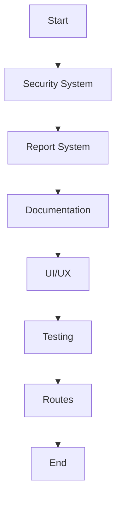

# Analisis Git Status dan Kategorisasi Commit

**Tanggal**: 15 Juni 2025 21:15 WIB  
**Update Terakhir**: 15 Juni 2025 21:15 WIB  
**Tujuan**: Mengkategorikan file berdasarkan tujuan perubahan untuk commit yang terstruktur

## 📊 Status Git Summary

**Modified files**: 20 files  
**Untracked files**: 75+ files

## 📋 Kategorisasi Berdasarkan Tujuan Perubahan

### 1. 🔐 **Security System Implementation**

_Implementasi sistem keamanan dengan blacklist dan verifikasi_

#### Files baru:

-   `app/Console/Commands/CleanSecurityBlacklist.php`
-   `app/Http/Controllers/SecurityController.php`
-   `app/Http/Middleware/SecurityBlacklistMiddleware.php`
-   `app/Models/SecurityBlacklist.php`
-   `app/Models/SecurityViolation.php`
-   `app/Models/ModelVerification.php`
-   `app/Models/VerificationLog.php`
-   `app/Models/VerificationRule.php`
-   `app/Services/VerificationService.php`
-   `database/migrations/2024_01_15_000001_create_security_blacklist_table.php`
-   `database/migrations/2024_01_15_000002_create_security_violations_table.php`
-   `database/migrations/2024_03_26_000000_create_verification_tables.php`
-   `database/migrations/2025_06_13_075800_refactor_security_tables_to_uuid.php`
-   `database/migrations/2025_06_13_101041_update_security_tables_to_uuid.php`
-   `database/seeders/PermissionSeeder.php`
-   `database/seeders/VerificationRuleSeeder.php`

**Commit message**: `feat(security): Implement comprehensive security system with blacklist and verification`

### 2. 📊 **Report System Refactoring**

_Enhancement sistem laporan dengan peningkatan performa dan error handling_

#### Files yang dimodifikasi:

-   `resources/views/pages/reports/feed/feed_purchase.blade.php`
-   `resources/views/pages/reports/index_report_batch_worker.blade.php`
-   `resources/views/pages/reports/index_report_pembelian_livestock.blade.php`
-   `resources/views/pages/reports/index_report_pembelian_pakan.blade.php`
-   `resources/views/pages/reports/index_report_pembelian_supply.blade.php`
-   `resources/views/pages/reports/index_report_performa.blade.php`
-   `resources/views/pages/reports/livestock-cost.blade.php`
-   `resources/views/pages/reports/pembelian-livestock.blade.php`
-   `resources/views/pages/reports/pembelian-pakan.blade.php`
-   `resources/views/pages/reports/pembelian-supply.blade.php`
-   `resources/views/pages/reports/performance.blade.php`

#### Files baru:

-   `app/Livewire/Reports/AdvancedSupplyPurchaseReport.php`
-   `resources/views/livewire/reports/advanced-supply-purchase-report.blade.php`

**Commit message**: `refactor(reports): Enhance report system with improved performance and error handling`

### 3. 📝 **Documentation and Logging**

_Penambahan dokumentasi dan logging untuk perubahan sistem_

#### Files baru:

-   `docs/DEBUGGING_ACTION_LOG.md`
-   `docs/NOTIFICATION_REFACTOR_LOG.md`
-   `docs/NOTIFICATION_REFACTOR_SUMMARY.md`
-   `docs/SECURITY_BLACKLIST_IMPLEMENTATION_LOG.md`
-   `docs/SECURITY_BLACKLIST_REFACTOR_SUMMARY.md`
-   `docs/SECURITY_BLACKLIST_SYSTEM.md`
-   `docs/SECURITY_ERROR_FIXES_FINAL.md`
-   `docs/SECURITY_FINAL_FIXES_COMPREHENSIVE.md`
-   `docs/SECURITY_RECURSION_LOOPHOLE_FIX.md`
-   `docs/SECURITY_UUID_REFACTORING.md`
-   `docs/debugging/livestock-cost-report-refactor.md`
-   `docs/debugging/livestock-cost-service-enhancement.md`
-   `docs/debugging/performance-report-refactor.md`
-   `docs/debugging/purchase-reports-error-handling.md`
-   `docs/debugging/records-ovk-supply-refactoring.md`
-   `docs/debugging/records-yesterday-data-enhancement.md`
-   `docs/debugging/sidebar-collapse-implementation-log.md`
-   `docs/dokumentasi-dan-log.mdc`
-   `docs/features/`
-   `docs/security-flowchart.svg`
-   `docs/sidebar-collapse-feature.md`
-   `docs/validation-system.md`
-   `logs/livestock-cost-service-enhancement.log`
-   `logs/performance-refactor-log.md`
-   `logs/records-refactoring-changelog.log`
-   `logs/records-yesterday-data-enhancement.log`

**Commit message**: `docs: Add comprehensive documentation and logging for system changes`

### 4. 🎨 **UI/UX Improvements**

_Implementasi perbaikan UI dan komponen kustom_

#### Files yang dimodifikasi:

-   `resources/views/pages/masterdata/farm/_draw-scripts.js`
-   `resources/views/pages/masterdata/farm/_related_data_modal.blade.php`
-   `resources/views/pages/transaction/feed-purchases/_actions.blade.php`
-   `resources/views/pages/transaction/feed-purchases/_draw-scripts.js`
-   `resources/views/pages/transaction/feed-purchases/_modal_pembelian_details.blade.php`
-   `resources/views/pages/transaction/feed-purchases/index.blade.php`

#### Files baru:

-   `public/css/custom/`
-   `public/js/custom/`
-   `public/svg-tester/`

**Commit message**: `feat(ui): Implement UI improvements and custom components`

### 5. 🧪 **Testing and Development**

_Penambahan infrastruktur testing dan tools development_

#### Files baru:

-   `testing/sse-notification-bridge.php`
-   `testing/sse-notifications.json`
-   `testing/debug_mode_test.php`
-   `testing/security_blacklist_test.php`
-   `public/debug_security_v2.html`
-   `public/test-production-ready.html`
-   `public/test-security-fix.html`
-   `public/test_security copy.html`

**Commit message**: `test: Add testing infrastructure and debug tools`

### 6. 🔄 **Route Updates**

_Update API dan web routes_

#### Files yang dimodifikasi:

-   `routes/api.php`
-   `routes/web.php`

**Commit message**: `chore: Update API and web routes`

## 🎯 Rekomendasi Commit Strategy

### Phase 1: Security System

```bash
git add app/Console/Commands/CleanSecurityBlacklist.php app/Http/Controllers/SecurityController.php app/Http/Middleware/SecurityBlacklistMiddleware.php app/Models/SecurityBlacklist.php app/Models/SecurityViolation.php app/Models/ModelVerification.php app/Models/VerificationLog.php app/Models/VerificationRule.php app/Services/VerificationService.php database/migrations/2024_01_15_000001_create_security_blacklist_table.php database/migrations/2024_01_15_000002_create_security_violations_table.php database/migrations/2024_03_26_000000_create_verification_tables.php database/migrations/2025_06_13_075800_refactor_security_tables_to_uuid.php database/migrations/2025_06_13_101041_update_security_tables_to_uuid.php database/seeders/PermissionSeeder.php database/seeders/VerificationRuleSeeder.php

git commit -m "feat(security): Implement comprehensive security system with blacklist and verification"
```

### Phase 2: Report System

```bash
git add resources/views/pages/reports/feed/feed_purchase.blade.php resources/views/pages/reports/index_report_batch_worker.blade.php resources/views/pages/reports/index_report_pembelian_livestock.blade.php resources/views/pages/reports/index_report_pembelian_pakan.blade.php resources/views/pages/reports/index_report_pembelian_supply.blade.php resources/views/pages/reports/index_report_performa.blade.php resources/views/pages/reports/livestock-cost.blade.php resources/views/pages/reports/pembelian-livestock.blade.php resources/views/pages/reports/pembelian-pakan.blade.php resources/views/pages/reports/pembelian-supply.blade.php resources/views/pages/reports/performance.blade.php app/Livewire/Reports/AdvancedSupplyPurchaseReport.php resources/views/livewire/reports/advanced-supply-purchase-report.blade.php

git commit -m "refactor(reports): Enhance report system with improved performance and error handling"
```

### Phase 3: Documentation

```bash
git add docs/ logs/

git commit -m "docs: Add comprehensive documentation and logging for system changes"
```

### Phase 4: UI/UX

```bash
git add resources/views/pages/masterdata/farm/_draw-scripts.js resources/views/pages/masterdata/farm/_related_data_modal.blade.php resources/views/pages/transaction/feed-purchases/_actions.blade.php resources/views/pages/transaction/feed-purchases/_draw-scripts.js resources/views/pages/transaction/feed-purchases/_modal_pembelian_details.blade.php resources/views/pages/transaction/feed-purchases/index.blade.php public/css/custom/ public/js/custom/ public/svg-tester/

git commit -m "feat(ui): Implement UI improvements and custom components"
```

### Phase 5: Testing

```bash
git add testing/ public/debug_security_v2.html public/test-production-ready.html public/test-security-fix.html public/test_security\ copy.html

git commit -m "test: Add testing infrastructure and debug tools"
```

### Phase 6: Routes

```bash
git add routes/api.php routes/web.php

git commit -m "chore: Update API and web routes"
```

## 🚨 Files yang Harus Diabaikan

```bash
# Tambahkan ke .gitignore jika belum ada
echo ".cursor/" >> .gitignore
echo "logs/" >> .gitignore
echo "storage/1" >> .gitignore
echo "storage/logs/" >> .gitignore
echo "test.svg" >> .gitignore
echo "untitled.codediagram" >> .gitignore
```

## 📊 Diagram Alur Commit



Setiap commit fokus pada satu tujuan spesifik, memudahkan tracking, rollback, dan code review.
