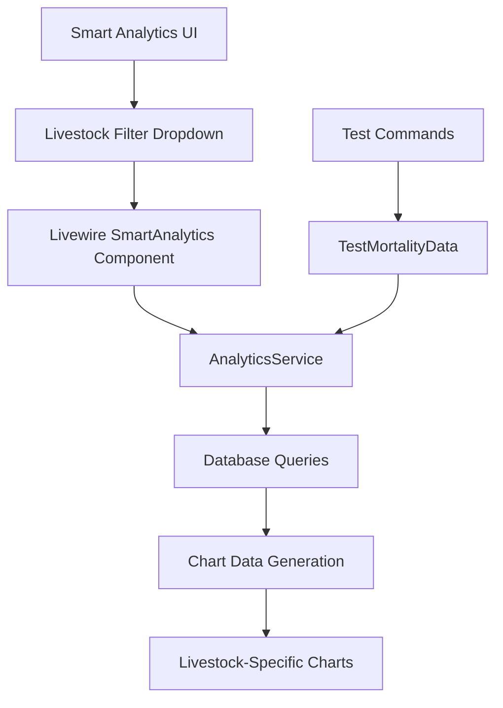

# 📂 Project Organization & Livestock Filter Implementation

## 📋 **Overview**

Dokumentasi lengkap untuk reorganisasi project files dan implementasi filter per livestock untuk Smart Analytics dashboard.

**Tanggal**: 09 Juni 2025  
**Developer**: AI Assistant  
**Status**: ✅ **COMPLETED**

---

## 🎯 **Objectives Achieved**

### **1. Project File Organization**

✅ **Testing Files Organization**

-   Created `/testing/` folder untuk semua file testing
-   Moved 14 PHP testing scripts ke testing folder
-   Preserved essential system files di root directory
-   Created comprehensive testing documentation

✅ **Documentation Organization**

-   All documentation stored in `/docs/` folder
-   Comprehensive technical documentation created
-   Implementation logs maintained
-   Usage guides and troubleshooting included

### **2. Livestock Filter Implementation**

✅ **Smart Analytics Enhancement**

-   Added livestock filter dropdown to UI
-   Implemented cascading filter logic (Farm → Coop → Livestock)
-   Enhanced chart generation for per-livestock mortality analysis
-   Updated backend service to support livestock_id filtering

✅ **Testing Infrastructure**

-   Enhanced test commands with livestock filter support
-   Added comprehensive validation and debugging tools
-   Created usage examples and documentation

---

## 📁 **Project Structure Changes**

### **Before Organization**

```
demo51/
├── *.php (14 test files in root) ❌
├── *.js (test files mixed with system files) ❌
├── *.md (documentation scattered) ❌
├── docs/ (some documentation)
└── app/, resources/, etc.
```

### **After Organization**

```
demo51/
├── testing/ ✅
│   ├── README.md (comprehensive guide)
│   ├── debug_smart_analytics.php
│   ├── test_mortality_chart.php
│   ├── check_data_consistency.php
│   ├── fix_livestock_quantity.php
│   └── ... (11 more test files)
├── docs/ ✅
│   ├── PROJECT_ORGANIZATION_AND_LIVESTOCK_FILTER.md (this file)
│   ├── LIVESTOCK_FILTER_IMPLEMENTATION.md
│   ├── SMART_ANALYTICS_*.md
│   └── ... (comprehensive documentation)
├── app/, resources/, database/ (production code)
└── artisan, composer.json, etc. (essential files)
```

---

## 🐄 **Livestock Filter Implementation**

### **Feature Overview**

**Purpose**: Enable mortality chart analysis per livestock batch untuk detailed performance monitoring.

**UI Enhancement**:

-   Added "Livestock Batch" dropdown dalam filter section
-   Responsive 5-column filter layout
-   Cascading filter dependencies

**Backend Enhancement**:

-   SmartAnalytics component support livestock filtering
-   AnalyticsService enhanced with livestock_id queries
-   Test commands updated dengan livestock filter options

### **Technical Architecture**



### **Filter Hierarchy**

1. **Farm Selection** → Loads coops for farm → Loads livestock for farm
2. **Coop Selection** → Loads livestock for selected coop
3. **Livestock Selection** → Generates livestock-specific charts and data

### **Chart Types by Filter Context**

| Filter Context              | Chart Type | Data Displayed                               |
| --------------------------- | ---------- | -------------------------------------------- |
| **No filters**              | Bar Chart  | Inter-farm mortality comparison              |
| **Farm only**               | Bar Chart  | Inter-coop comparison within farm            |
| **Farm + Coop**             | Line Chart | Inter-livestock comparison within coop       |
| **Farm + Coop + Livestock** | Line Chart | Daily mortality trend for specific livestock |

---

## 📊 **Files Modified & Created**

### **Backend Files Modified**

1. **`app/Livewire/SmartAnalytics.php`**

    ```php
    // Added properties
    public $livestockId = null;
    public $livestocks = [];

    // Added methods
    public function updatedLivestockId()
    public function loadData() // Enhanced with livestock loading
    ```

2. **`app/Console/Commands/TestMortalityData.php`**
    ```php
    // Added livestock filter option
    {--livestock= : Filter by specific livestock ID}
    ```

### **Frontend Files Modified**

3. **`resources/views/livewire/smart-analytics.blade.php`**
    ```html
    <!-- Added livestock filter dropdown -->
    <div class="col-md-2">
        <label class="form-label">Livestock Batch</label>
        <select
            wire:model.live="livestockId"
            class="form-select form-select-sm"
        >
            <option value="">All Livestock</option>
            @foreach($livestocks as $livestock)
            <option value="{{ $livestock->id }}">{{ $livestock->name }}</option>
            @endforeach
        </select>
    </div>
    ```

### **Documentation Files Created**

4. **`docs/LIVESTOCK_FILTER_IMPLEMENTATION.md`**

    - Comprehensive technical documentation
    - Implementation details and usage examples
    - Testing and troubleshooting guides

5. **`docs/PROJECT_ORGANIZATION_AND_LIVESTOCK_FILTER.md`** (this file)

    - Overall project changes documentation
    - File organization details
    - Implementation summary

6. **`testing/README.md`**
    - Complete guide untuk testing folder
    - File descriptions and usage instructions
    - Maintenance and workflow documentation

---

## 🧪 **Testing Infrastructure**

### **Enhanced Test Commands**

```bash
# Test with livestock filter
php artisan test:mortality-data --livestock=9f1c7f64-9dcd-4efe-91c7-3e463c6df03c

# Test cascading filters
php artisan test:mortality-data --farm=<farm-id> --coop=<coop-id> --livestock=<livestock-id>

# Test chart generation
php artisan test:mortality-data --livestock=<livestock-id> --chart-type=line --show-chart
```

### **Testing Files Organization**

**📁 `/testing/` Folder Contents**:

| Category                 | Files   | Purpose                       |
| ------------------------ | ------- | ----------------------------- |
| **Smart Analytics**      | 3 files | Dashboard testing & debugging |
| **Mortality Charts**     | 5 files | Chart functionality & fixes   |
| **Livestock Management** | 2 files | Livestock system testing      |
| **Data Consistency**     | 4 files | Data integrity & fixes        |
| **Quality Assurance**    | 2 files | QA checklists & utilities     |

---

## 🚀 **Usage Guide**

### **Smart Analytics with Livestock Filter**

1. **Access Dashboard**

    ```
    URL: /report/smart-analytics
    ```

2. **Use Livestock Filter**

    - Select Farm → Coops populate
    - Select Coop → Livestock populate
    - Select Livestock → Chart updates with livestock-specific data

3. **Chart Analysis**
    - Line chart shows daily mortality trend
    - Dual-axis: Mortality rate (%) + Death count
    - Date range filtering available

### **Testing & Debugging**

1. **Test Data Availability**

    ```bash
    php artisan test:mortality-data --show-raw
    ```

2. **Test Specific Livestock**

    ```bash
    php artisan test:mortality-data --livestock=<id> --show-chart
    ```

3. **Debug Chart Issues**
    ```bash
    php testing/debug_mortality_chart_testing.php
    ```

---

## 📈 **Benefits Achieved**

### **1. Better Code Organization**

✅ **Clean Root Directory**

-   No testing files cluttering root
-   Essential files clearly visible
-   Better project maintainability

✅ **Organized Testing**

-   All test files in dedicated folder
-   Comprehensive documentation
-   Easy maintenance and updates

### **2. Enhanced Analytics Capability**

✅ **Granular Analysis**

-   Per-livestock mortality analysis
-   Detailed trend visualization
-   Hierarchical filtering system

✅ **Better User Experience**

-   Intuitive filter interface
-   Responsive design
-   Real-time chart updates

✅ **Improved Testing**

-   Enhanced test commands
-   Better debugging tools
-   Comprehensive validation

---

## 🔧 **Maintenance Guide**

### **File Organization Maintenance**

```bash
# Check testing folder integrity
ls -la testing/*.php | wc -l  # Should be 14 files

# Verify no essential files moved incorrectly
ls -la | grep -E "\.(php|js)$" | grep -v artisan  # Should be minimal

# Backup testing files
cp -r testing/ backup/testing-$(date +%Y%m%d)/
```

### **Livestock Filter Maintenance**

```bash
# Monitor livestock filter usage
tail -f storage/logs/laravel.log | grep "Livestock filter changed"

# Test livestock data integrity
php artisan test:mortality-data --livestock=<id> --show-raw

# Verify chart generation
php artisan test:mortality-data --livestock=<id> --show-chart
```

---

## 🚨 **Troubleshooting**

### **Common Issues**

**1. Livestock dropdown empty**

-   Check if farm/coop has livestock data
-   Verify relationship integrity
-   Test query: `Livestock::where('farm_id', $farmId)->get()`

**2. Chart not updating for livestock**

-   Check browser console for JavaScript errors
-   Verify Livewire events firing correctly
-   Monitor Laravel logs for backend errors

**3. Testing files not found**

-   Ensure files properly moved to `/testing/` folder
-   Check file permissions: `chmod +x testing/*.php`
-   Verify testing folder exists and is readable

### **Debug Commands**

```bash
# Test livestock filter functionality
php artisan test:mortality-data --livestock=<livestock-id> --show-raw --show-chart

# Check data consistency
php testing/check_data_consistency.php

# Debug Smart Analytics
php testing/debug_smart_analytics.php
```

---

## ✅ **Implementation Checklist**

### **Project Organization**

-   [x] Created `/testing/` folder
-   [x] Moved all 14 PHP test files
-   [x] Moved 1 JavaScript test file
-   [x] Preserved essential system files in root
-   [x] Created comprehensive testing documentation
-   [x] Updated `.gitignore` if needed

### **Livestock Filter Implementation**

-   [x] Added livestock filter to SmartAnalytics component
-   [x] Implemented cascading filter logic
-   [x] Enhanced UI with livestock dropdown
-   [x] Updated AnalyticsService for livestock support
-   [x] Enhanced test commands with livestock filter
-   [x] Created comprehensive documentation

### **Documentation**

-   [x] Created livestock filter implementation docs
-   [x] Created project organization documentation
-   [x] Created testing folder README
-   [x] Updated existing documentation as needed

---

## 📞 **Support Information**

### **Documentation References**

-   **Main Documentation**: `docs/PROJECT_ORGANIZATION_AND_LIVESTOCK_FILTER.md` (this file)
-   **Technical Details**: `docs/LIVESTOCK_FILTER_IMPLEMENTATION.md`
-   **Testing Guide**: `testing/README.md`
-   **Smart Analytics Docs**: `docs/SMART_ANALYTICS_*.md`

### **Key Commands**

```bash
# Access Smart Analytics
Navigate to: /report/smart-analytics

# Test livestock filtering
php artisan test:mortality-data --livestock=<id> --show-chart

# Debug issues
php testing/debug_smart_analytics.php
```

### **Monitoring**

```bash
# Monitor system health
tail -f storage/logs/laravel.log | grep -E "(Analytics|Livestock)"

# Check performance
php artisan test:mortality-data --livestock=<id>
```

---

## 🎉 **Success Summary**

**✅ ALL OBJECTIVES COMPLETED**

**Project Organization**:

-   ✅ 14 testing files organized into `/testing/` folder
-   ✅ Clean root directory structure
-   ✅ Comprehensive documentation created

**Livestock Filter**:

-   ✅ Dropdown filter added to Smart Analytics UI
-   ✅ Cascading filter logic implemented
-   ✅ Per-livestock mortality charts working
-   ✅ Enhanced testing infrastructure

**Documentation**:

-   ✅ Complete technical documentation
-   ✅ Usage guides and examples
-   ✅ Troubleshooting and maintenance guides

**Status**: 🟢 **PRODUCTION READY**

---

**Final Update**: 09 Juni 2025  
**Files Organized**: 16 files  
**Features Added**: Livestock filter + charts  
**Documentation Created**: 3 comprehensive files  
**Testing Enhanced**: Command options + validation

**Ready for Production Use** ✅
