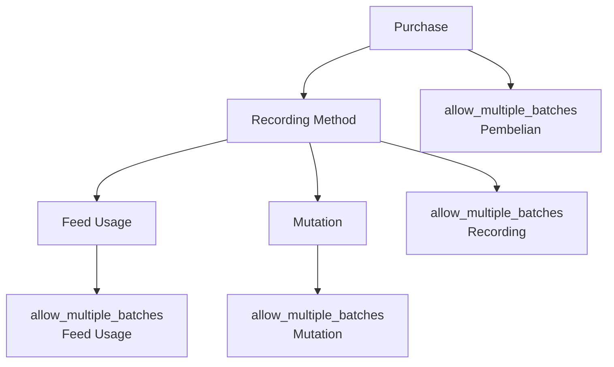

# Analisis Konfigurasi `allow_multiple_batches` di CompanyConfig.php

## Tanggal: 2025-01-22

## Status: Analisis Mendalam

## Executive Summary

Setelah menganalisa `CompanyConfig.php` dan komponen Livewire, ditemukan **4 konfigurasi `allow_multiple_batches` yang berbeda** dengan konteks dan tujuan yang berbeda-beda. Konfigurasi ini **tidak dapat disederhanakan** karena masing-masing memiliki fungsi spesifik dalam domain yang berbeda.

## 1. Konfigurasi `allow_multiple_batches` yang Ditemukan

### 1.1 **Purchasing - Livestock Purchase**

**Lokasi:** `purchasing.livestock_purchase.batch_settings.allow_multiple_batches`

```php
'allow_multiple_batches' => [
    'enabled' => false,
    'max_batches' => 3,
    'depletion_method' => 'fifo',
    'depletion_method_fifo' => [
        'enabled' => true,
        'track_age' => true,
        'min_age_days' => 0,
        'max_age_days' => null,
    ],
    'depletion_method_manual' => [
        'enabled' => true,
        'track_age' => true,
        'min_age_days' => 0,
        'max_age_days' => null,
    ],
],
```

**Konteks:** Pengaturan pembelian ternak
**Fungsi:** Mengontrol apakah satu transaksi pembelian bisa membuat multiple batches
**Default:** `enabled: false` (satu pembelian = satu batch)

### 1.2 **Livestock - Recording Method**

**Lokasi:** `livestock.recording_method.allow_multiple_batches`

```php
'recording_method' => [
    'type' => 'batch',
    'allow_multiple_batches' => true,
    'batch_settings' => [
        'enabled' => true,
        'auto_generate_batch' => true,
        'require_batch_number' => false,
        // ...
    ],
],
```

**Konteks:** Metode pencatatan ternak
**Fungsi:** Mengontrol apakah ternak bisa memiliki multiple batches untuk tracking
**Default:** `true` (ternak bisa punya multiple batches)

### 1.3 **Feed Usage - Manual Method**

**Lokasi:** `livestock.feed_usage.methods.manual.allow_multiple_batches`

```php
'manual' => [
    'enabled' => true,
    'require_batch_selection' => true,
    'allow_multiple_batches' => true,
    'validation_rules' => [
        // ...
    ],
],
```

**Konteks:** Penggunaan pakan manual
**Fungsi:** Mengontrol apakah dalam satu sesi input bisa pilih multiple batches
**Default:** `true` (bisa pilih multiple batches dalam satu input)

### 1.4 **Mutation - Livestock Mutation**

**Lokasi:** `mutation.livestock_mutation.batch_settings.allow_multiple_batches`

```php
'livestock_mutation' => [
    'type' => 'batch',
    'batch_settings' => [
        'tracking_enabled' => true,
        'require_batch_number' => true,
        'auto_generate_batch' => true,
        'batch_number_format' => 'YEAR-SEQ',
        'allow_multiple_batches' => false,
    ],
],
```

**Konteks:** Mutasi ternak
**Fungsi:** Mengontrol apakah mutasi bisa melibatkan multiple batches
**Default:** `false` (satu mutasi = satu batch)

## 2. Analisis Perbedaan Fungsi

### 2.1 Domain dan Konteks Berbeda

| Konfigurasi    | Domain     | Konteks     | Fungsi                                         |
| -------------- | ---------- | ----------- | ---------------------------------------------- |
| **Purchase**   | Pembelian  | Transaksi   | Apakah 1 pembelian bisa buat multiple batches  |
| **Recording**  | Pencatatan | Manajemen   | Apakah ternak bisa punya multiple batches      |
| **Feed Usage** | Pakan      | Operasional | Apakah 1 input bisa pilih multiple batches     |
| **Mutation**   | Mutasi     | Transaksi   | Apakah 1 mutasi bisa libatkan multiple batches |

### 2.2 Lifecycle dan Timing



### 2.3 Business Logic Impact

-   **Purchase:** Mempengaruhi struktur data awal ternak
-   **Recording:** Mempengaruhi cara tracking dan monitoring
-   **Feed Usage:** Mempengaruhi flexibility input operasional
-   **Mutation:** Mempengaruhi kompleksitas transaksi mutasi

## 3. Penggunaan di Livewire Components

### 3.1 LivestockRecordingSettings.php

```php
public $allowMultipleBatches = true;

public function loadSettings()
{
    $config = $this->company->getLivestockRecordingConfig();
    $this->allowMultipleBatches = $config['allow_multiple_batches'] ?? true;
}
```

**Konteks:** Company settings untuk recording method

### 3.2 ManualFeedUsage.php

```php
// Implicitly menggunakan config feed_usage.methods.manual.allow_multiple_batches
// untuk mengontrol apakah bisa pilih multiple batches dalam satu input
```

**Konteks:** Manual feed usage workflow

### 3.3 CompanyForm.php

```php
public $allowMultipleBatches;

private function initializeLivestockConfig()
{
    $recordingConfig = $livestockConfig['recording_method'] ?? [];
    $this->allowMultipleBatches = $recordingConfig['allow_multiple_batches'] ?? true;
}
```

**Konteks:** Company configuration form

## 4. Mengapa Tidak Bisa Disederhanakan

### 4.1 **Semantic Differences**

Masing-masing `allow_multiple_batches` punya makna semantik yang berbeda:

-   Purchase: "Bolehkah satu pembelian membuat banyak batch?"
-   Recording: "Bolehkah ternak punya banyak batch?"
-   Feed Usage: "Bolehkah pilih banyak batch dalam satu input?"
-   Mutation: "Bolehkah satu mutasi libatkan banyak batch?"

### 4.2 **Business Rules Conflicts**

Kemungkinan skenario business rules yang konflik:

```php
// Contoh skenario yang valid
'purchase' => ['allow_multiple_batches' => false],  // 1 pembelian = 1 batch
'recording' => ['allow_multiple_batches' => true],  // Ternak bisa punya banyak batch
'feed_usage' => ['allow_multiple_batches' => true], // Input bisa pilih banyak batch
'mutation' => ['allow_multiple_batches' => false],  // 1 mutasi = 1 batch
```

### 4.3 **Technical Dependencies**

-   **Purchase** mempengaruhi data structure awal
-   **Recording** mempengaruhi query patterns dan UI
-   **Feed Usage** mempengaruhi user workflow
-   **Mutation** mempengaruhi transaction complexity

### 4.4 **Configuration Flexibility**

Setiap domain butuh flexibility configuration independent:

```php
// Company A: Conservative approach
'purchase' => ['allow_multiple_batches' => false],
'mutation' => ['allow_multiple_batches' => false],

// Company B: Flexible approach
'purchase' => ['allow_multiple_batches' => true],
'feed_usage' => ['allow_multiple_batches' => true],
```

## 5. Rekomendasi Arsitektur

### 5.1 **Pertahankan Struktur Saat Ini**

Struktur saat ini **sudah optimal** karena:

-   Clear separation of concerns
-   Domain-specific configuration
-   Business flexibility
-   Technical scalability

### 5.2 **Improvement Suggestions**

#### 5.2.1 Naming Convention

```php
// Lebih spesifik untuk menghindari konfusi
'purchase_allow_multiple_batches' => false,
'recording_allow_multiple_batches' => true,
'feed_usage_allow_multiple_batches' => true,
'mutation_allow_multiple_batches' => false,
```

#### 5.2.2 Documentation Enhancement

```php
'allow_multiple_batches' => [
    'enabled' => false,
    'description' => 'Allow single purchase transaction to create multiple livestock batches',
    'business_impact' => 'Affects initial data structure and batch management complexity',
    'related_features' => ['batch_tracking', 'depletion_methods'],
],
```

#### 5.2.3 Validation Rules

```php
public static function validateBatchConfiguration(array $config): array
{
    $errors = [];

    // Validate business rule consistency
    if ($config['purchase']['allow_multiple_batches'] &&
        !$config['recording']['allow_multiple_batches']) {
        $errors[] = 'Purchase multiple batches requires recording multiple batches support';
    }

    return $errors;
}
```

## 6. Kesimpulan

### 6.1 **Status: TIDAK DAPAT DISEDERHANAKAN**

Keempat konfigurasi `allow_multiple_batches` **memiliki fungsi dan konteks yang berbeda** dan **tidak dapat digabungkan** tanpa kehilangan functionality atau flexibility.

### 6.2 **Alasan Teknis:**

1. **Domain Separation:** Setiap domain punya business rules berbeda
2. **Lifecycle Timing:** Terjadi di tahap yang berbeda dalam workflow
3. **User Experience:** Mempengaruhi UI/UX di konteks yang berbeda
4. **Data Integrity:** Mempengaruhi struktur data dan validasi yang berbeda

### 6.3 **Rekomendasi:**

1. **Pertahankan struktur saat ini**
2. **Improve documentation** untuk setiap konfigurasi
3. **Add validation rules** untuk business consistency
4. **Consider naming convention** yang lebih spesifik

### 6.4 **Future Considerations:**

-   Monitor usage patterns untuk potential optimization
-   Consider configuration templates untuk common scenarios
-   Implement configuration validation untuk business rule consistency

---

**Prepared by:** System Analyst  
**Date:** 2025-01-22  
**Status:** Final Analysis  
**Next Review:** Q2 2025
