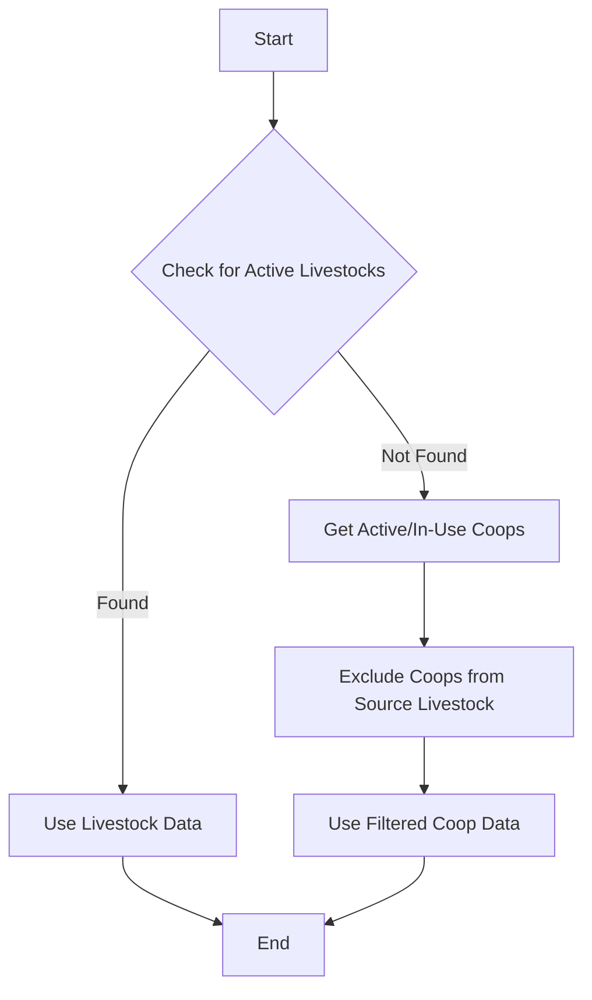
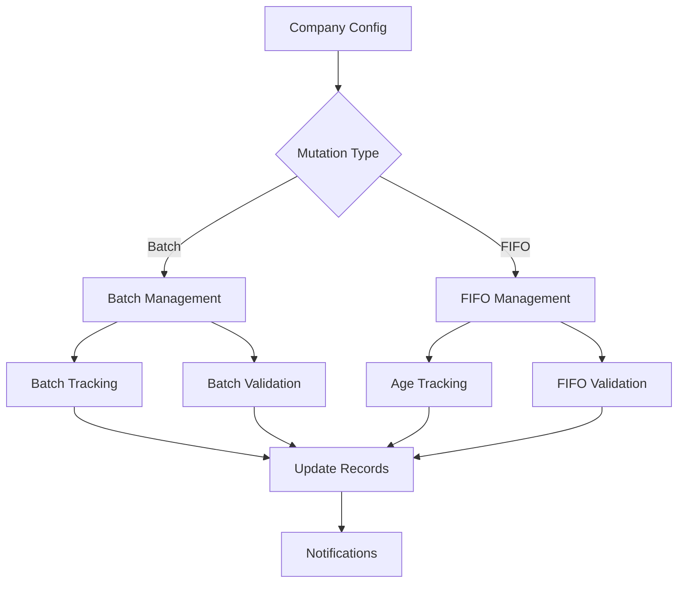
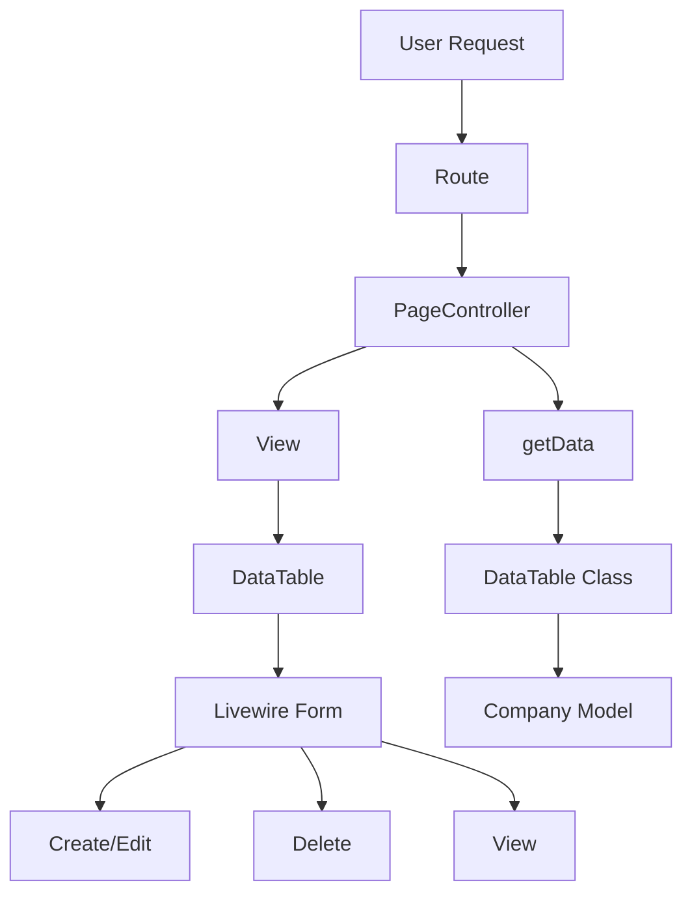
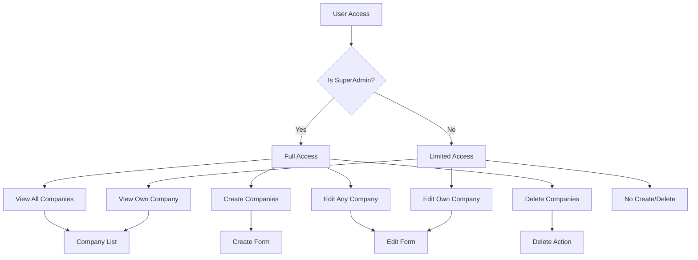
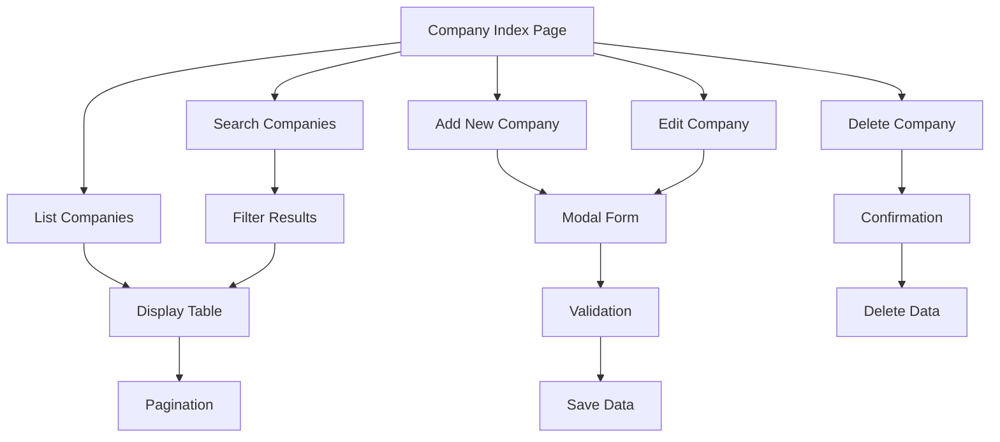
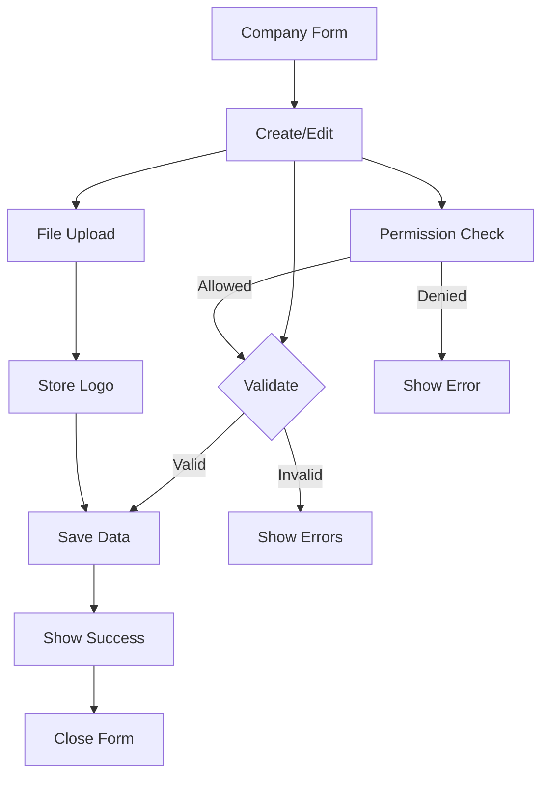
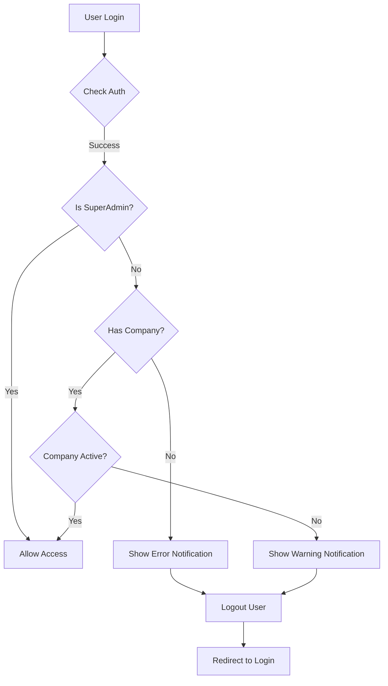
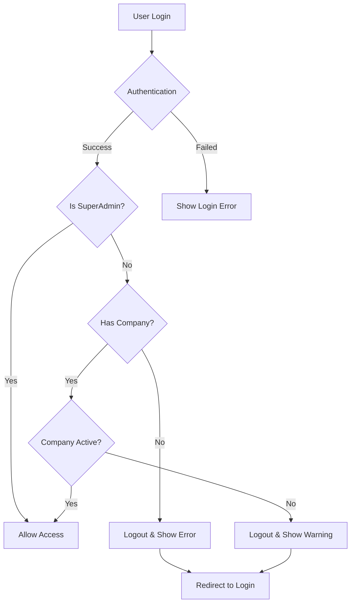
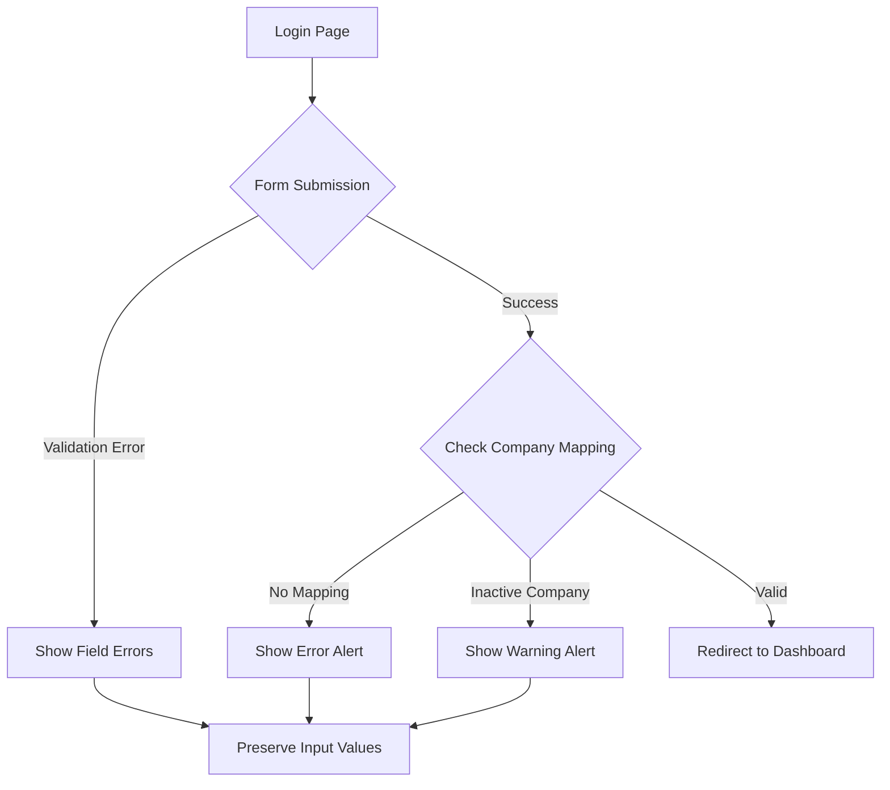

# Changelog

## [2024-03-19] - dstLivestocks Logic Update

### Changed

-   Updated `dstLivestocks` logic in `app/Livewire/MasterData/Livestock/Mutation.php` to:
    1. First try to get active livestocks (excluding cancelled and completed ones)
    2. If no livestocks are found, fall back to getting coops with status 'active' or 'in_use'
    3. When getting coop data, exclude coops that are already associated with the source livestock ($value)

### Diagram



### Technical Details

-   Added fallback logic to use coop data when no livestock data is available
-   Coop status filter includes both 'active' and 'in_use' states
-   Added exclusion logic to prevent selecting coops that are already associated with the source livestock
-   Maintains backward compatibility with existing livestock data usage

## [2024-03-19] Implementasi Konfigurasi Mutasi Livestock

## Deskripsi

Menambahkan sistem konfigurasi mutasi livestock yang fleksibel menggunakan model Company. Konfigurasi ini memungkinkan perusahaan untuk mengatur preferensi mutasi mereka, termasuk pengelolaan batch dan FIFO.

## Perubahan

1. Penambahan kolom mutation_config di tabel companies
2. Implementasi konfigurasi default untuk mutasi livestock
3. Integrasi konfigurasi dengan MutationService
4. Penambahan sistem notifikasi untuk mutasi

## Diagram Alur



## Technical Details

1. Konfigurasi Mutasi:

    ```json
    {
        "livestock_mutation": {
            "type": "batch",
            "batch_settings": {
                "tracking_enabled": true,
                "require_batch_number": true,
                "auto_generate_batch": true,
                "batch_number_format": "YEAR-SEQ"
            },
            "fifo_settings": {
                "enabled": true,
                "track_age": true,
                "min_age_days": 0
            },
            "validation_rules": {
                "require_weight": true,
                "require_quantity": true,
                "allow_partial_mutation": true
            },
            "notification_settings": {
                "notify_on_mutation": true,
                "notify_on_batch_completion": true
            }
        }
    }
    ```

2. Fitur Utama:

    - Konfigurasi per perusahaan
    - Dukungan multiple batch
    - Sistem FIFO otomatis
    - Validasi fleksibel
    - Notifikasi real-time

3. Keuntungan:
    - Fleksibilitas konfigurasi
    - Tracking yang lebih baik
    - Manajemen batch yang terstruktur
    - Notifikasi real-time
    - Validasi yang dapat disesuaikan

## Cara Penggunaan

1. Konfigurasi dapat diatur melalui API atau interface admin
2. Setiap perusahaan dapat memiliki konfigurasi berbeda
3. Konfigurasi dapat diubah kapan saja
4. Perubahan konfigurasi tidak mempengaruhi data historis

## Best Practices

1. Selalu gunakan konfigurasi default sebagai fallback
2. Validasi konfigurasi sebelum menyimpan
3. Log semua perubahan konfigurasi
4. Backup konfigurasi secara berkala
5. Test konfigurasi baru di environment staging

## [2024-03-19] - Company Management PageController Refactoring

### Added

-   Created new PageController for Company management
-   Implemented DataTable for better data handling
-   Added centralized page management

### Changes

-   Refactored Company management to use PageController pattern
-   Moved from direct Livewire component to controller-based approach
-   Implemented DataTable for better data presentation and handling
-   Updated routes to use new controller structure

### Technical Details

-   New Files:
    -   `app/Http/Controllers/Pages/CompanyController.php`
    -   `app/DataTables/CompanyDataTable.php`
    -   `resources/views/pages/company/list.blade.php`
-   Updated Files:
    -   `routes/web.php`
-   Removed Files:
    -   `app/Livewire/Company/CompanyIndex.php`
    -   `resources/views/livewire/company/index.blade.php`

### Diagram



## [2024-03-19] - Role-Based Access Control for Company Management

### Added

-   Implemented role-based access control for Company management
-   Added permission checks for SuperAdmin and regular users
-   Added error messages for unauthorized actions

### Changes

-   Modified CompanyIndex component to filter companies based on user role
-   Updated UI to show/hide actions based on user permissions
-   Added permission checks for create, edit, and delete operations

### Technical Details

-   SuperAdmin can:
    -   View all companies
    -   Create new companies
    -   Edit any company
    -   Delete companies
-   Regular users can:
    -   View only their assigned company
    -   Edit only their assigned company
    -   Cannot create or delete companies

### Diagram



## [2024-03-19] - Company Management UI Implementation

### Added

-   Created new Livewire component `CompanyIndex` for managing companies
-   Implemented modern UI with Tailwind CSS for company management
-   Added features:
    -   Company listing with search functionality
    -   Create new company with form validation
    -   Edit existing company details
    -   Delete company with confirmation
    -   File upload for company logo
    -   Status management (active/inactive)
    -   Pagination support
    -   Flash messages for user feedback

### Technical Details

-   Component Location: `app/Livewire/Company/CompanyIndex.php`
-   View Location: `resources/views/livewire/company/index.blade.php`
-   Route: `/companies` (named: `companies.index`)

### UI Features

-   Responsive design
-   Modal forms for create/edit operations
-   Search functionality
-   Image preview for company logos
-   Status indicators
-   Confirmation dialogs for delete operations
-   Form validation with error messages
-   Flash notifications

### Diagram



## [2024-03-19] - Company Form Livewire Component

### Added

-   Created new Livewire component for company form
-   Implemented form validation and error handling
-   Added file upload for company logo
-   Added role-based access control for form actions

### Changes

-   Separated form logic from list view
-   Implemented proper form state management
-   Added validation rules for all fields
-   Added permission checks for create/edit/delete operations

### Technical Details

-   New Files:
    -   `app/Livewire/Company/CompanyForm.php`
    -   `resources/views/livewire/company/form.blade.php`
-   Features:
    -   Form validation
    -   File upload handling
    -   Role-based access control
    -   Error messages
    -   Success notifications
    -   Form state management

### Diagram



## [2024-03-19] - CompanyUser Model Refactoring and Notification Improvements

### Added

-   New methods in CompanyUser model for user mapping checks
-   Enhanced notification system with different types (error/warning)
-   Improved error messages with titles and descriptions
-   Company status check in middleware

### Changes

-   Refactored CompanyUser model with new utility methods
-   Updated CheckCompanyUser middleware to use new model methods
-   Enhanced login view with better error notifications
-   Added company status validation

### Technical Details

-   Updated Files:
    -   `app/Models/CompanyUser.php`
    -   `app/Http/Middleware/CheckCompanyUser.php`
    -   `resources/views/auth/login.blade.php`
-   New Features:
    -   `isUserMapped()` - Check if user is mapped to a company
    -   `getUserMapping()` - Get user's company mapping
    -   `isCompanyAdmin()` - Check if user is company admin
    -   `getUserCompanies()` - Get all companies for user
    -   Enhanced error notifications with icons and styling
    -   Company status validation

### Diagram



## [2024-03-19] - Login Process Improvements

### Added

-   Immediate company mapping check after login
-   Enhanced session handling
-   Proper error handling for unmapped users
-   Company status validation during login

### Changes

-   Updated login controller to check company mapping
-   Improved session management
-   Enhanced error handling
-   Better user experience flow

### Technical Details

-   Updated Files:
    -   `app/Http/Controllers/Auth/AuthenticatedSessionController.php`
-   New Features:
    -   Immediate company mapping validation
    -   Session cleanup for invalid users
    -   Clear error messages
    -   Proper redirection handling

### Diagram



## [2024-03-19] - Login Page Refactoring

### Added

-   Enhanced error notifications in login page
-   Form validation error messages
-   Old input value preservation
-   Metronic theme compatible alerts

### Changes

-   Updated login page to use existing template
-   Improved error message styling
-   Added validation feedback
-   Enhanced user experience

### Technical Details

-   Updated Files:
    -   `resources/views/pages/auth/login.blade.php`
-   New Features:
    -   Styled error notifications with icons
    -   Form validation error messages
    -   Input value persistence
    -   Metronic theme integration
    -   Responsive alert design

### Diagram



## [Unreleased]

### Added

-   Production environment checks for console logs in:
    -   `sidebar-collapse.js`
    -   Master blade files
    -   Feed purchases draw scripts
    -   DataTables
    -   Livestock purchases index page
    -   SSE notification system
    -   Supply Purchase DataTable
-   New logging utility for environment-aware logging
-   Enhanced notification system with multiple fallback methods
-   Advanced DataTable refresh functionality with timeout protection
-   Global Livewire event listeners for livestock purchase notifications
-   Keyboard shortcuts for testing notifications (Ctrl+Shift+P, Ctrl+Shift+L)

### Changed

-   Refactored `sidebar-collapse.js` to hide logs in production
-   Replaced all `console.log` calls with new logging utility
-   Enhanced notification handling in livestock purchases page
-   Improved DataTable refresh mechanism with multiple fallback methods
-   Updated SSE notification system to respect production environment
-   Removed deprecated polling notification system
-   Cleaned up unused code and comments
-   Refactored Supply Purchase DataTable to hide logs in production
-   Updated Supply Purchase DataTable notification system to use environment-aware logging

### Technical Details

-   Implemented meta tag check for production environment
-   Added conditional logging based on environment
-   Preserved critical warnings and error logs in all environments
-   Enhanced notification system with multiple delivery methods:
    -   Global notification function
    -   Toastr notifications
    -   Browser notifications
    -   SweetAlert notifications
    -   Custom HTML notifications
-   Added robust DataTable refresh mechanism with:
    -   Laravel DataTables support
    -   jQuery DataTable API support
    -   Livewire component refresh
    -   Page reload fallback
-   Implemented timeout protection for DataTable refreshes
-   Added comprehensive error handling and logging
-   Enhanced Supply Purchase DataTable with:
    -   Production environment-aware logging
    -   Real-time notification integration
    -   Multiple DataTable refresh methods
    -   Fallback notification system

### Security

-   Console logs are now hidden in production environment
-   Debug information is only available in development
-   Critical warnings remain visible in all environments
-   Enhanced error handling and logging for better security
-   Supply Purchase DataTable logs are now environment-aware
