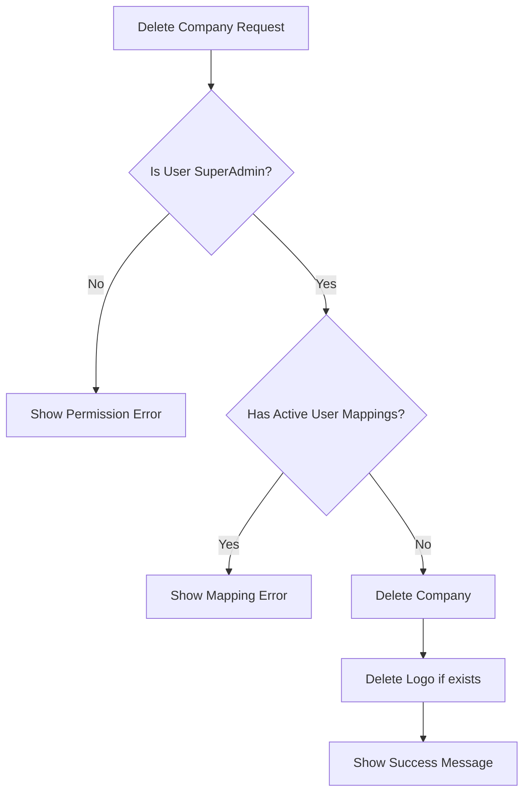

# Company Management Documentation

## Changes Log

### 2024-03-19 15:30:00 - Company Deletion Validation

#### Changes Made

-   Added validation to prevent deletion of companies with active user mappings
-   Modified `delete()` method in `CompanyForm.php` to check for existing user mappings

#### Technical Details

-   Added check using `CompanyUser::where('company_id', $id)->where('status', 'active')->exists()`
-   Returns error message if active mappings exist
-   Only allows deletion if no active mappings are found

#### Impact

-   Prevents accidental deletion of companies with active users
-   Maintains data integrity by ensuring no orphaned user records
-   Improves user experience by providing clear error messages

#### Diagram

