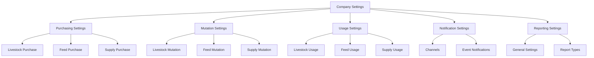

# Company Settings Implementation

Date: 2024-03-19 15:30:00

## Overview

The company settings implementation provides a centralized configuration system for managing various aspects of the application, including purchasing, mutation, usage, notifications, and reporting settings.

## Components

### 1. CompanyConfig Class

Location: `app/Config/CompanyConfig.php`
Purpose: Defines the default configuration structure and provides methods to access configuration settings.

### 2. CompanySettings Livewire Component

Location: `app/Livewire/Company/CompanySettings.php`
Purpose: Handles the UI logic for managing company settings, including loading and saving settings.

### 3. Company Settings View

Location: `resources/views/livewire/company/company-settings.blade.php`
Purpose: Provides the user interface for managing company settings.

## Configuration Sections

### 1. Purchasing Settings

-   **Livestock Purchase**

    -   Enable/disable livestock purchase
    -   Validation rules (farm, kandang, breed, supplier)
    -   Batch settings (tracking, batch number, multiple batches)
    -   Document settings (DO number, invoice, receipt)
    -   Approval settings (levels, requirements)

-   **Feed Purchase**

    -   Enable/disable feed purchase
    -   Validation rules (supplier, price, quantity)
    -   Batch settings (tracking, batch number)

-   **Supply Purchase**
    -   Enable/disable supply purchase
    -   Validation rules (supplier, price, quantity)
    -   Batch settings (tracking, batch number)

### 2. Mutation Settings

-   **Livestock Mutation**

    -   Mutation type (batch/FIFO)
    -   Batch settings (tracking, batch number, multiple batches)
    -   FIFO settings (age tracking, min/max age)
    -   Validation rules (weight, quantity, partial mutation)

-   **Feed Mutation**

    -   Batch settings (tracking, batch number)
    -   Validation rules (quantity, partial mutation)

-   **Supply Mutation**
    -   Batch settings (tracking, batch number)
    -   Validation rules (quantity, partial mutation)

### 3. Usage Settings

-   **Livestock Usage**

    -   Enable/disable livestock usage
    -   Validation rules (farm, kandang, breed)
    -   Batch settings (tracking, batch number)

-   **Feed Usage**

    -   Enable/disable feed usage
    -   Validation rules (farm, kandang, feed)
    -   Batch settings (tracking, batch number)

-   **Supply Usage**
    -   Enable/disable supply usage
    -   Validation rules (farm, kandang, supply)
    -   Batch settings (tracking, batch number)

### 4. Notification Settings

-   **Channels**

    -   Email notifications
    -   Database notifications
    -   Broadcast notifications

-   **Event Notifications**
    -   Purchase events
    -   Mutation events
    -   Usage events

### 5. Reporting Settings

-   **General Settings**

    -   Default period (daily/weekly/monthly/quarterly/yearly)
    -   Auto-generate reports

-   **Report Types**
    -   Purchase reports
    -   Mutation reports
    -   Usage reports

## UI/UX Improvements

1. Card-based layout for better organization
2. Form controls using Metronic theme
3. Real-time updates with Livewire
4. Success notifications using SweetAlert2
5. Responsive design for all screen sizes

## Future Improvements

1. Add validation rules for numeric inputs
2. Implement role-based access control
3. Add audit logging for settings changes
4. Implement settings import/export functionality
5. Add settings templates for quick configuration

## Diagram

## Latest Updates (2024-03-21)

1. Added comprehensive purchasing settings for livestock, feed, and supply
2. Implemented detailed mutation settings with batch and FIFO options
3. Added usage settings for livestock, feed, and supply
4. Enhanced notification settings with event-specific configurations
5. Improved reporting settings with report type options
6. Updated UI with better organization and validation
7. Added documentation with diagrams and future improvements

## Latest Updates (2024-06-13)

-   Refactored `CompanyConfig` untuk memisahkan default template config (semua kemungkinan config, termasuk yang belum siap) dan active config (hanya config yang boleh dipakai user/sistem).
-   Menambahkan method `getDefaultTemplateConfig()` dan `getDefaultActiveConfig()`.
-   Semua UI dan logic hanya menggunakan active config.
-   Field config yang belum siap tidak ditampilkan/diizinkan di UI maupun backend.
-   Perbaikan maintainability, keamanan, dan future-proofing.
