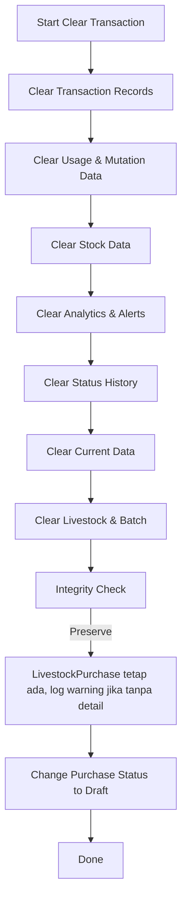

# [2025-06-24] Perbaikan Fitur Clear Transaction: Livestock Purchase Tidak Terhapus

## Ringkasan

Pada proses clear transaction sebelumnya, data pembelian ternak (`livestock_purchases` dan `livestock_purchase_items`) ikut terhapus jika tidak memiliki detail, akibat urutan eksekusi yang menyebabkan semua detail hilang setelah batch/ternak dihapus. Hal ini menyebabkan kehilangan data pembelian yang seharusnya dipertahankan.

## Root Cause

-   Setelah semua livestock & batch dihapus, seluruh LivestockPurchase tidak punya detail.
-   Proses integrity check menghapus LivestockPurchase yang dianggap "empty".
-   Akibatnya, seluruh data pembelian ternak hilang.

## Solusi

-   **Blok penghapusan LivestockPurchase yang empty dihapus.**
-   **Diganti dengan log warning saja, data tetap dipertahankan.**
-   **Status pembelian tetap diubah ke draft sesuai requirement.**

## Improvement Lain

-   Menambah log warning jika ditemukan LivestockPurchase tanpa detail, untuk monitoring data integrity.
-   Menyesuaikan summary preview agar menampilkan info preserved, bukan deleted.
-   Review seluruh proses agar tidak ada penghapusan data pembelian ternak di step manapun.

## Diagram Alur (Sesudah Perbaikan)

## Log Perubahan

-   [2025-06-24] Memperbaiki bug penghapusan data pembelian ternak pada fitur clear transaction.
-   Blok penghapusan LivestockPurchase "empty" dihapus, diganti dengan log warning.
-   Data pembelian ternak sekarang selalu dipertahankan, hanya status yang diubah ke draft.
-   Menambah log warning jika ditemukan LivestockPurchase tanpa detail.
-   Menambah proteksi: orphaned LivestockPurchaseItem juga tidak dihapus, hanya di-log warning.
-   Menyesuaikan summary preview dan dokumentasi.

---

**Status:** Production Ready, Robust, dan Future Proof.
