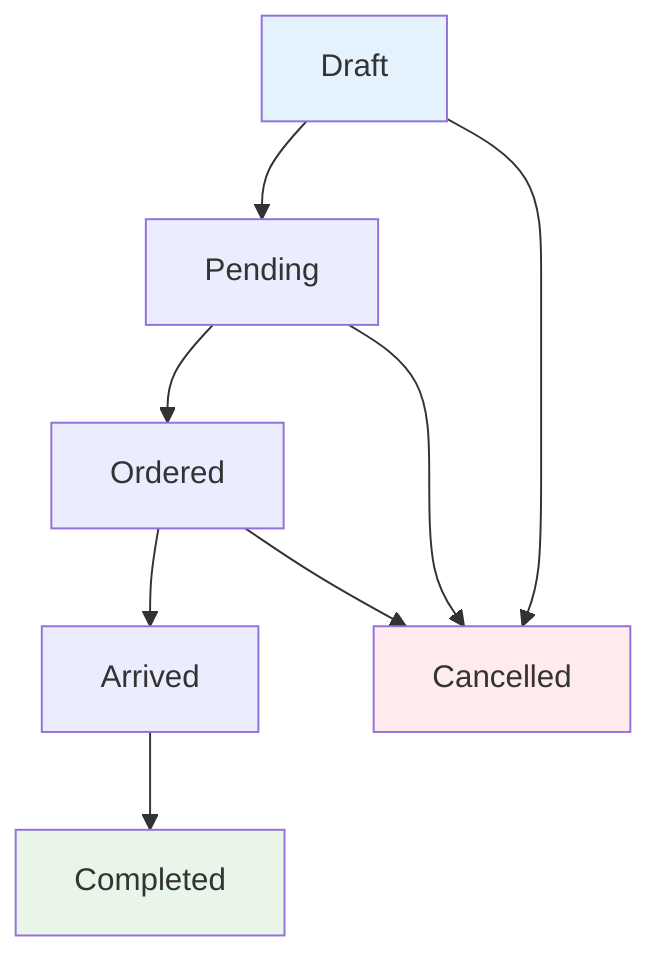

# Feed Purchase Status Permission Refactor

## Tanggal: {{ now()->format('Y-m-d H:i:s') }}

## Deskripsi

Refaktor logika permission status pada Feed Purchase DataTable untuk mengatur hak akses berdasarkan role user (Operator vs Supervisor) dan status transaksi.

## Masalah Sebelumnya

-   Operator tidak bisa mengubah status sama sekali jika status bukan draft
-   Logika permission terlalu rigid dan tidak sesuai dengan workflow bisnis
-   Status draft seharusnya bisa diubah oleh Operator

## Solusi Yang Diterapkan

### Permission Rules Baru:

#### **Role Operator:**

-   **Status Draft**: ✅ Dapat mengubah status ke: draft, pending, ordered
-   **Status Selain Draft**: ❌ Readonly (disabled), tidak bisa mengubah status
-   **Status Completed**: 👀 Hanya bisa melihat jika status sudah completed

#### **Role Supervisor:**

-   **Semua Status**: ✅ Dapat mengubah status (kecuali completed dan cancelled)
-   **Status Completed/Cancelled**: ❌ Readonly (disabled)

### Kode Yang Diubah

```php
// Operator special rules: dapat mengubah status jika status = draft
$isOperator = in_array('Operator', $userRole);
$isSupervisor = in_array('Supervisor', $userRole);

// Allow Operators to see 'completed' status if it's already set OR if they're Supervisor
$canSeeCompleted = $isSupervisor || ($currentStatus === 'completed' && $isOperator);

// Operator dapat mengubah status hanya jika status = draft
// Supervisor dapat mengubah semua status kecuali cancelled dan completed
$selectDisabled = '';
if ($isOperator && $currentStatus !== 'draft') {
    $selectDisabled = 'disabled';
} elseif ($currentStatus === 'completed' || $currentStatus === 'cancelled') {
    $selectDisabled = 'disabled';
}

// Logic untuk disable option berdasarkan role dan status
if ($isOperator && $currentStatus === 'draft') {
    // Operator dengan status draft hanya bisa pilih draft/pending/ordered
    if (!in_array($value, ['draft', 'pending', 'ordered'])) {
        $optionDisabled = 'disabled';
        $optionStyle = 'style="background-color: #f5f5f5; color: #999;"';
    }
}
```

## Workflow Transaksi



### Hak Akses Per Status:

| Status    | Operator                        | Supervisor                   |
| --------- | ------------------------------- | ---------------------------- |
| Draft     | ✅ Edit (draft/pending/ordered) | ✅ Edit                      |
| Pending   | ❌ Readonly                     | ✅ Edit                      |
| Ordered   | ❌ Readonly                     | ✅ Edit                      |
| Arrived   | ❌ Readonly                     | ✅ Edit (hanya ke completed) |
| Completed | 👀 View only                    | ❌ Readonly                  |
| Cancelled | ❌ Readonly                     | ❌ Readonly                  |

## Testing Scenarios

### Operator dengan Status Draft:

-   [x] Dapat melihat dropdown status
-   [x] Dapat memilih: draft, pending, ordered
-   [x] Tidak dapat memilih: arrived, completed, cancelled (disabled + grey)

### Operator dengan Status Pending/Ordered/Arrived:

-   [x] Dropdown disabled (readonly)
-   [x] Hanya menampilkan status saat ini

### Supervisor:

-   [x] Dapat mengubah semua status kecuali completed/cancelled
-   [x] Status completed/cancelled readonly

## File Yang Diubah

-   `app/DataTables/FeedPurchaseDataTable.php` - Line 59-95 (editColumn status)

## Benefits

1. **Workflow yang jelas**: Operator dapat mengelola transaksi draft sesuai kebutuhan
2. **Security**: Status lanjutan tetap dikontrol oleh Supervisor
3. **User Experience**: Interface yang lebih intuitif dengan visual disabled yang jelas
4. **Audit Trail**: Permission yang terdokumentasi dengan baik

## Future Enhancements

-   Tambah notification saat Operator mencoba mengubah status yang tidak diizinkan
-   Log activity untuk perubahan status
-   Real-time update status ke semua user yang sedang melihat transaksi yang sama

## Bug Fix: JavaScript Event Delegation

### Masalah

Setelah DataTable di-refresh atau re-render, dropdown status tidak bisa diklik/diubah karena event listener hanya terikat pada elemen yang ada saat halaman pertama kali dimuat.

### Solusi

Mengubah dari direct event listener ke **event delegation** menggunakan jQuery:

```javascript
// SEBELUM (tidak bekerja setelah DataTable refresh)
document.querySelectorAll('[data-kt-action="update_status"]')
    .forEach(function (element) {
        element.addEventListener("change", function (e) { ... });
    });

// SESUDAH (bekerja dengan dynamic content)
$(document).on('change', '[data-kt-action="update_status"]', function(e) {
    // Event handler logic tetap sama
});
```

### Manfaat Event Delegation

1. **Dynamic Content Support**: Event bekerja pada elemen yang ditambah setelah halaman dimuat
2. **DataTable Compatibility**: Tidak terpengaruh refresh/reload DataTable
3. **Performance**: Hanya satu event listener di document level
4. **Maintenance**: Tidak perlu re-bind event setiap kali content berubah

### File Yang Diubah

-   `resources/views/pages/transaction/feed-purchases/_draw-scripts.js` - Line 21-48

---

**Author:** System  
**Review:** Pending  
**Status:** Implemented
