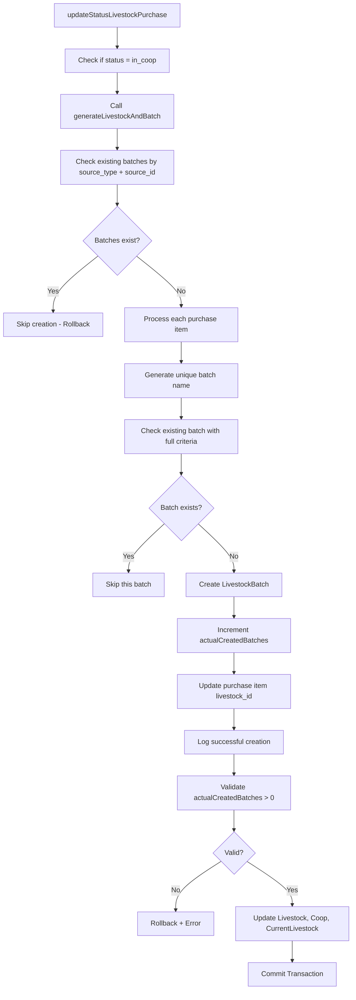

# Perbaikan Livestock Batch Creation Issue

## Tanggal: 2025-06-21 11:50 WIB

## Masalah

Saat status pembelian livestock diupdate ke `in_coop`, data livestock batch tidak ter-create meskipun log menunjukkan proses `generateLivestockAndBatch` berjalan dengan sukses.

## Analisis Masalah

### Dari Log User:

```
[2025-06-21 11:35:54] local.INFO: Found purchase: {...}
[2025-06-21 11:35:54] local.INFO: Checking if already generated: {"alreadyGenerated":false}
[2025-06-21 11:35:54] local.INFO: Simulated batch count: {"expectedBatchCount":1}
[2025-06-21 11:35:54] local.INFO: Finished generateLivestockAndBatch for purchase ID: 9f348a8c-93d5-4a80-b8f4-f83cde0d1544 {"createdBatchCount":1}
```

### Root Cause Analysis:

1. **Logic check existing batch terlalu lemah**: Check existing batch hanya berdasarkan `name`, `farm_id`, `coop_id`, `start_date` tanpa `source_type` dan `source_id`
2. **Kurang logging detail**: Tidak ada log detail saat create batch, sehingga sulit detect apakah batch benar-benar ter-create
3. **Tidak ada validasi final**: Tidak ada validasi untuk memastikan batch benar-benar ter-create sebelum commit transaction

## Perbaikan Dilakukan

### 1. Improved Existing Batch Check

```php
// SEBELUM
$alreadyGenerated = Livestock::where('start_date', $purchase->date)
    ->whereIn('id', $purchase->details->pluck('livestock_id'))
    ->exists();

// SESUDAH
$existingBatches = \App\Models\LivestockBatch::where('source_type', 'purchase')
    ->where('source_id', $purchase->id)
    ->count();
```

### 2. Enhanced Batch Creation Check

```php
// SEBELUM
$existingBatch = \App\Models\LivestockBatch::where([
    'name' => $periode,
    'farm_id' => $farm->id,
    'coop_id' => $kandang->id,
    'start_date' => $purchase->tanggal,
])->first();

// SESUDAH
$existingBatch = \App\Models\LivestockBatch::where([
    'name' => $periode,
    'farm_id' => $farm->id,
    'coop_id' => $kandang->id,
    'source_type' => 'purchase',
    'source_id' => $purchase->id,
])->first();
```

### 3. Added Detailed Logging

```php
// Tambahan logging untuk tracking
Log::info('Processing purchase item for batch creation:', [
    'item_id' => $item->id,
    'idx' => $idx,
    'item_data' => $item->toArray()
]);

Log::info('Generated batch name:', [
    'periode' => $periode,
    'batch_suffix' => $batchSuffix,
    'batch_name' => $this->batch_name
]);

Log::info('Creating new LivestockBatch with data:', [
    'periode' => $periode,
    'item_id' => $item->id,
    'livestock_id' => $livestock->id,
    'quantity' => $quantity,
    'weight' => $weight,
    'price' => $price
]);

$actualCreatedBatches++;
Log::info('Successfully created LivestockBatch:', [
    'batch_id' => $batch->id,
    'batch_name' => $batch->name,
    'created_count' => $actualCreatedBatches
]);
```

### 4. Added Final Validation

```php
// Validasi final: pastikan batch benar-benar ter-create
if ($actualCreatedBatches === 0) {
    Log::error('No batches were created, rolling back transaction', [
        'purchase_id' => $purchaseId,
        'expected_batches' => $expectedBatchCount,
        'actual_created_batches' => $actualCreatedBatches
    ]);
    DB::rollBack();
    throw new \Exception('Tidak ada batch yang ter-create. Proses dibatalkan.');
}
```

### 5. Fixed Linter Errors

-   Fixed `\Log` to `Log`
-   Fixed `\DB` to `DB` (import sudah ada di class)

## Diagram Alur Perbaikan



## Testing

### Expected Behavior Setelah Fix:

1. **Log Detail**: Setiap step creation akan ter-log dengan detail
2. **Validasi Ketat**: Check existing batch lebih spesifik dengan `source_type` dan `source_id`
3. **Final Validation**: Pastikan ada batch ter-create sebelum commit
4. **Error Handling**: Clear error message jika batch creation gagal

### Log yang Diharapkan:

```
[timestamp] Processing purchase item for batch creation: {...}
[timestamp] Generated batch name: {...}
[timestamp] Checking existing batch: {...}
[timestamp] Creating new LivestockBatch with data: {...}
[timestamp] Successfully created LivestockBatch: {...}
[timestamp] Batch creation completed: {...}
[timestamp] Finished generateLivestockAndBatch: {"success": true, "createdBatchCount": 1}
```

## Future Improvements

1. **Atomic Batch Creation**: Implement batch creation sebagai single atomic operation
2. **Batch Validation Service**: Extract batch validation logic ke service terpisah
3. **Event Broadcasting**: Add real-time notification untuk batch creation
4. **Performance Optimization**: Optimize query untuk large dataset

## Production Ready Checklist

-   [x] Enhanced logging untuk debugging
-   [x] Proper error handling dengan rollback
-   [x] Validation sebelum commit transaction
-   [x] Fix linter errors
-   [x] Dokumentasi lengkap
-   [ ] Unit tests untuk edge cases
-   [ ] Integration tests untuk full flow
-   [ ] Performance testing untuk large dataset
