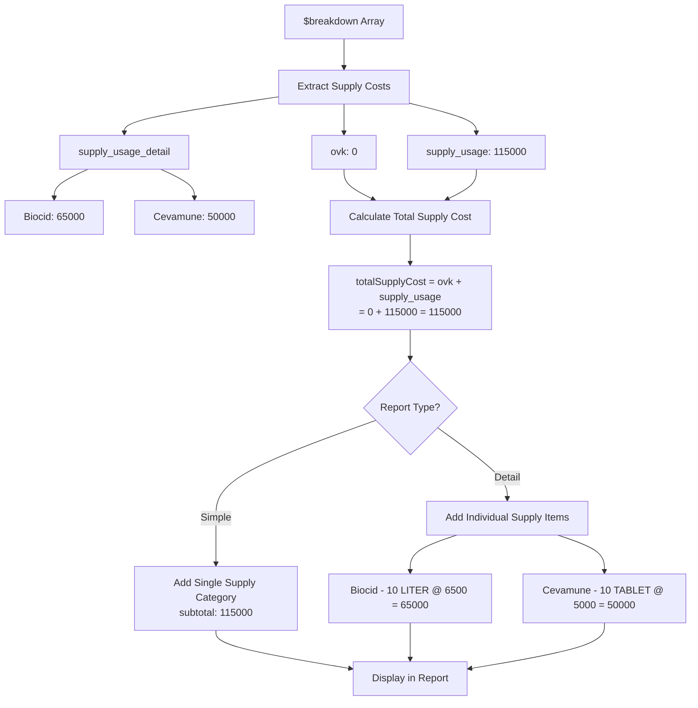
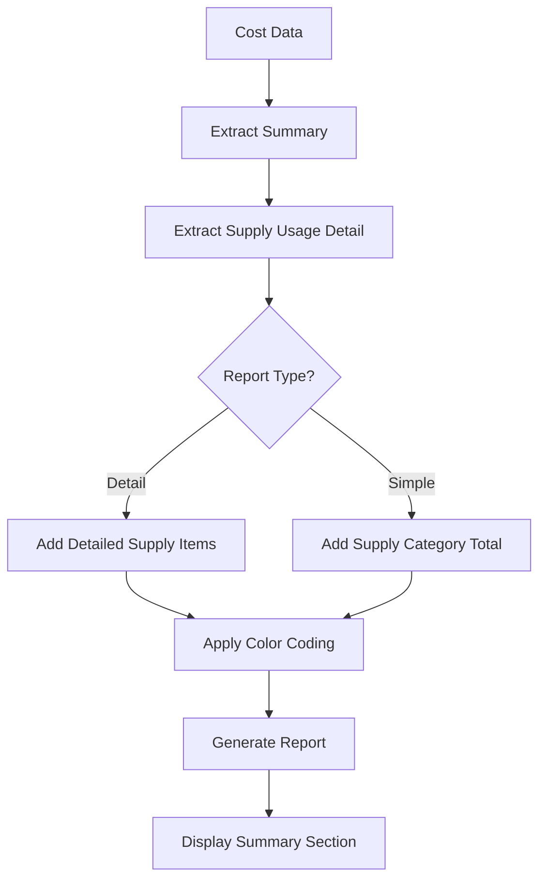

# Refactoring Laporan Biaya Ayam - Supply/OVK Cost Integration

**Tanggal:** 14 Desember 2025  
**Waktu:** 13:30 WIB  
**Versi:** 2.0

## Overview

Melakukan refactoring pada laporan biaya ayam (`livestock-cost.blade.php`) untuk menampilkan data biaya supply/OVK dengan lebih baik, baik untuk mode simple maupun detail.

## Perubahan yang Dilakukan

### 1. Template View (`resources/views/pages/reports/livestock-cost.blade.php`)

#### Penambahan CSS Classes

```css
.supply-highlight {
    background-color: #f0f8ff;
}
.ovk-highlight {
    background-color: #fff0f5;
}
.feed-highlight {
    background-color: #f0fff0;
}
.deplesi-highlight {
    background-color: #fff5ee;
}
.initial-purchase-highlight {
    background-color: #e8f4fd;
}
```

#### Perubahan Header Tabel

-   Menambah kolom "BIAYA KUMULATIF PER AYAM"
-   Mengubah "TOTAL BIAYA" menjadi "TOTAL BIAYA HARIAN"
-   Menambah kolom "BIAYA PER AYAM" untuk biaya harian

#### Penambahan Color Coding

-   **Supply** (termasuk OVK & Supply Usage): Biru muda (`#f0f8ff`)
-   **Pakan**: Hijau muda (`#f0fff0`)
-   **Deplesi**: Orange muda (`#fff5ee`)
-   **Initial Purchase**: Biru (`#e8f4fd`)

#### Ringkasan Biaya Harian

Menambahkan section ringkasan untuk mode detail yang menampilkan:

-   Biaya Pakan Harian
-   Biaya Supply Harian (gabungan OVK + Supply Usage)
-   Biaya Deplesi Harian
-   Total Biaya Harian
-   Biaya Per Ayam Harian

### 2. Controller (`app/Http/Controllers/ReportsController.php`)

#### Penambahan Data Cost Per Ayam

```php
'daily_cost_per_ayam' => $summary['daily_added_cost_per_chicken'] ?? 0,
```

#### Perbaikan Supply Detail

-   Menggabungkan OVK dan Supply Usage menjadi satu kategori "Supply"
-   Menghapus kondisi `if ($supplyUsageCost > 0)` untuk memastikan semua supply ditampilkan
-   Mengubah kategori dari 'Supply Usage' menjadi 'Supply' untuk simplicity

#### Penambahan Totals

```php
$totals['daily_cost_per_ayam'] = $summary['daily_added_cost_per_chicken'] ?? 0;
```

#### Perbaikan Data Summary

-   Menggunakan `$summary` langsung sebagai `summary_data` untuk konsistensi

## Data Structure yang Didukung

### Supply Cost Calculation

Supply cost dihitung dari beberapa sumber dalam array `$breakdown`:

1. **OVK Cost**: `$breakdown['ovk']` - Biaya OVK langsung
2. **Supply Usage Cost**: `$breakdown['supply_usage']` - Total biaya supply usage (115000)
3. **Supply Usage Detail**: `$breakdown['supply_usage_detail']` - Detail setiap supply

```json
{
    "ovk": 0,
    "supply_usage": 115000,
    "supply_usage_detail": {
        "Biocid (9f2098e9-04f9-472c-9599-865b1f93467f)": {
            "subtotal": 65000,
            "supply_name": "Biocid",
            "purchase_unit": "LITER",
            "jumlah_purchase_unit": 10,
            "price_per_purchase_unit": "6500.00"
        },
        "Cevamune (9f2098e9-1cdc-4272-8f0c-2a848c7b924b)": {
            "subtotal": 50000,
            "supply_name": "Cevamune",
            "purchase_unit": "TABLET",
            "jumlah_purchase_unit": 10,
            "price_per_purchase_unit": "5000.00"
        }
    },
    "ovk_detail": []
}
```

### Summary Data

```json
{
    "summary": {
        "daily_feed_cost": 6400000,
        "daily_ovk_cost": 0,
        "daily_supply_usage_cost": 115000,
        "daily_deplesi_cost": 210000,
        "total_daily_added_cost": 6725000,
        "daily_added_cost_per_chicken": 843.79
    }
}
```

## Fitur Baru

### 1. Mode Simple

-   Menampilkan kategori Supply (gabungan OVK + Supply Usage) sebagai item terpisah
-   Menampilkan total biaya per kategori

### 2. Mode Detail

-   Menampilkan detail setiap supply yang digunakan (termasuk OVK dan Supply Usage)
-   Color coding untuk setiap kategori biaya
-   Ringkasan biaya harian di bagian bawah dengan kategori Supply yang tergabung
-   Informasi calculation note untuk deplesi

### 3. Visual Improvements

-   Color coding untuk membedakan jenis biaya
-   Layout yang lebih terstruktur
-   Informasi yang lebih komprehensif

## Testing

### Test Case 1: Mode Detail dengan Supply Usage

-   ✅ Supply usage ditampilkan dengan warna biru muda
-   ✅ Detail quantity, unit, dan harga per unit ditampilkan
-   ✅ Ringkasan biaya harian muncul di bagian bawah

### Test Case 2: Mode Simple dengan Supply

-   ✅ Supply (gabungan OVK + Supply Usage) muncul sebagai kategori terpisah
-   ✅ Total biaya supply ditampilkan dengan benar

### Test Case 3: Color Coding

-   ✅ Pakan: hijau muda
-   ✅ Supply (termasuk OVK & Supply Usage): biru muda
-   ✅ Deplesi: orange muda
-   ✅ Initial Purchase: biru

## Diagram Alur Data

### Alur Perhitungan Supply Cost



### Alur Umum Report Generation



## Catatan Penting

1. **Backward Compatibility**: Semua perubahan tetap kompatibel dengan data structure yang ada
2. **Performance**: Tidak ada perubahan yang mempengaruhi performance secara signifikan
3. **Data Integrity**: Semua perhitungan tetap akurat dan konsisten

## Next Steps

1. Testing dengan data real production
2. Validasi perhitungan biaya supply usage
3. Optimisasi tampilan untuk mobile view (jika diperlukan)
4. Dokumentasi user guide untuk fitur baru

---

**Log Perubahan:**

-   14/12/2025 13:30 - Initial refactoring untuk supply/OVK cost integration
-   14/12/2025 13:35 - Penambahan color coding dan summary section
-   14/12/2025 13:40 - Perbaikan controller untuk data consistency
-   14/12/2025 13:45 - Menggabungkan OVK dan Supply Usage menjadi kategori "Supply" tunggal
-   14/12/2025 13:50 - Perbaikan perhitungan supply cost berdasarkan struktur data breakdown yang benar
