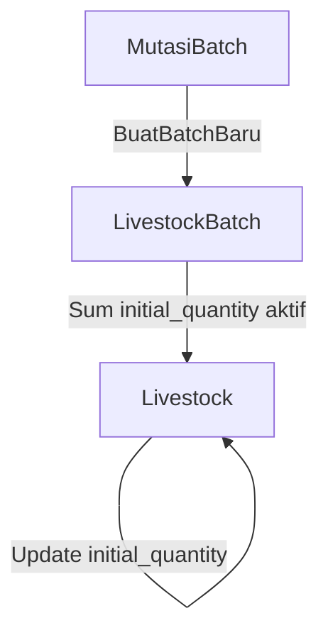

# [BUGFIX] Sync initial_quantity Livestock Setelah Mutasi Batch

**Tanggal:** 2024-06-25  
**Waktu:** 10:00 WIB

## Masalah

Field `initial_quantity` pada Livestock tidak otomatis ter-update saat batch baru dibuat melalui proses mutasi. Akibatnya, data populasi awal pada Livestock bisa tidak sesuai dengan total batch aktif yang sebenarnya.

## Root Cause

-   Proses mutasi hanya mengisi `initial_quantity` Livestock saat create, berdasarkan input `$additional['initial_quantity']`.
-   Tidak ada proses sinkronisasi otomatis setelah batch baru dibuat.
-   Jika batch bertambah/berkurang, field `initial_quantity` Livestock tidak ikut berubah.

## Solusi

-   Setelah batch baru berhasil dibuat pada proses mutasi (`createLivestockAndBatchIfNotExists`), lakukan penjumlahan seluruh batch aktif pada Livestock tersebut.
-   Update field `initial_quantity` Livestock dengan hasil penjumlahan tersebut.
-   Tambahkan log untuk debugging dan audit trail.

## Kode Perbaikan

```php
// Setelah batch baru berhasil dibuat
totalInitialQuantity = \App\Models\LivestockBatch::where([
    'livestock_id' => $livestock->id,
    'status' => 'active'
])->sum('initial_quantity');
$livestock->update([
    'initial_quantity' => $totalInitialQuantity,
    'updated_by' => auth()->id(),
]);
Log::info('🔄 Synced Livestock initial_quantity after batch creation', [
    'livestock_id' => $livestock->id,
    'new_initial_quantity' => $totalInitialQuantity
]);
```

## Dampak & Benefit

-   Data populasi awal Livestock selalu konsisten dengan total batch aktif.
-   Mengurangi potensi error pada laporan populasi, integrasi, dan analitik.
-   Memudahkan debugging dan audit dengan log yang jelas.

## Log Perubahan

-   [2024-06-25 10:00 WIB] Implementasi update initial_quantity Livestock setelah batch mutasi.
-   Penambahan log sinkronisasi di LivestockMutationService.php.

## Diagram Alur (Sederhana)



---

**Catatan:**

-   Pastikan proses serupa diterapkan pada event penghapusan/penambahan batch di luar mutasi.
-   Dokumentasi ini disimpan di `docs/debugging/livestock-mutation-initial-quantity-fix.md`.
