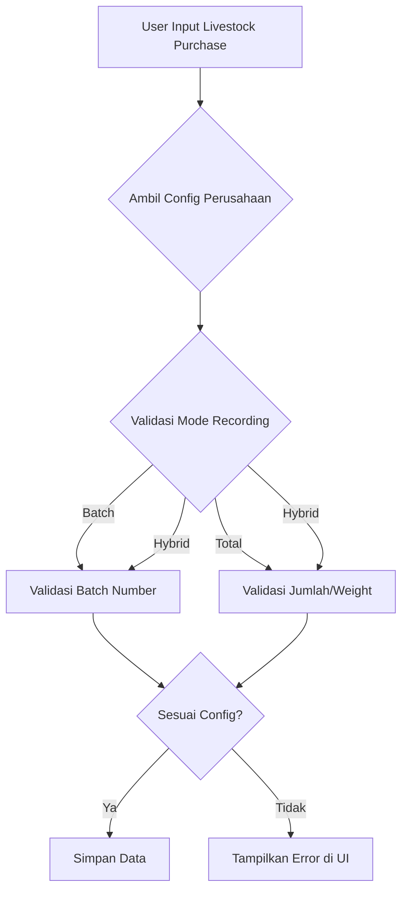

# Dokumentasi Validasi Config Livestock Purchase

**Tanggal:** 2024-06-16
**Waktu:** 21:00 WIB

## Summary

Implementasi validasi berbasis konfigurasi perusahaan (CompanyConfig) pada proses pembelian ternak (LivestockPurchase) di Livewire component `Create` dan Blade view. Validasi ini memastikan input sesuai dengan aturan recording_mode (batch/total/hybrid) dan pengaturan detail lain dari config perusahaan.

## Perubahan Utama

-   Integrasi pengambilan config perusahaan dari relasi user-company.
-   Validasi pada backend (Livewire):
    -   Cek mode pencatatan (`recording_mode`): batch, total, hybrid.
    -   Validasi batch number, jumlah, berat, dan fleksibilitas input sesuai config.
    -   Error dicatat di `$errorItems` dan ditampilkan di UI.
    -   Logging setiap langkah validasi untuk debugging.
-   Update Blade:
    -   Menampilkan error dan hint config di bawah field terkait (batch_name, quantity, weight).
    -   Menampilkan pesan jika input manual batch tidak diizinkan.

## Contoh Error/Hints di UI

-   "Nama batch wajib diisi sesuai konfigurasi perusahaan."
-   "Input manual batch tidak diizinkan oleh konfigurasi perusahaan."
-   "Jumlah total wajib diisi sesuai konfigurasi perusahaan."
-   "Berat total wajib diisi sesuai konfigurasi perusahaan."

## Catatan Improvement

-   Validasi berbasis config memudahkan penyesuaian bisnis di masa depan.
-   Logging detail memudahkan debugging dan audit.
-   UI/UX lebih informatif dan responsif terhadap aturan perusahaan.

## Future Proofing

-   Struktur config mudah di-extend untuk kebutuhan baru.
-   Validasi dan UI dapat dikembangkan untuk mode hybrid/otomatis.

---

**Diagram (flow):**

</rewritten_file>
