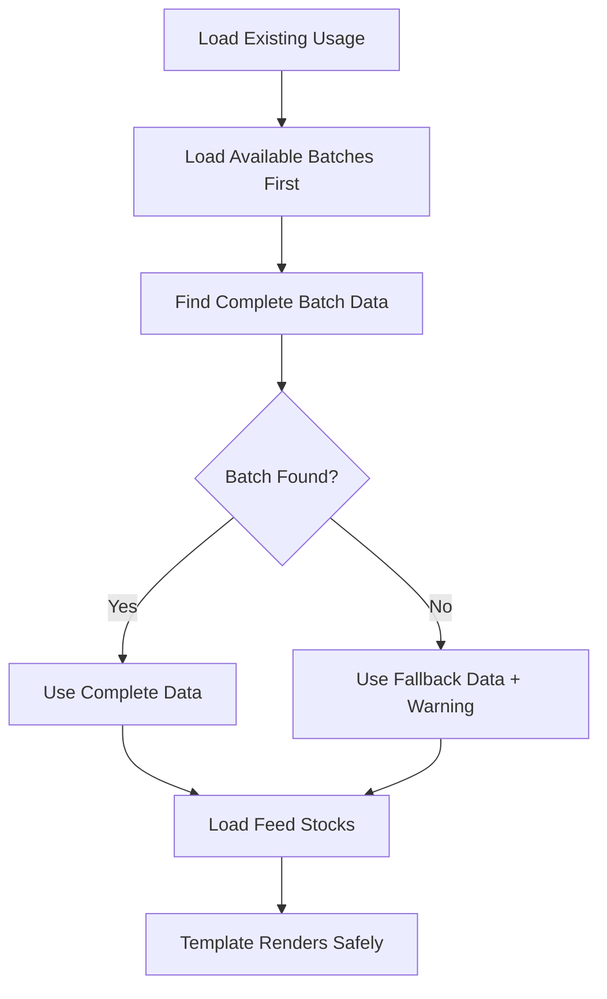

# Manual Feed Usage LivestockStrain Error Fix

## Tanggal: 2025-01-23 18:00:00 WIB

## Masalah yang Ditemukan

User melaporkan error "Undefined array key 'livestockStrain'" yang terjadi saat memilih tanggal yang sudah memiliki data feed usage existing. Error terjadi di:

```
resources\views\livewire\feed-usages\manual-feed-usage.blade.php: 301
```

### Error Log:

```
[2025-06-20 12:15:30] local.ERROR: Undefined array key "livestockStrain"
{"view":{"view":"C:\\laragon\\www\\demo51\\resources\\views\\livewire\\feed-usages\\manual-feed-usage.blade.php","data":[]},"userId":6,"exception":"[object] (Spatie\\LaravelIgnition\\Exceptions\\ViewException(code: 0): Undefined array key \"livestockStrain\" at C:\\laragon\\www\\demo51\\resources\\views\\livewire\\feed-usages\\manual-feed-usage.blade.php:301)"}
```

## Analisis Root Cause

### 1. Incomplete Batch Data saat Load Existing Usage

Saat existing usage data di-load, `selectedBatch` hanya di-set dengan data minimal:

```php
// PROBLEMATIC - Incomplete batch data
$this->selectedBatch = [
    'batch_id' => $existingData['livestock_batch_id'],
    'batch_name' => $existingData['livestock_batch_name'],
    // ❌ Missing: livestockStrain, current_quantity, age_days
];
```

### 2. Template Expects Complete Batch Structure

Template mengharapkan struktur data lengkap seperti saat normal batch selection:

```blade
{{ $selectedBatch['livestockStrain'] }} •  {{-- ❌ Undefined key --}}
{{ number_format($selectedBatch['current_quantity']) }} heads •  {{-- ❌ Undefined key --}}
{{ $selectedBatch['age_days'] }} days old  {{-- ❌ Undefined key --}}
```

### 3. Data Flow Inconsistency

-   **Normal flow**: `loadAvailableBatches()` → `selectBatch()` → Complete batch data
-   **Edit flow**: Direct assignment dari existing data → Incomplete batch data

## Solusi yang Diterapkan

### 1. Fix Component Logic - `loadExistingUsageData()`

#### BEFORE (problematic):

```php
if ($existingData['livestock_batch_id']) {
    $this->selectedBatchId = $existingData['livestock_batch_id'];
    $this->selectedBatch = [
        'batch_id' => $existingData['livestock_batch_id'],
        'batch_name' => $existingData['livestock_batch_name'],
        // ❌ Missing required fields
    ];

    // Load batches after setting incomplete data
    $this->loadAvailableBatches();
    $this->loadAvailableFeedStocks();
}
```

#### AFTER (fixed):

```php
if ($existingData['livestock_batch_id']) {
    $this->selectedBatchId = $existingData['livestock_batch_id'];

    // ✅ Load available batches first to get complete batch data
    $this->loadAvailableBatches();

    // ✅ Find the complete batch data from available batches
    $this->selectedBatch = collect($this->availableBatches)->firstWhere('batch_id', $existingData['livestock_batch_id']);

    // ✅ Fallback to minimal data if batch not found in available batches
    if (!$this->selectedBatch) {
        $this->selectedBatch = [
            'batch_id' => $existingData['livestock_batch_id'],
            'batch_name' => $existingData['livestock_batch_name'] ?? 'Unknown Batch',
            'livestockStrain' => 'Unknown Strain',
            'current_quantity' => 0,
            'age_days' => 0,
        ];

        Log::warning('Batch not found in available batches, using fallback data', [
            'batch_id' => $existingData['livestock_batch_id'],
            'batch_name' => $existingData['livestock_batch_name']
        ]);
    }

    $this->loadAvailableFeedStocks();
}
```

### 2. Fix Template Robustness

#### BEFORE (vulnerable):

```blade
{{ $selectedBatch['batch_name'] }}
<div class="text-muted fs-7">
    {{ $selectedBatch['livestockStrain'] }} •          {{-- ❌ Can cause error --}}
    {{ number_format($selectedBatch['current_quantity']) }} heads •  {{-- ❌ Can cause error --}}
    {{ $selectedBatch['age_days'] }} days old          {{-- ❌ Can cause error --}}
</div>
```

#### AFTER (robust):

```blade
{{ $selectedBatch['batch_name'] ?? 'Unknown Batch' }}
<div class="text-muted fs-7">
    {{ $selectedBatch['livestockStrain'] ?? 'Unknown Strain' }} •          {{-- ✅ Safe fallback --}}
    {{ number_format($selectedBatch['current_quantity'] ?? 0) }} heads •   {{-- ✅ Safe fallback --}}
    {{ $selectedBatch['age_days'] ?? 0 }} days old                         {{-- ✅ Safe fallback --}}
</div>
```

## Key Improvements

### 1. Consistent Data Structure

-   `selectedBatch` sekarang selalu memiliki struktur data yang lengkap
-   Data di-load dari `availableBatches` yang memiliki struktur complete
-   Fallback mechanism untuk edge cases

### 2. Robust Template Handling

-   Null coalescing operator (`??`) untuk semua field yang bisa undefined
-   Graceful degradation dengan meaningful fallback values
-   No more undefined array key errors

### 3. Better Error Handling

-   Warning log saat batch tidak ditemukan di available batches
-   Fallback data yang meaningful untuk user
-   Consistent behavior antara normal dan edit flow

### 4. Data Flow Consistency



## Expected Batch Data Structure

### Complete Structure (from loadAvailableBatches):

```php
[
    'batch_id' => 'uuid',
    'batch_name' => 'Batch Name',
    'livestockStrain' => 'Strain Name',           // ✅ Required by template
    'current_quantity' => 100,                    // ✅ Required by template
    'initial_quantity' => 120,
    'age_days' => 45,                             // ✅ Required by template
    'start_date' => '2025-01-01',
    'coop_name' => 'Coop Name',                   // Optional
    'farm_name' => 'Farm Name',                   // Optional
]
```

### Fallback Structure (when batch not found):

```php
[
    'batch_id' => 'uuid',
    'batch_name' => 'Unknown Batch',
    'livestockStrain' => 'Unknown Strain',        // ✅ Safe fallback
    'current_quantity' => 0,                      // ✅ Safe fallback
    'age_days' => 0,                              // ✅ Safe fallback
]
```

## Testing Scenarios

### 1. Normal Edit Flow

-   Select date with existing usage data
-   Verify batch information loads completely
-   Check all template fields render without errors

### 2. Edge Cases

-   Batch exists in usage but not in available batches (inactive/deleted)
-   Missing batch name in existing data
-   Corrupted batch data

### 3. Template Robustness

-   Test with missing array keys
-   Test with null values
-   Test with invalid data types

## Files Modified

1. **`app/Livewire/FeedUsages/ManualFeedUsage.php`**

    - Enhanced `loadExistingUsageData()` method
    - Added proper batch data loading sequence
    - Added fallback mechanism for missing batches

2. **`resources/views/livewire/feed-usages/manual-feed-usage.blade.php`**
    - Added null coalescing operators for all batch fields
    - Enhanced template robustness with safe fallbacks

## Prevention Measures

### 1. Always Load Complete Data

-   Load `availableBatches` before setting `selectedBatch`
-   Use complete data structure from available sources
-   Implement fallback for edge cases

### 2. Template Safety

-   Use null coalescing operators for all dynamic data
-   Provide meaningful fallback values
-   Test with incomplete data scenarios

### 3. Logging & Monitoring

-   Log warnings when fallback data is used
-   Track batch data inconsistencies
-   Monitor template errors in production

## Status: ✅ RESOLVED

Error "Undefined array key 'livestockStrain'" telah diperbaiki dengan:

-   ✅ Proper batch data loading sequence
-   ✅ Complete data structure consistency
-   ✅ Robust template handling with fallbacks
-   ✅ Enhanced error handling and logging

Manual feed usage sekarang dapat menangani existing data dengan aman tanpa undefined array key errors.
