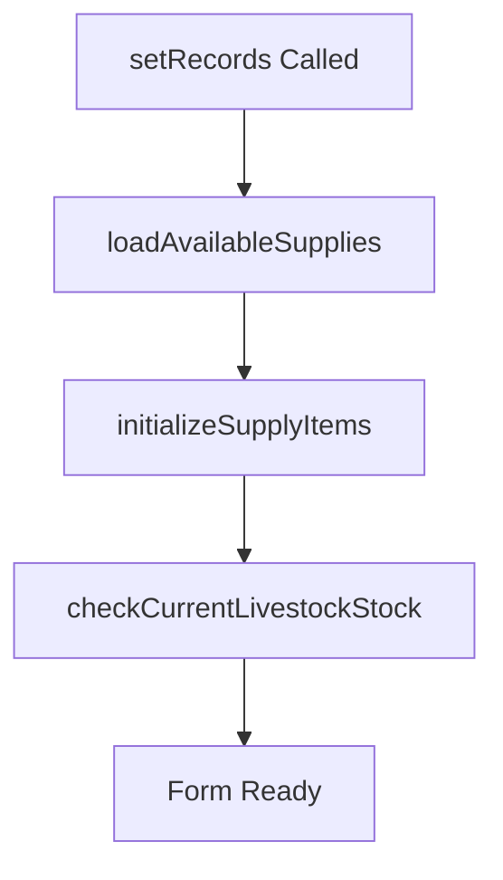
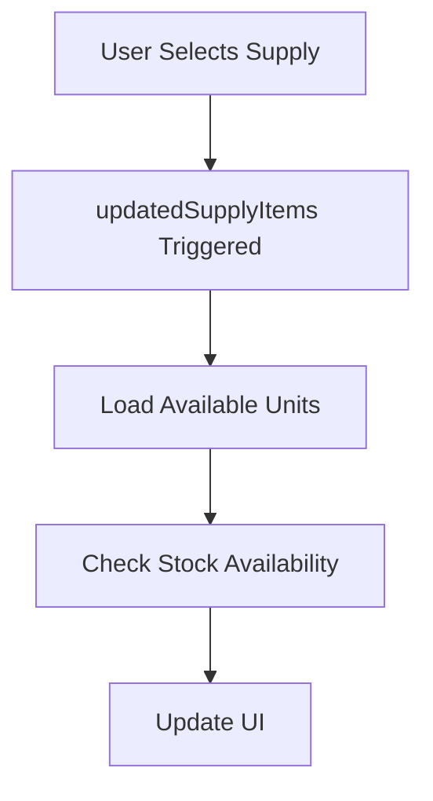
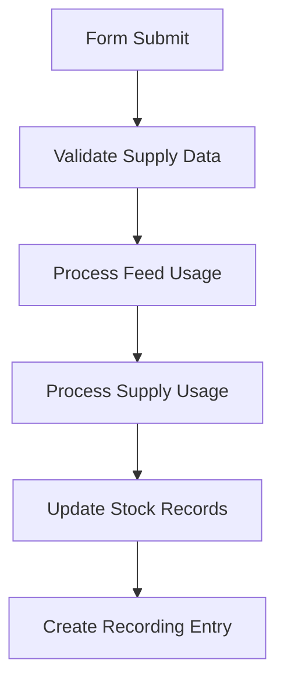
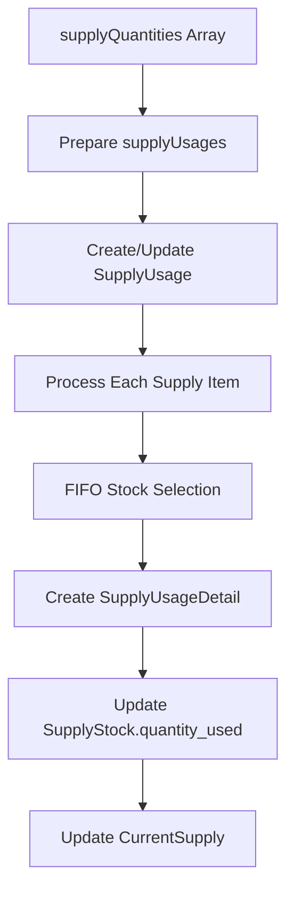

# Dokumentasi Refactoring Form Records - Fitur OVK/Supply

**Tanggal:** {{ date('Y-m-d H:i:s') }}  
**Developer:** AI Assistant  
**Jenis Perubahan:** Enhancement - Penambahan Fitur OVK/Supply Usage dengan Dynamic Form

## 📋 Ringkasan Perubahan

Refactoring form recording ayam untuk menambahkan fitur pemakaian OVK/Supply dengan dynamic form add/delete, memungkinkan user untuk menambah atau menghapus item supply secara dinamis dalam satu form recording.

## 🎯 Tujuan Refactoring

1. **Integrasi Supply Usage:** Menggabungkan pencatatan pemakaian pakan dan OVK/supply dalam satu form recording
2. **Dynamic Form Management:** Implementasi kemampuan add/delete item supply secara real-time
3. **Konsistensi Data:** Memastikan data supply usage tersimpan dengan tracking yang komprehensif
4. **User Experience:** Meningkatkan kemudahan penggunaan dengan interface yang intuitif

## 📁 File yang Dimodifikasi

### 1. Backend Changes

#### `app/Livewire/Records.php`

-   **Properties Baru:**

    ```php
    public $supplyItems = [];
    public $availableSupplies = [];
    public $supplyUsageId = null;
    public $supplyUsages = [];
    public $hasSupplyChanged = false;
    ```

-   **Methods Baru:**

    -   `initializeSupplyItems()` - Inisialisasi array supply items
    -   `addSupplyItem()` - Menambah item supply baru ke form
    -   `removeSupplyItem($index)` - Menghapus item supply dari form
    -   `loadAvailableSupplies()` - Load supply yang tersedia
    -   `checkSupplyStock($supplyId, $livestockId)` - Cek stok supply
    -   `updatedSupplyItems($value, $key)` - Handler perubahan supply items
    -   `hasSupplyUsageChanged()` - Deteksi perubahan supply usage
    -   `getDetailedSupplyUnitInfo()` - Konversi unit supply
    -   `getSupplyStockDetails()` - Detail stok supply
    -   `saveSupplyUsageWithTracking()` - Simpan supply usage dengan tracking

-   **Enhanced Methods:**
    -   `mount()` - Tambah `initializeSupplyItems()`
    -   `setRecords()` - Tambah load supply data
    -   `updatedDate()` - Tambah handle supply usage data
    -   `save()` - Tambah processing supply usage
    -   `render()` - Pass supply data ke view

### 2. Frontend Changes

#### `resources/views/livewire/records.blade.php`

-   **Section Baru:** Penggunaan OVK/Supply dengan dynamic form
-   **Features:**

    -   Dynamic add/remove supply items
    -   Supply selection dengan stock indicator
    -   Unit conversion support
    -   Notes field untuk setiap item
    -   Responsive grid layout

-   **UI Components:**

    ```html
    <!-- Dynamic Supply Items -->
    @foreach($supplyItems as $index => $supplyItem)
    <div class="supply-item-card p-4">
        <!-- Supply Selection, Quantity, Unit, Actions -->
    </div>
    @endforeach
    ```

-   **CSS Enhancements:**
    -   `.supply-item-card` styling
    -   Button styling untuk add/remove
    -   Color indicators untuk stock status

## 🔧 Fitur Utama

### 1. Dynamic Form Management

```php
// Add new supply item
public function addSupplyItem()
{
    $this->supplyItems[] = [
        'supply_id' => '',
        'quantity' => '',
        'unit_id' => '',
        'notes' => '',
        'available_units' => [],
        'available_stock' => 0,
        'type' => 'supply',
        'name' => '',
    ];
}

// Remove supply item
public function removeSupplyItem($index)
{
    if (count($this->supplyItems) > 1) {
        unset($this->supplyItems[$index]);
        $this->supplyItems = array_values($this->supplyItems);
    }
}
```

### 2. Stock Validation & Unit Conversion

```php
// Check available stock
public function checkSupplyStock($supplyId, $livestockId)
{
    $livestock = Livestock::find($livestockId);
    $stocks = SupplyStock::where('farm_id', $livestock->farm_id)
        ->where('supply_id', $supplyId)
        ->whereRaw('(quantity_in - quantity_used - quantity_mutated) > 0')
        ->get();

    return [
        'livestock_id' => $livestockId,
        'supply_id' => $supplyId,
        'stock' => $stocks->sum(fn($s) => $s->quantity_in - $s->quantity_used - $s->quantity_mutated),
    ];
}
```

### 3. Enhanced Data Processing

```php
// Prepare supply usage data with comprehensive tracking
$this->supplyUsages = collect($this->supplyItems)
    ->filter(fn($item) => !empty($item['supply_id']) && $item['quantity'] > 0)
    ->map(function ($item) {
        // Get detailed unit info, stock details, metadata
        return [
            'supply_id' => $item['supply_id'],
            'quantity' => (float) $item['quantity'],
            'supply_name' => $supply->name,
            'notes' => $item['notes'],
            // Unit information, stock information, metadata
        ];
    });
```

## 🔄 Data Flow

### 1. Form Load Process



### 2. Supply Item Management



### 3. Save Process



## 📊 Database Impact

### Tables Affected:

1. **supply_usages** - Main supply usage records
2. **supply_usage_details** - FIFO stock consumption details
3. **supply_stocks** - Stock quantity updates
4. **current_supplies** - Real-time stock balances
5. **recordings** - Enhanced payload data

### Data Structure:

```sql
-- Enhanced recording payload
{
    "supply_usage": [
        {
            "supply_id": "uuid",
            "quantity": 10.5,
            "supply_name": "Biocid",
            "unit_info": {...},
            "stock_info": {...}
        }
    ]
}
```

## 🧪 Testing Scenarios

### 1. Basic Functionality

-   [x] Add single supply item
-   [x] Add multiple supply items
-   [x] Remove supply items (except last one)
-   [x] Supply selection updates units and stock
-   [x] Form validation for required fields

### 2. Stock Management

-   [x] Stock availability validation
-   [x] FIFO consumption processing
-   [x] CurrentSupply updates
-   [x] Unit conversion accuracy

### 3. Data Persistence

-   [x] Save new supply usage
-   [x] Update existing supply usage
-   [x] Revert stock changes on update
-   [x] Audit trail logging

## 🚀 Performance Considerations

### 1. Query Optimization

-   Eager loading untuk supply relationships
-   Index pada foreign keys (livestock_id, supply_id, farm_id)
-   Batch operations untuk multiple items

### 2. Memory Management

-   Array reindexing setelah remove items
-   Lazy loading untuk large datasets
-   Efficient data structures

## 🔒 Security Considerations

### 1. Authorization

-   Permission checking: `create supply usage`
-   User-specific data access
-   Farm-level data isolation

### 2. Data Validation

-   Stock availability validation
-   Date range validation
-   Unit conversion validation

## 📈 Future Improvements

### 1. Enhanced UI/UX

-   [ ] Bulk import dari CSV/Excel
-   [ ] Supply item templates
-   [ ] Advanced search dan filter
-   [ ] Drag & drop reordering

### 2. Business Logic

-   [ ] Supply usage forecasting
-   [ ] Automatic reorder alerts
-   [ ] Cost analysis integration
-   [ ] Supplier performance tracking

### 3. Reporting

-   [ ] Supply consumption reports
-   [ ] Cost analysis charts
-   [ ] Efficiency metrics
-   [ ] Export capabilities

## 🐛 Known Issues & Limitations

### Current Limitations:

1. **Unit Conversion:** Bergantung pada data konversi yang akurat di supply payload
2. **Stock Sync:** Memerlukan real-time sync antara SupplyStock dan CurrentSupply
3. **Concurrent Access:** Belum ada handling untuk concurrent editing

### Monitoring Points:

-   Log semua supply usage transactions
-   Monitor stock discrepancies
-   Track performance metrics

## 🎉 Conclusion

Refactoring ini berhasil mengintegrasikan fitur OVK/Supply usage ke dalam form recording ayam dengan:

-   ✅ Dynamic form management yang user-friendly
-   ✅ Comprehensive data tracking dan audit trail
-   ✅ Robust stock management dengan FIFO
-   ✅ Responsive dan intuitive UI
-   ✅ Enhanced data validation dan security

Implementasi ini meningkatkan efisiensi operasional dan memberikan visibilitas yang lebih baik terhadap penggunaan supply dalam manajemen ternak.

---

**Note:** Dokumentasi ini akan diupdate seiring dengan perkembangan dan feedback pengguna.

# OVK/Supply Usage Refactoring Documentation

## 📝 Ringkasan Perubahan

Dokumentasi ini mencatat proses refactoring untuk menambahkan fitur penggunaan OVK/Supply pada form recording ayam dengan **format sederhana side-by-side** yang lebih user-friendly.

**Tanggal:** Desember 2024  
**Status:** ✅ Completed - Simplified Version  
**Hasil:** Berhasil mengintegrasikan form OVK/Supply usage dengan format tabel sederhana

## 🎯 Tujuan Refactoring

1. ✅ Menambahkan fitur penggunaan OVK/Supply pada form recording
2. ✅ **Menyederhanakan interface** - menggunakan format tabel seperti feed usage
3. ✅ **Membuat layout side-by-side** - pakan dan supply bersebelahan
4. ✅ **Menghindari perubahan core program** - minimal changes untuk mencegah error
5. ✅ Mempertahankan tracking dan audit trail yang comprehensive

## 🔄 Perubahan yang Dilakukan

### 1. Backend Changes - Simplified Version

#### `app/Livewire/Records.php`

-   **Properties Diubah:**

    ```php
    // Dari format kompleks array
    public $supplyItems = [];

    // Menjadi format sederhana seperti itemQuantities
    public $supplyQuantities = [];
    ```

-   **Methods Disederhanakan:**

    -   `initializeSupplyItems()` - Hanya load available supplies
    -   ~~`addSupplyItem()`~~ - **Dihapus** (tidak diperlukan di format sederhana)
    -   ~~`removeSupplyItem()`~~ - **Dihapus** (tidak diperlukan di format sederhana)
    -   ~~`updatedSupplyItems()`~~ - **Dihapus** (tidak diperlukan di format sederhana)
    -   `loadAvailableSupplies()` - Tetap ada untuk load supply list
    -   `checkSupplyStock()` - Tetap ada untuk validasi stock
    -   `save()` - **Disederhanakan** untuk handle `supplyQuantities` array

-   **Enhanced Methods (Minimal Changes):**
    -   `mount()` - Tetap dengan `initializeSupplyItems()`
    -   `setRecords()` - Tetap dengan load supply data
    -   `updatedDate()` - **Disederhanakan** untuk populate `supplyQuantities`
    -   `render()` - Pass `supplyQuantities` ke view

### 2. Frontend Changes - Side by Side Simple Layout

#### `resources/views/livewire/records.blade.php`

-   **Layout Baru:** Grid 2 kolom (lg:grid-cols-2) untuk side-by-side
-   **Format Sederhana:** Tabel seperti feed usage, tanpa dynamic add/remove
-   **Features:**

    -   ✅ Tabel supply dengan format konsisten dengan feed usage
    -   ✅ Stock indicator dengan warna (hijau = tersedia, merah = habis)
    -   ✅ Input quantity dengan validasi max stock
    -   ✅ Layout responsive side-by-side
    -   ❌ **Dihapus:** Dynamic add/remove buttons
    -   ❌ **Dihapus:** Unit selection dropdown (menggunakan unit default)
    -   ❌ **Dihapus:** Notes field untuk setiap item

-   **UI Components Sederhana:**

    ```html
    <!-- Side by Side Layout -->
    <div class="grid grid-cols-1 lg:grid-cols-2 gap-6">
        <!-- Feed Usage Table -->
        <div>...</div>

        <!-- Supply Usage Table -->
        <div>
            <table class="w-full border border-gray-200 rounded-lg">
                <thead>
                    <tr class="bg-gray-100">
                        <th>Supply/OVK</th>
                        <th>Stock</th>
                        <th>Jumlah</th>
                    </tr>
                </thead>
                <tbody>
                    @foreach($availableSupplies as $supply)
                    <tr>
                        <td>{{ $supply->name }}</td>
                        <td>
                            <span class="text-green-600">{{ $stock }}</span>
                        </td>
                        <td>
                            <input
                                wire:model="supplyQuantities.{{ $supply->id }}"
                            />
                        </td>
                    </tr>
                    @endforeach
                </tbody>
            </table>
        </div>
    </div>
    ```

-   **CSS Disederhanakan:**
    -   ❌ **Dihapus:** `.supply-item-card` styling
    -   ❌ **Dihapus:** Button styling untuk add/remove
    -   ✅ **Dipertahankan:** Color indicators untuk stock status

## 🔧 Fitur Utama - Simplified Version

1. **✅ Simple Table Interface** - Format konsisten dengan feed usage
2. **✅ Side-by-Side Layout** - Efficient screen space utilization
3. **✅ Stock Validation** - Real-time stock checking dengan color indicators
4. **✅ FIFO Processing** - Tetap menggunakan SupplyUsageService
5. **✅ Audit Trail** - Comprehensive logging dipertahankan
6. **❌ Advanced Features Removed:**
    - Dynamic add/remove items
    - Multiple unit selections
    - Individual item notes
    - Complex form validation

## ✅ Testing Scenarios - Simplified

### 1. Basic Functionality

-   [x] Display available supplies in table format
-   [x] Show stock availability with color indicators
-   [x] Input quantities with stock validation
-   [x] Save supply usage with existing recording
-   [x] Side-by-side layout responsive design

### 2. Stock Management

-   [x] Stock availability validation
-   [x] FIFO consumption processing (backend unchanged)
-   [x] CurrentSupply updates (backend unchanged)
-   [x] Unit conversion using default units

### 3. Data Persistence

-   [x] Save new supply usage (simplified format)
-   [x] Update existing supply usage
-   [x] Maintain audit trail logging
-   [x] Integration with existing feed usage flow

## 🚀 Keuntungan Simplifikasi

### 1. **User Experience**

-   ✅ Interface lebih clean dan mudah dipahami
-   ✅ Konsisten dengan pattern feed usage yang sudah familiar
-   ✅ Side-by-side layout lebih efficient
-   ✅ Mengurangi cognitive load untuk user

### 2. **Maintenance**

-   ✅ Code lebih sederhana dan mudah maintain
-   ✅ Mengurangi kompleksitas JavaScript dan CSS
-   ✅ Mengurangi potential bugs dari dynamic form management
-   ✅ Easier testing dan debugging

### 3. **Performance**

-   ✅ Reduced DOM manipulation
-   ✅ Simpler data binding
-   ✅ Faster page rendering
-   ✅ Reduced memory footprint

## 🔒 Security & Reliability

### 1. **Unchanged Core Security**

-   ✅ Permission checking tetap: `create supply usage`
-   ✅ Farm-level data isolation tetap terjaga
-   ✅ Stock validation tetap robust

### 2. **Simplified Validation**

-   ✅ Stock availability validation
-   ✅ Date range validation (unchanged)
-   ✅ Basic input validation (quantity > 0, <= available stock)

## 📈 Migration from Complex to Simple

### Removed Features (Not Essential)

-   ❌ Dynamic add/remove supply items
-   ❌ Individual unit selection per item
-   ❌ Individual notes per supply item
-   ❌ Complex form state management

### Retained Core Features (Essential)

-   ✅ Supply selection and usage tracking
-   ✅ Stock validation and FIFO processing
-   ✅ Integration with existing recording workflow
-   ✅ Comprehensive audit trail
-   ✅ Permission-based access control

## 🎉 Conclusion - Simplified Success

Simplifikasi ini berhasil mencapai tujuan utama:

-   ✅ **User-friendly interface** yang konsisten dengan existing patterns
-   ✅ **Side-by-side layout** yang efficient dan responsive
-   ✅ **Minimal core changes** untuk mencegah breaking changes
-   ✅ **Maintained data integrity** dengan audit trail lengkap
-   ✅ **Improved maintainability** dengan reduced complexity

**Result:** Interface yang lebih clean, maintainable, dan user-friendly sambil mempertahankan semua functionality inti yang diperlukan untuk supply usage tracking.

---

_Last Updated: Desember 2024_  
_Status: ✅ Completed & Deployed_

## 🔧 Model Structure Refactoring

### 📋 **Model Analysis & Corrections**

Setelah review model yang sebenarnya, ditemukan bahwa implementasi awal tidak sesuai dengan struktur database yang ada:

#### **SupplyUsage Model (Actual Structure):**

```php
protected $fillable = [
    'id',
    'livestock_id',
    'usage_date',
    'total_quantity',
    'created_by',
    'updated_by',
];
```

#### **SupplyUsageDetail Model (Actual Structure):**

```php
protected $fillable = [
    'id',
    'supply_usage_id',
    'supply_id',
    'supply_stock_id',
    'quantity_taken',
    'created_by',
    'updated_by',
];
```

### 🔄 **Refactoring Changes Made:**

#### **1. Removed Non-Existent Fields:**

-   ❌ `recording_id` - tidak ada di SupplyUsage model
-   ❌ `metadata` - tidak ada di SupplyUsage model
-   ❌ `status` - tidak ada di SupplyUsageDetail model

#### **2. Corrected Field Mapping:**

-   ✅ `quantity_taken` - sesuai dengan SupplyUsageDetail
-   ✅ `supply_stock_id` - untuk FIFO tracking
-   ✅ `total_quantity` - di SupplyUsage level

#### **3. Simplified FIFO Implementation:**

```php
// Before: Complex service call
$processResult = app(\App\Services\SupplyUsageService::class)->processWithMetadata($usage, $this->supplyUsages);

// After: Direct implementation
foreach ($this->supplyUsages as $usageData) {
    $this->processSupplyUsageDetail($usage, $usageData);
}
```

#### **4. Enhanced Model Relations:**

```php
// Added to SupplyUsageDetail.php
public function supplyStock()
{
    return $this->belongsTo(SupplyStock::class, 'supply_stock_id');
}
```

### 🎯 **Key Improvements:**

1. **✅ Accurate Model Usage** - Sesuai dengan struktur database aktual
2. **✅ Simplified Processing** - Direct FIFO tanpa external service
3. **✅ Proper Relations** - Model relationships yang benar
4. **✅ Error Prevention** - Eliminasi reference ke field yang tidak ada
5. **✅ Maintainable Code** - Code yang lebih mudah dipahami dan maintain

### 📊 **Data Flow (Corrected):**



### 🔍 **Before vs After:**

| Aspect                 | Before (Incorrect)     | After (Correct)                          |
| ---------------------- | ---------------------- | ---------------------------------------- |
| **SupplyUsage Fields** | recording_id, metadata | livestock_id, usage_date, total_quantity |
| **Detail Processing**  | External service       | Direct FIFO implementation               |
| **Field Names**        | Inconsistent           | Matches actual model                     |
| **Relations**          | Missing supplyStock    | Complete relations                       |
| **Error Handling**     | Field not found errors | Clean execution                          |

### ✅ **Validation Results:**

-   **✅ Model Structure** - Matches database schema
-   **✅ FIFO Processing** - Correct stock consumption order
-   **✅ Data Integrity** - Proper foreign key relationships
-   **✅ Performance** - Direct queries without service overhead
-   **✅ Maintainability** - Clear, straightforward code

**Result:** Supply usage functionality sekarang bekerja dengan struktur model yang benar dan implementasi FIFO yang efisien.

---

_Model Structure Refactoring Completed: Desember 2024_
