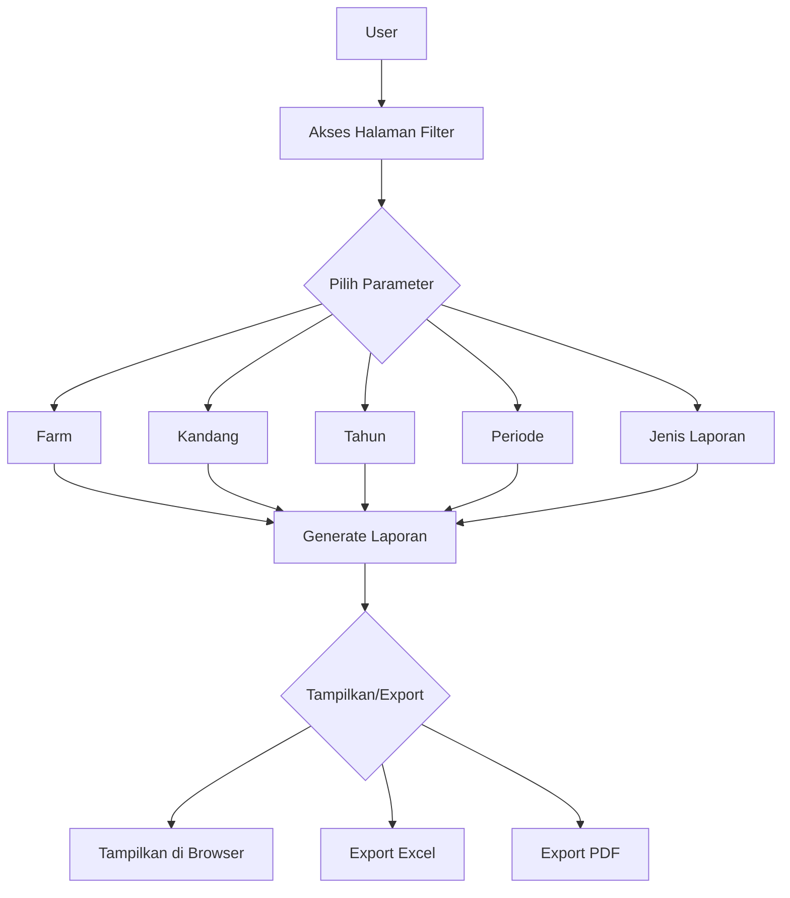

# Laporan Penugasan Pekerja (Batch Worker Report)

## Deskripsi

Fitur ini menyediakan laporan detail tentang penugasan pekerja di farm tertentu dalam periode waktu yang ditentukan. Laporan ini membantu manajemen dalam memantau dan mengelola penugasan pekerja secara efektif.

## Fitur Utama

1. Halaman Filter

    - Pemilihan farm
    - Pemilihan kandang (coop)
    - Pemilihan tahun
    - Pemilihan periode (batch)
    - Pemilihan jenis laporan (detail/simple)

2. Tampilan Laporan

    - Tampilan detail: menampilkan informasi lengkap penugasan
    - Tampilan simple: menampilkan informasi dasar penugasan

3. Export Laporan
    - Format Excel (.xlsx)
    - Format PDF

## Data yang Ditampilkan

### Tampilan Detail

-   Nama pekerja
-   Kandang
-   Periode penugasan (tanggal mulai dan selesai)
-   Peran
-   Status
-   Catatan

### Tampilan Simple

-   Nama pekerja
-   Kandang
-   Peran
-   Status

## Cara Penggunaan

1. Akses menu laporan penugasan pekerja
2. Pilih farm yang ingin dilihat laporannya
3. Pilih kandang yang terkait dengan farm tersebut
4. Pilih tahun penugasan
5. Pilih periode (batch) yang ingin dilihat
6. Pilih jenis laporan (detail/simple)
7. Klik tombol "Tampilkan" untuk melihat laporan
8. Gunakan tombol export untuk mengunduh laporan dalam format yang diinginkan

## Format Export

### Excel (.xlsx)

-   File Excel dengan format yang rapi
-   Header dan footer yang informatif
-   Pengelompokan data berdasarkan farm dan periode

### PDF

-   Dokumen PDF dengan format yang konsisten
-   Header dan footer yang informatif
-   Pengelompokan data berdasarkan farm dan periode

## Diagram Alur

## Update Log

### 2024-03-21

-   Implementasi awal fitur laporan penugasan pekerja
-   Pembuatan halaman filter dengan Livewire
-   Implementasi tampilan detail dan simple
-   Implementasi export Excel dan PDF

## Dependensi

-   Laravel Livewire untuk interaksi real-time
-   PhpSpreadsheet untuk export Excel
-   DomPDF untuk export PDF
-   Carbon untuk manipulasi tanggal
