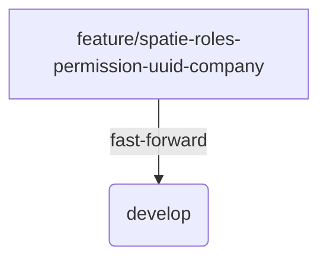

## Feature Branch Roles & Permissions Merge to Develop

**Date & Time:** 2025-06-30 10:00 UTC

### Summary

Merged branch `feature/spatie-roles-permission-uuid-company` into `develop` via fast-forward.

Key points:

-   Implemented company-scoped roles & permissions using Spatie package.
-   Updated models, Livewire components, DataTables, Blade views.
-   Added new docs and migration commands.
-   Composer dependencies updated.

### Commands Executed

```bash
git status -sb
git add -A
git commit -m "feat: company-scoped roles & permissions implementation with spatie package"
git push origin feature/spatie-roles-permission-uuid-company
git checkout develop
git pull origin develop
git merge feature/spatie-roles-permission-uuid-company
git push origin develop
```

### Diagram



### Next Steps

1. Verify CI pipeline passes on develop.
2. Deploy to staging environment for QA.
3. Monitor for permission regressions.
