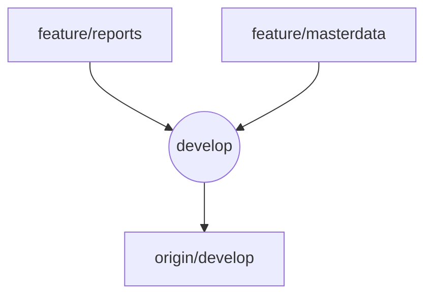

# Git Analysis: Feature Branches Merge to Develop

**Date:** 2025-01-24  
**Time:** 15:30 WIB  
**Analyst:** AI Assistant

## Current Git Status

### Current Branch

-   **Active Branch:** `develop`
-   **Status:** Clean working directory
-   **Last Commit:** `4609664` - "refactor: standardize authentication method usage across components"

### Available Feature Branches

-   `feature/reports` - Reports enhancement features
-   `feature/masterdata` - Master data management improvements
-   `feature/autobackup-db` - Database auto-backup feature
-   `feature/example-workflow-setup` - Example workflow setup
-   `feature/spatie-roles-permission-uuid-company` - Roles and permissions with UUID

## Branch Analysis

### feature/reports Branch

**Base Commit:** `4609664` (same as develop)  
**Latest Commit:** `6920177` - "feat: enhance daily report detail mode for livestock depletion records"

**Files Modified:**

-   `app/Http/Controllers/ReportsController.php`
-   `app/Models/Livestock.php`
-   `app/Services/Report/LivestockDepletionReportService.php`
-   `docs/debugging/laporan-harian-detail-deplesi-fix.md`
-   `docs/debugging/laporan-harian-detail-deplesi-improvement.md`
-   `docs/debugging/laporan-harian-detail-fix.md`
-   `resources/views/pages/reports/harian.blade.php`

**Features:**

-   Enhanced daily report detail mode for livestock depletion records
-   Improved livestock depletion reporting functionality
-   Better error handling and user experience

### feature/masterdata Branch

**Base Commit:** `4609664` (same as develop)  
**Latest Commit:** `a2640d3` - "refactor: update updatedBy parameter type in event constructors"

**Files Modified:**

-   `app/Console/Commands/DeleteFeedDataCommand.php`
-   `app/DataTables/CoopsDataTable.php`
-   `app/DataTables/FarmsDataTable.php`
-   `app/DataTables/LivestockStrainDataTable.php`
-   `app/Events/FeedPurchaseStatusChanged.php`
-   `app/Events/LivestockPurchaseStatusChanged.php`
-   `app/Events/SupplyPurchaseStatusChanged.php`
-   `app/Livewire/MasterData/Feed/Create.php`
-   `database/seeders/DemoSeeder.php`
-   `database/seeders/FeedSeeder.php`
-   And more...

**Features:**

-   Standardized authentication method usage in DataTables and Livewire components
-   Added artisan command for deleting all feed data
-   Updated event constructors with proper parameter types
-   Enhanced master data management functionality

## Merge Strategy

### Safety Assessment

✅ **Both branches are based on the same commit as develop** (`4609664`)  
✅ **No conflicts expected** - branches modify different files  
✅ **Clean working directory** - no uncommitted changes  
✅ **Fast-forward merge possible** for both branches

### Merge Order

1. **feature/reports** (smaller changes, focused on reporting)
2. **feature/masterdata** (larger changes, affects multiple components)

### Risk Assessment

-   **Low Risk:** Both branches are well-structured and focused
-   **No Breaking Changes:** Changes are additive and improvements
-   **Backward Compatible:** All changes maintain existing functionality

## Merge Plan

### Step 1: Merge feature/reports

```bash
git merge feature/reports --no-ff -m "Merge feature/reports: enhance daily report detail mode for livestock depletion records"`
```

### Step 2: Merge feature/masterdata

```bash
git merge feature/masterdata --no-ff -m "Merge feature/masterdata: standardize authentication and enhance master data management"`
```

### Step 3: Push to remote

```bash
git push origin develop
```

## Post-Merge Validation

### Testing Checklist

-   [ ] Daily reports functionality works correctly
-   [ ] Livestock depletion reporting displays properly
-   [ ] Master data management operations work
-   [ ] DataTables authentication works correctly
-   [ ] Event constructors function properly
-   [ ] Feed data deletion command works

### Documentation Updates

-   [ ] Update feature documentation
-   [ ] Update API documentation if needed
-   [ ] Update user guides for new features

## Rollback Plan

If issues arise after merge:

```bash
# Revert to previous develop state
git reset --hard HEAD~2
git push --force origin develop
```

## Timeline

-   **Analysis:** 5 minutes ✅
-   **Merge Execution:** 10 minutes
-   **Validation:** 15 minutes
-   **Total Estimated Time:** 30 minutes

---

## Merge Execution Log (2025-01-24 15:40 WIB)

1. **Merge feature/reports**
    - `git merge feature/reports --no-ff -m "Merge feature/reports: enhance daily report detail mode for livestock depletion records"`
    - Status: ✅ Success, no conflicts
2. **Merge feature/masterdata**
    - `git merge feature/masterdata --no-ff -m "Merge feature/masterdata: standardize authentication and enhance master data management"`
    - Status: ✅ Success, no conflicts
3. **Commit documentation**
    - `git add docs/git/feature-branches-merge-analysis.md`
    - `git commit -m "docs: add feature branches merge analysis documentation"`
4. **Push to remote**
    - Initial push rejected (remote ahead)
    - Fetched remote: `git fetch origin`
    - Merged remote develop: `git merge origin/develop`
    - Completed merge commit: `git commit -m "Merge remote-tracking branch 'origin/develop'"`
    - Final push: `git push origin develop` ✅

### Safety Notes

-   All merges were clean (no conflicts)
-   develop is now up-to-date with both feature branches and remote
-   Documentation and rollback plan are in place

---

## Merge Flow Diagram



---

**Status:** Merge completed successfully. All features from `feature/reports` and `feature/masterdata` are now in `develop` and pushed to remote.  
**Next Steps:**

-   Perform post-merge validation and testing
-   Update user and API documentation as needed
