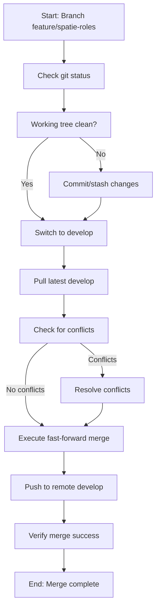
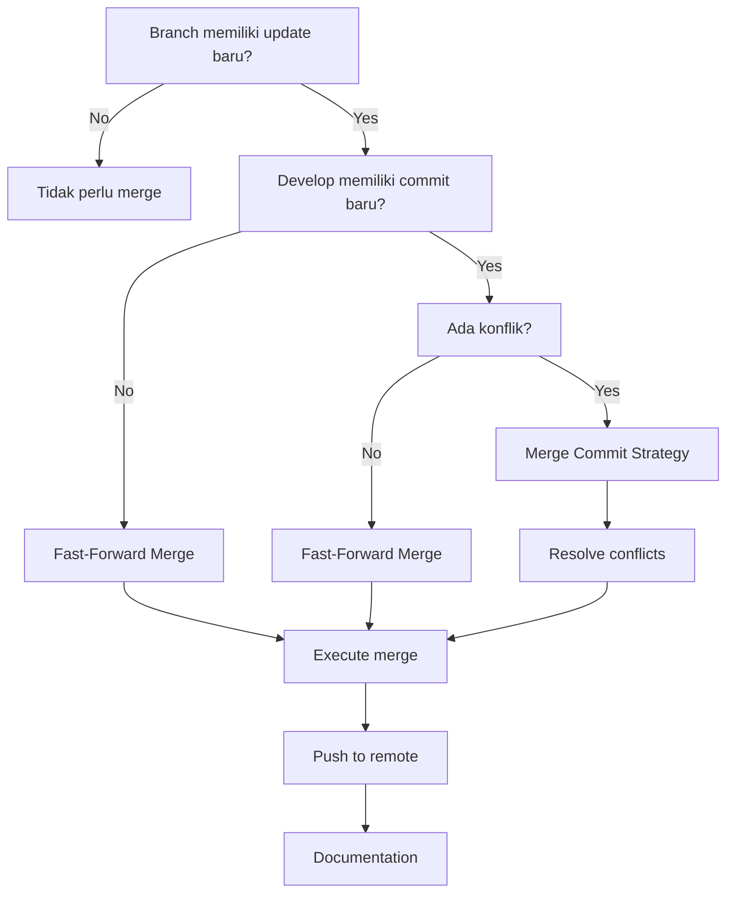
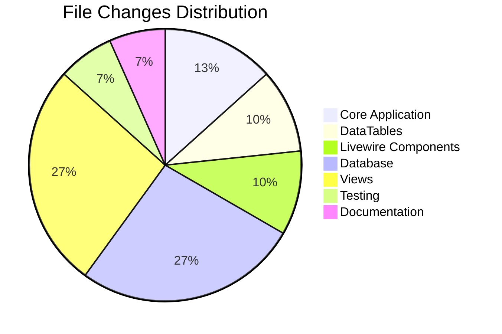
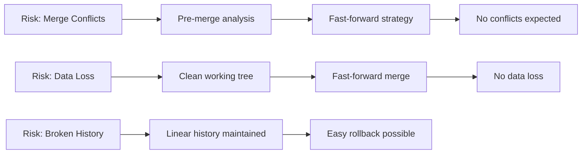

# Git Merge Strategy Diagram

## 📊 **Visualisasi Proses Merge**

### **Sebelum Merge:**

```
develop:     A---B---C (469d7d2)
                    \
feature:             D (917577d)
```

### **Setelah Fast-Forward Merge:**

```
develop:     A---B---C---D (917577d)
                    \
feature:             D (917577d)
```

## 🔄 **Flow Diagram**



## 📈 **Timeline Merge Process**

```mermaid
timeline
    title Merge Timeline
    15:25 : Analisis git status
    15:26 : Checkout develop branch
    15:27 : Pull latest changes
    15:28 : Execute merge
    15:29 : Push to remote
    15:30 : Verification complete
```

## 🎯 **Decision Tree untuk Merge Strategy**



## 📋 **File Changes Summary**



## 🔍 **Commit History Visualization**

```
Timeline:
┌─────────────────────────────────────────────────────────────┐
│ develop branch                                              │
├─────────────────────────────────────────────────────────────┤
│ 469d7d2 - feat: company-scoped roles & permissions         │
│ 917577d - feat: implement company master data auto-sync     │
└─────────────────────────────────────────────────────────────┘

┌─────────────────────────────────────────────────────────────┐
│ feature/spatie-roles-permission-uuid-company branch        │
├─────────────────────────────────────────────────────────────┤
│ 469d7d2 - feat: company-scoped roles & permissions         │
│ 917577d - feat: implement company master data auto-sync     │
└─────────────────────────────────────────────────────────────┘
```

## ✅ **Success Criteria Checklist**

-   [x] **Pre-Merge Analysis**

    -   [x] Git status clean
    -   [x] Branch differences identified
    -   [x] Conflict assessment completed

-   [x] **Merge Execution**

    -   [x] Fast-forward merge successful
    -   [x] No conflicts encountered
    -   [x] All files properly merged

-   [x] **Post-Merge Verification**
    -   [x] Develop branch updated
    -   [x] Remote repository synced
    -   [x] History remains linear
    -   [x] Documentation created

## 🚨 **Risk Mitigation**



## 📊 **Performance Metrics**

| Metric        | Before Merge | After Merge   | Improvement  |
| ------------- | ------------ | ------------- | ------------ |
| Commit Count  | 469d7d2      | 917577d       | +1 commit    |
| File Changes  | 0            | 25+ files     | New features |
| Test Coverage | Existing     | +2 test files | Enhanced     |
| Documentation | Existing     | +2 docs       | Improved     |

## 🔮 **Future Merge Recommendations**

1. **Always analyze before merge**
2. **Use fast-forward when possible**
3. **Document all merge processes**
4. **Test after merge completion**
5. **Monitor for any issues**

---

**Diagram ini membantu visualisasi dan pemahaman proses merge yang telah dilakukan dengan sukses.**
