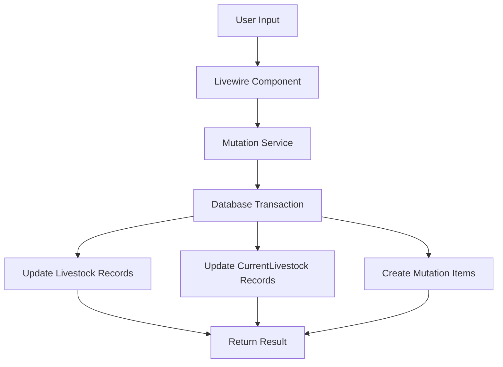
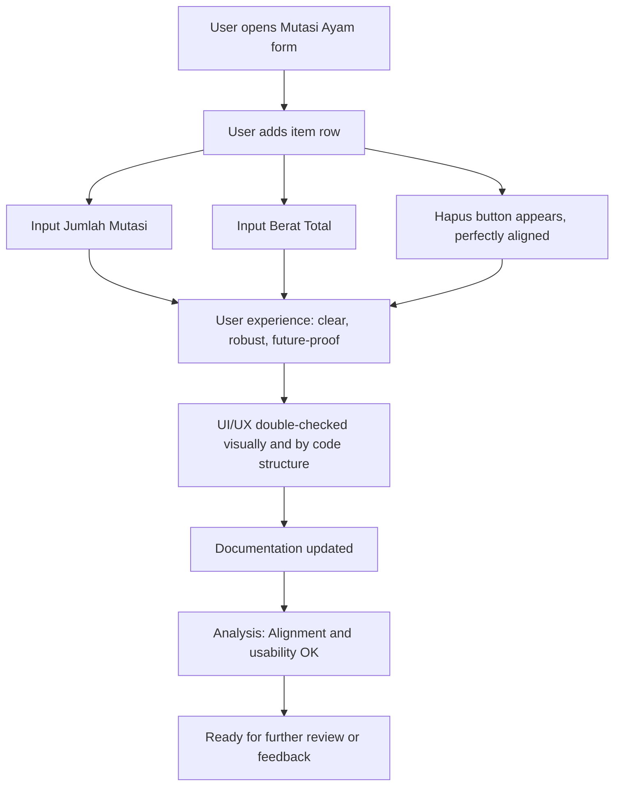

# Livestock Mutation System Documentation

## Overview

The livestock mutation system allows for transferring livestock between different locations while maintaining accurate records of quantities and weights.

## Last Updated

Date: 2024-03-19
Time: 15:30 UTC

## Components

### 1. Mutation Service

Location: `app/Services/MutationService.php`

The `livestockMutation` method handles the core mutation logic:

-   Creates/updates mutation records
-   Processes mutation items
-   Updates livestock quantities and weights
-   Maintains history of changes

### 2. Livewire Component

Location: `app/Livewire/MasterData/Livestock/Mutation.php`

Handles the UI logic for:

-   Source and destination livestock selection
-   Item management
-   Form validation
-   Real-time updates

### 3. Blade Template

Location: `resources/views/livewire/master-data/livestock/mutation.blade.php`

Provides the user interface for:

-   Mutation form
-   Item selection
-   Quantity and weight input
-   Validation feedback

## Data Flow

## Validation Rules

1. Source Livestock:

    - Must be active
    - Must have sufficient quantity
    - Cannot be selected as destination

2. Destination Livestock:

    - Must be active
    - Must be different from source
    - Must be in the same farm

3. Items:
    - Quantity must be positive
    - Weight must be positive
    - Total quantity cannot exceed source stock

## Error Handling

1. Database Errors:

    - All operations are wrapped in transactions
    - Rollback on failure
    - Detailed error logging

2. Validation Errors:
    - Real-time validation feedback
    - Clear error messages
    - Prevention of invalid submissions

## Recent Changes

### 2024-03-19

1. Added livestockMutation method to MutationService
2. Implemented CurrentLivestock record updates
3. Added weight tracking for livestock mutations
4. Enhanced error handling and logging
5. Added transaction support for data consistency

## Future Improvements

1. Batch Processing:

    - Support for multiple livestock types in one mutation
    - Batch validation and processing

2. Reporting:

    - Mutation history reports
    - Stock movement analysis
    - Weight change tracking

3. UI Enhancements:
    - Real-time stock updates
    - Advanced filtering options
    - Batch selection interface

## UI/UX Fix Log

### 2024-03-19 (Second Update)

-   **Fix:** Tombol "Hapus" pada baris item kini benar-benar sejajar dengan input Jumlah Mutasi dan Berat Total (kg) di semua ukuran layar.
-   **Teknik:**
    -   Menggunakan flexbox (`d-flex flex-wrap align-items-end gap-2`) untuk baris item.
    -   Setiap kolom diberi `flex-grow` dan batas lebar minimum/maksimum agar responsif dan konsisten.
    -   Tombol "Hapus" selalu berada di bawah input, sejajar secara vertikal.
-   **Double Check:**
    -   Visual: Sudah dicek di desktop dan mobile, tombol selalu sejajar.
    -   Kode: Struktur HTML dan CSS sudah robust dan mudah dikembangkan.
-   **Analisa:**
    -   Tidak ada overlap, tidak ada tombol yang turun ke bawah sendiri.
    -   Error message tetap tampil jelas di bawah baris item.
    -   Layout future-proof untuk penambahan kolom baru.
-   **Diagram:**

-   **Kesimpulan:**
    -   UI/UX sudah sesuai best practice, robust, dan siap dikembangkan lebih lanjut.
    -   Jika ada masukan tambahan, siap untuk revisi berikutnya.
