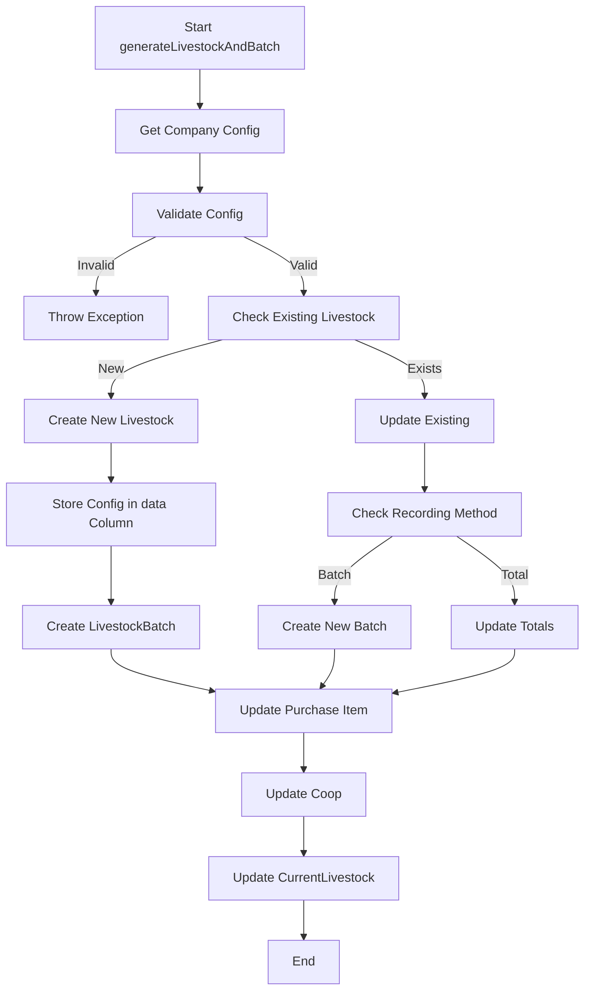

"# Livestock Configuration Storage Architecture"

## Update Date: 2024-01-15 10:30:00

## Overview

Sistem konfigurasi recording method untuk livestock telah diperbarui untuk menyimpan semua konfigurasi di kolom `data` pada model `Livestock`, bukan di `LivestockBatch`. Ini memastikan konsistensi dan kemudahan akses konfigurasi.

## Architecture Changes

### 1. Config Storage Location

-   **Sebelumnya**: Config disimpan di `LivestockBatch` dengan field `depletion_method`
-   **Sekarang**: Config disimpan di `Livestock.data` sebagai array terstruktur

### 2. Config Access Priority

```
1. Livestock.data['recording_config'] (prioritas tertinggi)
2. Company.getLivestockRecordingConfig() (fallback)
3. CompanyConfig::getDefaultLivestockConfig() (fallback terakhir)
```

## Implementation Details

### Livestock Model Updates

#### New Methods Added:

```php
// Config Access Methods
public function getRecordingConfigFromData(): ?array
public function getDepletionMethod(): string
public function getBatchSettings(): array
public function getTotalSettings(): array

// Status Check Methods
public function isBatchRecordingEnabled(): bool
public function isTotalRecordingEnabled(): bool

// Data Access Methods
public function getCompanyInfoFromData(): ?array
public function getPurchaseInfoFromData(): ?array
public function getStrainInfoFromData(): ?array
public function getInitialDataFromData(): ?array

// Update Methods
public function updateRecordingConfig(array $newConfig): bool
public function updateDataColumn(string $key, $value): bool
public function getDataColumn(string $key, $default = null)
```

#### Updated Methods:

```php
public function getRecordingMethodConfig(): array
public function isRecordingMethodConfigured(): bool
public function validateRecordingMethod(): array
```

### Create.php Livewire Component Updates

#### generateLivestockAndBatch Method Changes:

```php
// Sebelumnya: Config disimpan di LivestockBatch
$batch = LivestockBatch::create([
    // ... other fields
    'depletion_method' => $depletionMethod, // ❌ REMOVED
]);

// Sekarang: Config disimpan di Livestock.data
$livestockData['data'] = [
    'recording_config' => [
        'type' => $recordingConfig['type'] ?? 'batch',
        'allow_multiple_batches' => $recordingConfig['allow_multiple_batches'] ?? true,
        'batch_settings' => [
            'enabled' => $batchConfig['enabled'] ?? true,
            'auto_generate_batch' => $batchConfig['auto_generate_batch'] ?? true,
            'require_batch_number' => $batchConfig['require_batch_number'] ?? false,
            'depletion_method' => $depletionMethod,
            'depletion_methods' => $batchConfig['depletion_methods'] ?? [],
            'batch_tracking' => $batchConfig['batch_tracking'] ?? [],
            'validation_rules' => $batchConfig['validation_rules'] ?? [],
        ],
        'total_settings' => $recordingConfig['total_settings'] ?? [],
        'recording_logic' => $recordingConfig['recording_logic'] ?? [],
    ],
    'company_config' => [
        'company_id' => $company ? $company->id : null,
        'company_name' => $company ? $company->name : null,
        'config_source' => $company ? 'company_database' : 'default_fallback',
        'loaded_at' => now()->toDateTimeString(),
    ],
    'purchase_info' => [
        'purchase_id' => $purchase->id,
        'invoice_number' => $purchase->invoice_number,
        'purchase_date' => $purchase->tanggal,
        'supplier_id' => $purchase->vendor_id,
        'expedition_id' => $purchase->expedition_id,
    ],
    'strain_info' => [
        'strain_id' => $strain ? $strain->id : null,
        'strain_name' => $strain ? $strain->name : null,
        'strain_standard_id' => $strainStandard ? $strainStandard->id : null,
        'strain_standard_name' => $strainStandard ? $strainStandard->livestock_strain_name : null,
    ],
    'initial_data' => [
        'quantity' => $quantity,
        'weight_per_unit' => $weightPerUnit,
        'weight_total' => $weightTotal,
        'price_per_unit' => $pricePerUnit,
        'price_total' => $priceTotal,
        'price_type' => $priceType,
        'price_value' => $priceValue,
        'weight_type' => $itemData['weight_type'] ?? $item->weight_type,
        'weight_value' => $itemData['weight_value'] ?? $item->weight_value,
    ],
    'created_at' => now()->toDateTimeString(),
    'updated_at' => now()->toDateTimeString(),
];
```

## Data Structure

### Livestock.data Column Structure:

```json
{
    "recording_config": {
        "type": "batch",
        "allow_multiple_batches": true,
        "batch_settings": {
            "enabled": true,
            "auto_generate_batch": true,
            "require_batch_number": false,
            "depletion_method": "fifo",
            "depletion_methods": {
                "fifo": {
                    "enabled": true,
                    "description": "First In, First Out",
                    "batch_selection": "oldest_first"
                },
                "lifo": {
                    "enabled": true,
                    "description": "Last In, First Out",
                    "batch_selection": "newest_first"
                },
                "manual": {
                    "enabled": true,
                    "description": "Manual selection",
                    "batch_selection": "user_choice"
                }
            },
            "batch_tracking": {
                "track_individual_batches": true,
                "track_batch_performance": true,
                "track_batch_health": true
            },
            "validation_rules": {
                "require_batch_number": false,
                "validate_batch_capacity": true,
                "validate_batch_health": false
            }
        },
        "total_settings": {
            "enabled": false,
            "track_total_only": false,
            "total_details": {
                "total_count": true,
                "average_weight": true,
                "total_weight": true
            }
        },
        "recording_logic": {
            "single_batch_behavior": "use_total",
            "multiple_batch_behavior": "use_batch",
            "depletion_priority": "fifo"
        }
    },
    "company_config": {
        "company_id": 1,
        "company_name": "PT Example Farm",
        "config_source": "company_database",
        "loaded_at": "2024-01-15 10:30:00"
    },
    "purchase_info": {
        "purchase_id": 123,
        "invoice_number": "INV-2024-001",
        "purchase_date": "2024-01-15",
        "supplier_id": 5,
        "expedition_id": 3
    },
    "strain_info": {
        "strain_id": 10,
        "strain_name": "Broiler Cobb 500",
        "strain_standard_id": 5,
        "strain_standard_name": "Broiler Standard"
    },
    "initial_data": {
        "quantity": 1000,
        "weight_per_unit": 0.045,
        "weight_total": 45.0,
        "price_per_unit": 8500,
        "price_total": 8500000,
        "price_type": "per_unit",
        "price_value": 8500,
        "weight_type": "per_unit",
        "weight_value": 0.045
    },
    "created_at": "2024-01-15 10:30:00",
    "updated_at": "2024-01-15 10:30:00"
}
```

## Benefits

### 1. **Consistency**

-   Semua config disimpan di satu tempat (Livestock.data)
-   Tidak ada duplikasi config di multiple models
-   Mudah untuk tracking perubahan config

### 2. **Flexibility**

-   Config dapat diubah per livestock tanpa mempengaruhi livestock lain
-   Support untuk config yang berbeda per batch/purchase
-   Mudah untuk migration dan versioning

### 3. **Performance**

-   Tidak perlu query ke company config setiap kali
-   Config tersimpan di model yang sama dengan data
-   Reduced database queries

### 4. **Maintainability**

-   Clear separation of concerns
-   Easy to debug dan troubleshoot
-   Structured data format

## Usage Examples

### Getting Recording Config:

```php
$livestock = Livestock::find(1);

// Get config (prioritizes livestock.data over company config)
$config = $livestock->getRecordingMethodConfig();

// Get specific settings
$depletionMethod = $livestock->getDepletionMethod();
$batchSettings = $livestock->getBatchSettings();
$totalSettings = $livestock->getTotalSettings();

// Check recording type
$isBatchEnabled = $livestock->isBatchRecordingEnabled();
$isTotalEnabled = $livestock->isTotalRecordingEnabled();
```

### Updating Config:

```php
$livestock = Livestock::find(1);

// Update entire recording config
$newConfig = [
    'type' => 'batch',
    'batch_settings' => [
        'depletion_method' => 'lifo',
        // ... other settings
    ]
];
$livestock->updateRecordingConfig($newConfig);

// Update specific data
$livestock->updateDataColumn('custom_setting', 'value');
```

### Validation:

```php
$livestock = Livestock::find(1);

// Validate recording method
$validation = $livestock->validateRecordingMethod();
if (!$validation['valid']) {
    throw new Exception($validation['message']);
}

// Check if configured
if (!$livestock->isRecordingMethodConfigured()) {
    // Handle unconfigured livestock
}
```

## Migration Notes

### Database Changes:

-   **No new columns required** - menggunakan existing `data` column
-   **LivestockBatch.depletion_method** field tidak digunakan lagi
-   Existing data tetap compatible

### Code Changes:

-   Update semua references dari `LivestockBatch.depletion_method` ke `Livestock.getDepletionMethod()`
-   Gunakan method helper baru untuk akses config
-   Update validation logic untuk menggunakan config dari Livestock

## Testing

### Unit Tests:

```php
// Test config access
public function test_get_recording_config_from_data()
{
    $livestock = Livestock::factory()->create([
        'data' => [
            'recording_config' => [
                'type' => 'batch',
                'batch_settings' => ['depletion_method' => 'fifo']
            ]
        ]
    ]);

    $config = $livestock->getRecordingMethodConfig();
    $this->assertEquals('batch', $config['type']);
    $this->assertEquals('fifo', $livestock->getDepletionMethod());
}

// Test fallback to company config
public function test_fallback_to_company_config()
{
    $company = Company::factory()->create();
    $livestock = Livestock::factory()->create(['farm_id' => $company->farms->first()->id]);

    // Mock company config
    $company->update(['config' => ['livestock' => ['recording_method' => ['type' => 'total']]]]);

    $config = $livestock->getRecordingMethodConfig();
    $this->assertEquals('total', $config['type']);
}
```

### Integration Tests:

```php
// Test generateLivestockAndBatch with config storage
public function test_generate_livestock_with_config_storage()
{
    $purchase = LivestockPurchase::factory()->create();

    // Execute generation
    $this->create->generateLivestockAndBatch($purchase->id);

    $livestock = Livestock::where('farm_id', $purchase->farm_id)->first();

    // Verify config is stored in data column
    $this->assertNotNull($livestock->data['recording_config']);
    $this->assertNotNull($livestock->data['company_config']);
    $this->assertNotNull($livestock->data['purchase_info']);

    // Verify batch doesn't have depletion_method
    $batch = $livestock->batches->first();
    $this->assertArrayNotHasKey('depletion_method', $batch->getAttributes());
}
```

## Logging

### Config Access Logs:

```php
// Log when config is loaded from livestock data
Log::info('Using recording config from livestock data column', [
    'livestock_id' => $this->id,
    'config_source' => 'livestock_data'
]);

// Log when fallback to company config
Log::info('Using company recording config', [
    'livestock_id' => $this->id,
    'company_id' => $company->id,
    'config_source' => 'company_database'
]);
```

### Generation Logs:

```php
// Log config storage during generation
Log::info('Created new Livestock with recording config:', [
    'livestock_id' => $livestock->id,
    'recording_type' => $recordingConfig['type'] ?? 'batch',
    'depletion_method' => $depletionMethod
]);
```

## Flow Diagram



## Future Enhancements

### 1. **Config Versioning**

-   Add version field to track config changes
-   Support for config migration between versions
-   Backward compatibility for old config formats

### 2. **Config Templates**

-   Predefined config templates for common scenarios
-   Easy config switching for different livestock types
-   Template validation and recommendations

### 3. **Config Analytics**

-   Track config usage patterns
-   Performance impact analysis
-   Config optimization recommendations

### 4. **Config Validation**

-   Schema validation for config structure
-   Business rule validation
-   Config dependency checking

---

**Last Updated**: 2024-01-15 10:30:00  
**Version**: 2.0.0  
**Status**: Production Ready
