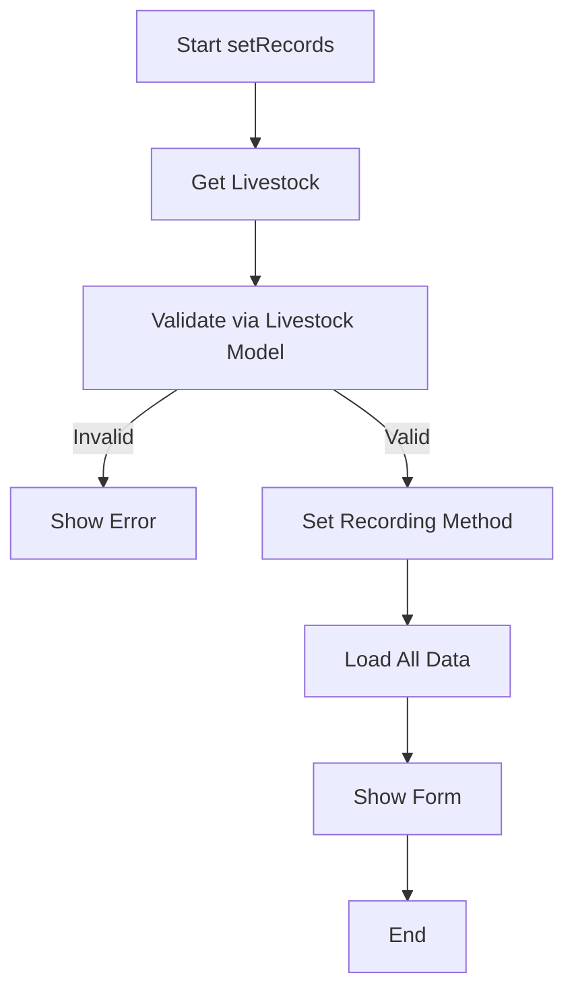

# Recording Method Validation Documentation

## Update Date: 2024-03-19

## Changes Made

### 1. Added Recording Method Validation in Records Component

The Records component has been updated to include validation for the recording method configuration. The following changes were implemented:

-   Added `recordingMethod` property to track the current recording method
-   Added validation rules for the recording method
-   Implemented checks for recording method configuration
-   Added handling for batch vs total recording methods
-   Refactored code into separate functions for better organization
-   Moved validation logic to Livestock model for better separation of concerns

### 2. Added Default Configuration to Livestock Model

The Livestock model now includes:

-   Default recording method configuration
-   Methods to check and validate recording methods
-   Helper methods for batch management
-   Centralized validation logic

### 3. Validation Logic

The validation now includes:

1. Checking if recording method is configured in company settings
2. Verifying if multiple batches are allowed based on configuration
3. Determining the appropriate recording method based on batch count
4. Setting default to 'total' if no multiple batches exist

### 4. Error Handling

Added error messages for:

-   Missing recording method configuration
-   Invalid recording method selection
-   Multiple batches not allowed in current configuration
-   Company configuration not found

## Technical Details

### Component Properties

```php
public $recordingMethod;
```

### Validation Rules

```php
protected $rules = [
    'recordingMethod' => 'required|in:batch,total',
];
```

### Error Messages

```php
protected $messages = [
    'recordingMethod.required' => 'Recording method must be selected.',
    'recordingMethod.in' => 'Invalid recording method selected.',
];
```

### New Livestock Model Methods

1. `getDefaultRecordingConfig(): array`

    - Returns default recording method configuration
    - Includes batch and total settings

2. `getRecordingMethod(): string`

    - Returns 'batch' or 'total' based on active batch count

3. `hasMultipleBatches(): bool`

    - Checks if livestock has multiple active batches

4. `getActiveBatchesCount(): int`

    - Returns count of active batches

5. `isRecordingMethodConfigured(): bool`

    - Checks if recording method is configured for company

6. `getRecordingMethodConfig(): array`

    - Gets recording method configuration with fallback to defaults

7. `validateRecordingMethod(): array`
    - Comprehensive validation with detailed result array

### Refactored Component Functions

1. `validateRecordingMethod(Livestock $livestock, Company $company): bool`

    - Now uses Livestock model's validation method
    - Simplified logic with better error handling

2. `checkAndSetRecordingMethod(Livestock $livestock, Company $company): bool`

    - Uses Livestock model's validation
    - Sets recording method based on validation result

3. `loadAllRecordingData(): void`
    - Loads all necessary data for recording
    - Includes stock data, item quantities, supplies, etc.

## Flow Diagram



## Default Configuration

```php
[
    'type' => 'total',
    'allow_multiple_batches' => false,
    'batch_settings' => [
        'enabled' => false,
        'auto_generate_batch' => false,
        'require_batch_number' => false,
        'batch_details' => [
            'weight' => false,
            'age' => false,
            'breed' => false,
            'health_status' => false,
            'notes' => false,
        ]
    ],
    'total_settings' => [
        'enabled' => true,
        'track_total_only' => true,
        'total_details' => [
            'total_count' => true,
            'average_weight' => true,
            'total_weight' => true,
        ]
    ]
]
```

## Dependencies

-   Company Model
-   Livestock Model
-   LivestockBatch Model
-   CompanyConfig

## Related Files

-   `app/Livewire/Records.php`
-   `app/Models/Company.php`
-   `app/Models/Livestock.php`
-   `app/Models/LivestockBatch.php`
-   `app/Config/CompanyConfig.php`

## CompanyConfig Integration

The system now uses `CompanyConfig::getDefaultLivestockConfig()` for default configuration. This provides:

### Complete Livestock Configuration Structure

```php
[
    'recording_method' => [
        'type' => 'batch',
        'allow_multiple_batches' => true,
        'batch_settings' => [
            'enabled' => true,
            'auto_generate_batch' => true,
            'require_batch_number' => false,
            'batch_details' => [
                'weight' => true,
                'age' => true,
                'breed' => true,
                'health_status' => true,
                'notes' => true,
            ],
            'depletion_method' => 'fifo',
            'depletion_methods' => [
                'fifo' => [
                    'enabled' => true,
                    'description' => 'Batch yang masuk pertama akan digunakan terlebih dahulu',
                    'track_age' => true,
                    'auto_select' => true,
                ],
                'lifo' => [
                    'enabled' => true,
                    'description' => 'Batch yang masuk terakhir akan digunakan terlebih dahulu',
                    'track_age' => false,
                    'auto_select' => true,
                ],
                'manual' => [
                    'enabled' => true,
                    'description' => 'Pengguna dapat memilih batch secara manual',
                    'track_age' => true,
                    'auto_select' => false,
                    'show_batch_details' => true,
                    'require_selection' => true,
                ],
            ],
            'batch_tracking' => [
                'enabled' => true,
                'track_individual_batches' => true,
                'track_batch_performance' => true,
                'batch_aging' => true,
                'batch_rotation' => true,
            ],
        ],
        'total_settings' => [
            'enabled' => false,
            'use_when' => [
                'single_batch_only' => true,
                'fallback_method' => true,
                'summary_reports' => true,
            ],
        ],
        'recording_logic' => [
            'single_batch' => [
                'method' => 'total',
                'description' => 'Untuk ternak dengan 1 batch, gunakan pencatatan total',
            ],
            'multiple_batches' => [
                'method' => 'batch',
                'description' => 'Untuk ternak dengan multiple batch, gunakan pencatatan batch',
                'depletion_methods' => ['fifo', 'lifo', 'manual'],
                'default_depletion' => 'fifo',
            ],
        ],
    ],
    'depletion_tracking' => [
        'enabled' => true,
        'types' => [
            'mortality' => [
                'enabled' => true,
                'track_by_batch' => true,
                'batch_attribution' => 'auto',
            ],
            'culling' => [
                'enabled' => true,
                'track_by_batch' => true,
                'batch_attribution' => 'manual',
            ],
            'sales' => [
                'enabled' => true,
                'track_by_batch' => true,
                'batch_attribution' => 'manual',
            ],
        ],
        'batch_attribution_methods' => [
            'auto' => [
                'enabled' => true,
                'description' => 'Sistem otomatis menentukan batch berdasarkan depletion method',
            ],
            'manual' => [
                'enabled' => true,
                'description' => 'Pengguna memilih batch secara manual',
            ],
        ],
    ],
    'weight_tracking' => [
        'enabled' => true,
        'unit' => 'gram',
        'precision' => 2,
        'require_daily_weight' => false,
        'weight_gain_calculation' => true,
    ],
    'feed_tracking' => [
        'enabled' => true,
        'require_feed_type' => true,
        'require_quantity' => true,
        'fcr_calculation' => true,
        'feed_cost_tracking' => false,
    ],
    'supply_tracking' => [
        'enabled' => true,
        'require_supply_type' => true,
        'require_quantity' => true,
        'supply_cost_tracking' => false,
    ],
    'performance_metrics' => [
        'enabled' => true,
        'metrics' => [
            'fcr' => true,
            'ip' => true,
            'adg' => true,
            'mortality_rate' => true,
            'liveability' => true,
        ],
        'calculation_frequency' => 'daily',
    ],
    'validation_rules' => [
        'enabled' => false,
        'require_farm' => true,
        'require_coop' => true,
        'require_start_date' => true,
        'require_initial_quantity' => true,
        'require_initial_weight' => false,
        'max_future_date' => 1,
        'min_quantity' => 1,
        'max_quantity' => 100000,
    ],
    'documentation' => [
        'enabled' => true,
        'require_notes' => false,
        'require_photos' => false,
        'auto_generate_reports' => false,
    ],
]
```

### New Batch Recording Logic

#### **Depletion Methods:**

1. **FIFO (First In First Out)**

    - Batch yang masuk pertama digunakan terlebih dahulu
    - Cocok untuk ternak yang perlu dikonsumsi berdasarkan umur
    - Tracking umur batch otomatis

2. **LIFO (Last In First Out)**

    - Batch yang masuk terakhir digunakan terlebih dahulu
    - Cocok untuk ternak dengan kualitas yang lebih baik di batch baru
    - Tidak memerlukan tracking umur

3. **Manual**
    - Pengguna memilih batch secara manual
    - Fleksibilitas maksimal untuk pemilihan batch
    - Menampilkan detail batch untuk pemilihan

#### **Recording Logic:**

-   **Single Batch**: Menggunakan pencatatan total untuk kesederhanaan
-   **Multiple Batches**: Menggunakan pencatatan batch dengan depletion method yang sesuai

### Benefits of CompanyConfig Integration

1. **Centralized Configuration**: All livestock-related configurations are in one place
2. **Consistent Defaults**: Same defaults across the entire application
3. **Easy Maintenance**: Changes to defaults only need to be made in one location
4. **Future-Proof**: Structure supports future livestock features
5. **Comprehensive**: Includes all aspects of livestock management
6. **Better DB Tracking**: Batch recording provides explicit database tracking
7. **Flexible Depletion**: Multiple depletion methods for different business needs

### Configuration Sections

-   **recording_method**: Controls how livestock data is recorded with batch logic
-   **depletion_tracking**: Manages mortality, culling, and sales tracking by batch
-   **weight_tracking**: Controls weight measurement and calculations by batch
-   **feed_tracking**: Manages feed consumption tracking by batch
-   **supply_tracking**: Controls supply/OVK usage tracking by batch
-   **performance_metrics**: Defines which performance indicators to calculate by batch
-   **validation_rules**: Sets validation requirements for livestock data including batch validation
-   **documentation**: Controls documentation and reporting features with batch history

## Sample Output Configurations

### 1. Default Configuration (When Company Config is Missing)

```php
// Output from Livestock::getDefaultRecordingConfig()
[
    'type' => 'total',
    'allow_multiple_batches' => false,
    'batch_settings' => [
        'enabled' => false,
        'auto_generate_batch' => false,
        'require_batch_number' => false,
        'batch_details' => [
            'weight' => false,
            'age' => false,
            'breed' => false,
            'health_status' => false,
            'notes' => false,
        ]
    ],
    'total_settings' => [
        'enabled' => true,
        'track_total_only' => true,
        'total_details' => [
            'total_count' => true,
            'average_weight' => true,
            'total_weight' => true,
        ]
    ]
]
```

### 2. Company Configuration - Total Recording Method

```php
// Company config: livestock.recording_method
[
    'type' => 'total',
    'allow_multiple_batches' => false,
    'batch_settings' => [
        'enabled' => false,
        'auto_generate_batch' => false,
        'require_batch_number' => false,
        'batch_details' => [
            'weight' => false,
            'age' => false,
            'breed' => false,
            'health_status' => false,
            'notes' => false,
        ]
    ],
    'total_settings' => [
        'enabled' => true,
        'track_total_only' => true,
        'total_details' => [
            'total_count' => true,
            'average_weight' => true,
            'total_weight' => true,
        ]
    ]
]

// Validation Result for Livestock with 1 batch
[
    'valid' => true,
    'method' => 'total',
    'message' => '',
    'config' => [/* company config */]
]
```

### 3. Company Configuration - Batch Recording Method (Single Batch)

```php
// Company config: livestock.recording_method
[
    'type' => 'batch',
    'allow_multiple_batches' => true,
    'batch_settings' => [
        'enabled' => true,
        'auto_generate_batch' => true,
        'require_batch_number' => false,
        'batch_details' => [
            'weight' => true,
            'age' => true,
            'breed' => false,
            'health_status' => true,
            'notes' => true,
        ]
    ],
    'total_settings' => [
        'enabled' => false,
        'track_total_only' => false,
        'total_details' => [
            'total_count' => false,
            'average_weight' => false,
            'total_weight' => false,
        ]
    ]
]

// Validation Result for Livestock with 1 batch
[
    'valid' => true,
    'method' => 'total', // Still total because only 1 batch
    'message' => '',
    'config' => [/* company config */]
]
```

### 4. Company Configuration - Batch Recording Method (Multiple Batches)

```php
// Company config: livestock.recording_method
[
    'type' => 'batch',
    'allow_multiple_batches' => true,
    'batch_settings' => [
        'enabled' => true,
        'auto_generate_batch' => true,
        'require_batch_number' => true,
        'batch_details' => [
            'weight' => true,
            'age' => true,
            'breed' => true,
            'health_status' => true,
            'notes' => true,
        ]
    ],
    'total_settings' => [
        'enabled' => false,
        'track_total_only' => false,
        'total_details' => [
            'total_count' => false,
            'average_weight' => false,
            'total_weight' => false,
        ]
    ]
]

// Validation Result for Livestock with 3 batches
[
    'valid' => true,
    'method' => 'batch',
    'message' => '',
    'config' => [/* company config */]
]
```

### 5. Error Scenario - Multiple Batches Not Allowed

```php
// Company config: livestock.recording_method
[
    'type' => 'batch',
    'allow_multiple_batches' => false, // Multiple batches not allowed
    'batch_settings' => [
        'enabled' => true,
        'auto_generate_batch' => false,
        'require_batch_number' => false,
        'batch_details' => [
            'weight' => true,
            'age' => true,
            'breed' => false,
            'health_status' => false,
            'notes' => true,
        ]
    ],
    'total_settings' => [
        'enabled' => false,
        'track_total_only' => false,
        'total_details' => [
            'total_count' => false,
            'average_weight' => false,
            'total_weight' => false,
        ]
    ]
]

// Validation Result for Livestock with 2 batches
[
    'valid' => false,
    'method' => 'batch',
    'message' => 'Multiple batches are not allowed in the current recording method configuration.',
    'config' => [/* company config */]
]
```

### 6. Error Scenario - No Company Configuration

```php
// No company config set

// Validation Result
[
    'valid' => false,
    'method' => 'total',
    'message' => 'Recording method configuration is not set. Please configure it in company settings first.',
    'config' => null
]
```

### 7. Error Scenario - Company Not Found

```php
// Livestock has no farm or farm has no company

// Validation Result
[
    'valid' => false,
    'method' => 'total',
    'message' => 'Company configuration not found for this livestock.',
    'config' => null
]
```

## Usage Examples

### Example 1: Check Recording Method

```php
$livestock = Livestock::find($id);
$method = $livestock->getRecordingMethod(); // Returns 'batch' or 'total'
```

### Example 2: Validate Recording Method

```php
$livestock = Livestock::find($id);
$validation = $livestock->validateRecordingMethod();

if ($validation['valid']) {
    $recordingMethod = $validation['method'];
    $config = $validation['config'];
} else {
    $errorMessage = $validation['message'];
}
```

### Example 3: Check Batch Count

```php
$livestock = Livestock::find($id);
$batchCount = $livestock->getActiveBatchesCount();
$hasMultiple = $livestock->hasMultipleBatches();
```

### Example 4: Get Configuration with Fallback

```php
$livestock = Livestock::find($id);
$config = $livestock->getRecordingMethodConfig(); // Returns company config or default
```

# Livestock Recording Method Validation & Configuration

## Overview

Sistem validasi dan konfigurasi recording method untuk livestock telah diperbarui untuk menyimpan semua konfigurasi di kolom `data` pada model `Livestock`, bukan di `LivestockBatch`. Ini memastikan konsistensi dan kemudahan akses konfigurasi.

## Architecture Changes

### 1. Config Storage Location

-   **Sebelumnya**: Config disimpan di `LivestockBatch` dengan field `depletion_method`
-   **Sekarang**: Config disimpan di `Livestock.data` sebagai array terstruktur

### 2. Config Access Priority

```
1. Livestock.data['recording_config'] (prioritas tertinggi)
2. Company.getLivestockRecordingConfig() (fallback)
3. CompanyConfig::getDefaultLivestockConfig() (fallback terakhir)
```

## Implementation Details

### Livestock Model Updates

#### New Methods Added:

```php
// Config Access Methods
public function getRecordingConfigFromData(): ?array
public function getDepletionMethod(): string
public function getBatchSettings(): array
public function getTotalSettings(): array

// Status Check Methods
public function isBatchRecordingEnabled(): bool
public function isTotalRecordingEnabled(): bool

// Data Access Methods
public function getCompanyInfoFromData(): ?array
public function getPurchaseInfoFromData(): ?array
public function getStrainInfoFromData(): ?array
public function getInitialDataFromData(): ?array

// Update Methods
public function updateRecordingConfig(array $newConfig): bool
public function updateDataColumn(string $key, $value): bool
public function getDataColumn(string $key, $default = null)
```

#### Updated Methods:

```php
public function getRecordingMethodConfig(): array
public function isRecordingMethodConfigured(): bool
public function validateRecordingMethod(): array
```

### Create.php Livewire Component Updates

#### generateLivestockAndBatch Method Changes:

```php
// Sebelumnya: Config disimpan di LivestockBatch
$batch = LivestockBatch::create([
    // ... other fields
    'depletion_method' => $depletionMethod, // ❌ REMOVED
]);

// Sekarang: Config disimpan di Livestock.data
$livestockData['data'] = [
    'recording_config' => [
        'type' => $recordingConfig['type'] ?? 'batch',
        'allow_multiple_batches' => $recordingConfig['allow_multiple_batches'] ?? true,
        'batch_settings' => [
            'enabled' => $batchConfig['enabled'] ?? true,
            'auto_generate_batch' => $batchConfig['auto_generate_batch'] ?? true,
            'require_batch_number' => $batchConfig['require_batch_number'] ?? false,
            'depletion_method' => $depletionMethod,
            'depletion_methods' => $batchConfig['depletion_methods'] ?? [],
            'batch_tracking' => $batchConfig['batch_tracking'] ?? [],
            'validation_rules' => $batchConfig['validation_rules'] ?? [],
        ],
        'total_settings' => $recordingConfig['total_settings'] ?? [],
        'recording_logic' => $recordingConfig['recording_logic'] ?? [],
    ],
    'company_config' => [
        'company_id' => $company ? $company->id : null,
        'company_name' => $company ? $company->name : null,
        'config_source' => $company ? 'company_database' : 'default_fallback',
        'loaded_at' => now()->toDateTimeString(),
    ],
    'purchase_info' => [
        'purchase_id' => $purchase->id,
        'invoice_number' => $purchase->invoice_number,
        'purchase_date' => $purchase->tanggal,
        'supplier_id' => $purchase->vendor_id,
        'expedition_id' => $purchase->expedition_id,
    ],
    'strain_info' => [
        'strain_id' => $strain ? $strain->id : null,
        'strain_name' => $strain ? $strain->name : null,
        'strain_standard_id' => $strainStandard ? $strainStandard->id : null,
        'strain_standard_name' => $strainStandard ? $strainStandard->livestock_strain_name : null,
    ],
    'initial_data' => [
        'quantity' => $quantity,
        'weight_per_unit' => $weightPerUnit,
        'weight_total' => $weightTotal,
        'price_per_unit' => $pricePerUnit,
        'price_total' => $priceTotal,
        'price_type' => $priceType,
        'price_value' => $priceValue,
        'weight_type' => $itemData['weight_type'] ?? $item->weight_type,
        'weight_value' => $itemData['weight_value'] ?? $item->weight_value,
    ],
    'created_at' => now()->toDateTimeString(),
    'updated_at' => now()->toDateTimeString(),
];
```

## Data Structure

### Livestock.data Column Structure:

```json
{
    "recording_config": {
        "type": "batch",
        "allow_multiple_batches": true,
        "batch_settings": {
            "enabled": true,
            "auto_generate_batch": true,
            "require_batch_number": false,
            "depletion_method": "fifo",
            "depletion_methods": {
                "fifo": {
                    "enabled": true,
                    "description": "First In, First Out",
                    "batch_selection": "oldest_first"
                },
                "lifo": {
                    "enabled": true,
                    "description": "Last In, First Out",
                    "batch_selection": "newest_first"
                },
                "manual": {
                    "enabled": true,
                    "description": "Manual selection",
                    "batch_selection": "user_choice"
                }
            },
            "batch_tracking": {
                "track_individual_batches": true,
                "track_batch_performance": true,
                "track_batch_health": true
            },
            "validation_rules": {
                "require_batch_number": false,
                "validate_batch_capacity": true,
                "validate_batch_health": false
            }
        },
        "total_settings": {
            "enabled": false,
            "track_total_only": false,
            "total_details": {
                "total_count": true,
                "average_weight": true,
                "total_weight": true
            }
        },
        "recording_logic": {
            "single_batch_behavior": "use_total",
            "multiple_batch_behavior": "use_batch",
            "depletion_priority": "fifo"
        }
    },
    "company_config": {
        "company_id": 1,
        "company_name": "PT Example Farm",
        "config_source": "company_database",
        "loaded_at": "2024-01-15 10:30:00"
    },
    "purchase_info": {
        "purchase_id": 123,
        "invoice_number": "INV-2024-001",
        "purchase_date": "2024-01-15",
        "supplier_id": 5,
        "expedition_id": 3
    },
    "strain_info": {
        "strain_id": 10,
        "strain_name": "Broiler Cobb 500",
        "strain_standard_id": 5,
        "strain_standard_name": "Broiler Standard"
    },
    "initial_data": {
        "quantity": 1000,
        "weight_per_unit": 0.045,
        "weight_total": 45.0,
        "price_per_unit": 8500,
        "price_total": 8500000,
        "price_type": "per_unit",
        "price_value": 8500,
        "weight_type": "per_unit",
        "weight_value": 0.045
    },
    "created_at": "2024-01-15 10:30:00",
    "updated_at": "2024-01-15 10:30:00"
}
```

## Benefits

### 1. **Consistency**

-   Semua config disimpan di satu tempat (Livestock.data)
-   Tidak ada duplikasi config di multiple models
-   Mudah untuk tracking perubahan config

### 2. **Flexibility**

-   Config dapat diubah per livestock tanpa mempengaruhi livestock lain
-   Support untuk config yang berbeda per batch/purchase
-   Mudah untuk migration dan versioning

### 3. **Performance**

-   Tidak perlu query ke company config setiap kali
-   Config tersimpan di model yang sama dengan data
-   Reduced database queries

### 4. **Maintainability**

-   Clear separation of concerns
-   Easy to debug dan troubleshoot
-   Structured data format

## Usage Examples

### Getting Recording Config:

```php
$livestock = Livestock::find(1);

// Get config (prioritizes livestock.data over company config)
$config = $livestock->getRecordingMethodConfig();

// Get specific settings
$depletionMethod = $livestock->getDepletionMethod();
$batchSettings = $livestock->getBatchSettings();
$totalSettings = $livestock->getTotalSettings();

// Check recording type
$isBatchEnabled = $livestock->isBatchRecordingEnabled();
$isTotalEnabled = $livestock->isTotalRecordingEnabled();
```

### Updating Config:

```php
$livestock = Livestock::find(1);

// Update entire recording config
$newConfig = [
    'type' => 'batch',
    'batch_settings' => [
        'depletion_method' => 'lifo',
        // ... other settings
    ]
];
$livestock->updateRecordingConfig($newConfig);

// Update specific data
$livestock->updateDataColumn('custom_setting', 'value');
```

### Validation:

```php
$livestock = Livestock::find(1);

// Validate recording method
$validation = $livestock->validateRecordingMethod();
if (!$validation['valid']) {
    throw new Exception($validation['message']);
}

// Check if configured
if (!$livestock->isRecordingMethodConfigured()) {
    // Handle unconfigured livestock
}
```

## Migration Notes

### Database Changes:

-   **No new columns required** - menggunakan existing `data` column
-   **LivestockBatch.depletion_method** field tidak digunakan lagi
-   Existing data tetap compatible

### Code Changes:

-   Update semua references dari `LivestockBatch.depletion_method` ke `Livestock.getDepletionMethod()`
-   Gunakan method helper baru untuk akses config
-   Update validation logic untuk menggunakan config dari Livestock

## Testing

### Unit Tests:

```php
// Test config access
public function test_get_recording_config_from_data()
{
    $livestock = Livestock::factory()->create([
        'data' => [
            'recording_config' => [
                'type' => 'batch',
                'batch_settings' => ['depletion_method' => 'fifo']
            ]
        ]
    ]);

    $config = $livestock->getRecordingMethodConfig();
    $this->assertEquals('batch', $config['type']);
    $this->assertEquals('fifo', $livestock->getDepletionMethod());
}

// Test fallback to company config
public function test_fallback_to_company_config()
{
    $company = Company::factory()->create();
    $livestock = Livestock::factory()->create(['farm_id' => $company->farms->first()->id]);

    // Mock company config
    $company->update(['config' => ['livestock' => ['recording_method' => ['type' => 'total']]]]);

    $config = $livestock->getRecordingMethodConfig();
    $this->assertEquals('total', $config['type']);
}
```

### Integration Tests:

```php
// Test generateLivestockAndBatch with config storage
public function test_generate_livestock_with_config_storage()
{
    $purchase = LivestockPurchase::factory()->create();

    // Execute generation
    $this->create->generateLivestockAndBatch($purchase->id);

    $livestock = Livestock::where('farm_id', $purchase->farm_id)->first();

    // Verify config is stored in data column
    $this->assertNotNull($livestock->data['recording_config']);
    $this->assertNotNull($livestock->data['company_config']);
    $this->assertNotNull($livestock->data['purchase_info']);

    // Verify batch doesn't have depletion_method
    $batch = $livestock->batches->first();
    $this->assertArrayNotHasKey('depletion_method', $batch->getAttributes());
}
```

## Logging

### Config Access Logs:

```php
// Log when config is loaded from livestock data
Log::info('Using recording config from livestock data column', [
    'livestock_id' => $this->id,
    'config_source' => 'livestock_data'
]);

// Log when fallback to company config
Log::info('Using company recording config', [
    'livestock_id' => $this->id,
    'company_id' => $company->id,
    'config_source' => 'company_database'
]);
```

### Generation Logs:

```php
// Log config storage during generation
Log::info('Created new Livestock with recording config:', [
    'livestock_id' => $livestock->id,
    'recording_type' => $recordingConfig['type'] ?? 'batch',
    'depletion_method' => $depletionMethod
]);
```

## Future Enhancements

### 1. **Config Versioning**

-   Add version field to track config changes
-   Support for config migration between versions
-   Backward compatibility for old config formats

### 2. **Config Templates**

-   Predefined config templates for common scenarios
-   Easy config switching for different livestock types
-   Template validation and recommendations

### 3. **Config Analytics**

-   Track config usage patterns
-   Performance impact analysis
-   Config optimization recommendations

### 4. **Config Validation**

-   Schema validation for config structure
-   Business rule validation
-   Config dependency checking

---

**Last Updated**: 2024-01-15 10:30:00  
**Version**: 2.0.0  
**Status**: Production Ready
