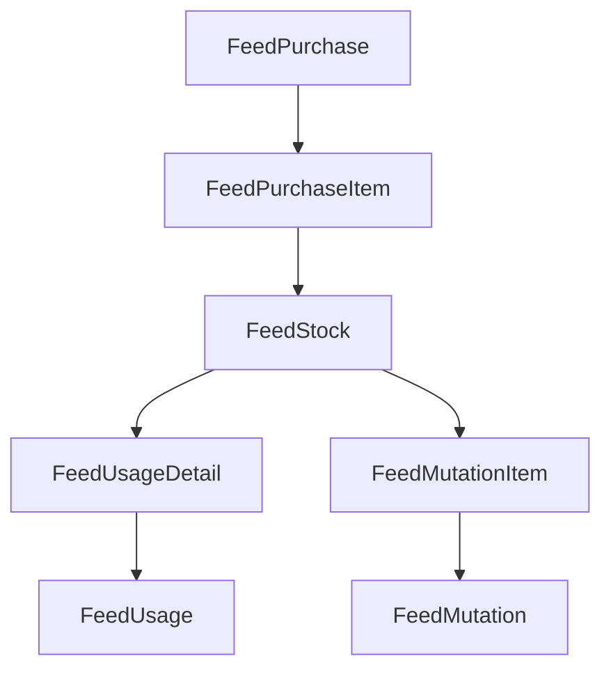

# FeedTransactionHistoryService Documentation

## Overview

`FeedTransactionHistoryService` adalah service terpusat untuk membangun histori stok pakan/obat secara linear dan detail, menggabungkan semua transaksi pembelian, pemakaian, dan mutasi dalam satu sumber data utama. Service ini dirancang untuk kebutuhan audit, laporan, dan integrasi frontend yang membutuhkan histori stok yang konsisten, kronologis, dan kaya informasi.

---

## Tujuan & Manfaat

-   **Satu sumber kebenaran** untuk semua histori stok pakan/obat.
-   Menyatukan seluruh transaksi (beli, pakai, mutasi masuk/keluar) dalam satu histori kronologis.
-   Memudahkan audit, pelacakan, dan pelaporan stok.
-   Output siap pakai untuk frontend (tabel, grafik) dan backend (export, API).
-   Extensible: mudah ditambah jenis transaksi baru (retur, koreksi, dsb).

---

## Struktur Data & Relasi Model

### Model Terkait

-   `FeedPurchase`, `FeedPurchaseItem` (pembelian)
-   `FeedStock` (stok fisik per transaksi)
-   `FeedUsage`, `FeedUsageDetail` (pemakaian)
-   `FeedMutation`, `FeedMutationItem` (mutasi masuk/keluar)
-   (Opsional: FeedReturn, FeedAdjustment, dsb)

### Relasi Kunci

-   `FeedPurchaseItem` → `FeedPurchase` (header)
-   `FeedStock` → `FeedPurchaseItem` (sumber stok)
-   `FeedUsageDetail` → `FeedUsage` (header)
-   `FeedUsageDetail` → `FeedStock` (stok yang dipakai)
-   `FeedMutationItem` → `FeedMutation` (header)
-   `FeedMutationItem` → `FeedStock` (stok yang dimutasi)

---

## Rancangan Database & Migration

### Tabel Utama: feed_transaction_histories

Tabel ini menyimpan seluruh histori transaksi pakan/obat secara terpusat dan kronologis.

#### Field Utama:

-   `id` (uuid, primary key)
-   `feed_id` (uuid, foreign key ke feeds)
-   `livestock_id` (uuid, foreign key ke livestocks)
-   `unit_id` (uuid, foreign key ke units)
-   `supplier_id` (uuid, nullable, foreign key ke partners)
-   `batch_no` (string, nullable)
-   `kadaluarsa` (date, nullable)
-   `tanggal` (date/datetime, index)
-   `jenis_transaksi` (enum/string: pembelian, pemakaian, mutasi_masuk, mutasi_keluar, retur, koreksi, dsb)
-   `nomor_transaksi` (string, nullable)
-   `masuk` (decimal)
-   `keluar` (decimal)
-   `stok_awal` (decimal)
-   `stok_akhir` (decimal)
-   `hpp` (decimal, nullable)
-   `keterangan` (string, nullable)
-   `created_at`, `updated_at`

#### Contoh Migration Laravel

```php
Schema::create('feed_transaction_histories', function (Blueprint $table) {
    $table->uuid('id')->primary();
    $table->uuid('feed_id');
    $table->uuid('livestock_id');
    $table->uuid('unit_id');
    $table->uuid('supplier_id')->nullable();
    $table->string('batch_no')->nullable();
    $table->date('kadaluarsa')->nullable();
    $table->dateTime('tanggal')->index();
    $table->string('jenis_transaksi');
    $table->string('nomor_transaksi')->nullable();
    $table->decimal('masuk', 12, 2)->default(0);
    $table->decimal('keluar', 12, 2)->default(0);
    $table->decimal('stok_awal', 12, 2)->default(0);
    $table->decimal('stok_akhir', 12, 2)->default(0);
    $table->decimal('hpp', 14, 4)->nullable();
    $table->string('keterangan')->nullable();
    $table->timestamps();
    $table->foreign('feed_id')->references('id')->on('feeds');
    $table->foreign('livestock_id')->references('id')->on('livestocks');
    $table->foreign('unit_id')->references('id')->on('units');
    $table->foreign('supplier_id')->references('id')->on('partners');
});
```

#### Indexing & Extensibility

-   Index pada `tanggal`, `feed_id`, `livestock_id`, dan `jenis_transaksi` untuk query cepat.
-   Tambahkan field baru (misal: retur, koreksi, metadata) tanpa mengubah struktur utama.
-   Bisa di-extend untuk multi-company/tenant dengan menambah `company_id`.

---

## Alur Query & Proses

1. **Ambil semua transaksi** (pembelian, usage, mutasi) untuk livestock/feed/periode tertentu.
2. **Gabungkan ke satu array** dengan field standar:
    - `tanggal`, `jenis_transaksi`, `masuk`, `keluar`, `stok_awal`, `stok_akhir`, info barang, info supplier, batch, kadaluarsa, dsb.
3. **Urutkan secara kronologis** (by tanggal, id).
4. **Hitung stok_awal/akhir** secara berurutan dari saldo awal periode.
5. **Format output** sesuai kebutuhan frontend/laporan.

---

## Format Output Standar

```json
{
    "total": 4,
    "results": [
        {
            "rowrecord": 0,
            "feed_id": "...",
            "feed_kode": "...",
            "feed_nama": "...",
            "unit_id": "...",
            "unit_nama": "...",
            "supplier_nama": "...",
            "batch_no": "...",
            "kadaluarsa": "...",
            "jenis_transaksi": "Pembelian|Pemakaian|Mutasi Masuk|Mutasi Keluar|...",
            "nomor_transaksi": "...",
            "tanggal": "2025-07-15",
            "stok_awal": 12,
            "masuk": 2000,
            "keluar": 0,
            "stok_akhir": 2012,
            "hpp": 1200.0
            // ... field lain sesuai kebutuhan
        }
        // ...
    ]
}
```

---

## Contoh Implementasi Service (Pseudocode)

```php
class FeedTransactionHistoryService {
    public function getHistory($livestockId, $feedId, $startDate, $endDate) {
        $transactions = collect();
        // 1. Pembelian
        // 2. Pemakaian
        // 3. Mutasi Masuk/Keluar
        // 4. (Opsional: Retur, Koreksi)
        // 5. Urutkan, hitung stok_awal/akhir
        // 6. Return array hasil
    }
}
```

---

## Diagram Alur (Mermaid)



---

## Best Practice & Extensibility

-   **Selalu gunakan eager loading** untuk relasi agar query efisien.
-   **Mapping tipe transaksi** secara konsisten (enum/const).
-   **Tambah field baru** (retur, koreksi, dsb) cukup tambahkan di service, tidak perlu ubah struktur utama.
-   **Integrasi frontend**: output sudah siap untuk tabel, grafik, export Excel/CSV.
-   **Audit trail**: histori ini bisa digunakan untuk audit dan investigasi stok.

---

## Integrasi ke Frontend/Laporan

-   **API endpoint**: return output JSON sesuai format di atas.
-   **Export**: bisa langsung di-export ke Excel/CSV.
-   **Visualisasi**: data siap untuk chart stok, histori transaksi, dsb.

---

## Penutup

Dengan FeedTransactionHistoryService, seluruh histori stok pakan/obat menjadi terpusat, konsisten, dan mudah diintegrasikan ke berbagai kebutuhan bisnis, audit, dan pelaporan.
