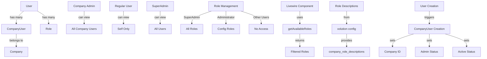

# User Management System Updates

## Update Log

### 2024-03-21 10:30 AM - Company-based User Management Implementation

#### Changes Made:

1. Modified `UsersDataTable.php` to implement company-based user filtering:

    - Added logic to show all users from the same company for company admins
    - Restricted non-admin users to only see their own data
    - Maintained SuperAdmin access to all users

2. Updated `User.php` model:
    - Added `companyUsers` relationship to support company-based filtering
    - Added proper Role model import

### 2024-03-21 11:00 AM - Spatie Permission Integration Fix

#### Changes Made:

1. Fixed role management integration:
    - Removed custom `roles()` relationship from User model
    - Using Spatie Permission's built-in role management
    - Ensured proper table structure for role management

### 2024-03-21 11:30 AM - Role Management Enhancement

#### Changes Made:

1. Enhanced role management system:

    - Added `getAvailableRoles()` method to User model
    - Implemented role filtering based on user type
    - Integrated with xolution config for company roles

2. Updated Livewire component:
    - Modified `AddUserModal` to use new role management system
    - Simplified role retrieval logic
    - Maintained role descriptions for UI

### 2024-03-21 12:00 PM - Role Description Integration

#### Changes Made:

1. Enhanced role description system:
    - Removed hardcoded role descriptions
    - Integrated with xolution config for role descriptions
    - Using `company_role_descriptions` from config

### 2024-03-21 12:30 PM - CompanyUser Integration

#### Changes Made:

1. Enhanced user management system:
    - Added automatic CompanyUser record creation/update
    - Integrated company-based user management
    - Added proper company isolation

#### Technical Details:

-   Company admins can now view all users within their company
-   Non-admin users can only view their own data
-   SuperAdmin role maintains full access to all users
-   Added proper relationship between User and CompanyUser models
-   Fixed role management using Spatie Permission package
-   Role selection now based on user type:
    -   SuperAdmin: Can see all roles
    -   Administrator: Can only see roles defined in xolution config
    -   Other users: No role management access
-   Role descriptions maintained for better user experience
-   Role descriptions now centralized in xolution config:
    -   Administrator: "Administrator bertugas untuk mengelola master data, user, dan role"
    -   Manager: "Manager hanya bisa melihat semua jenis transaksi dan data yang ada"
    -   Supervisor: "Supervisor bertugas untuk melakukan verifikasi data pembelian, pemakaian supply, dan pembelian pakan, dan juga pencatatan harian ayam"
    -   Operator: "Operator bertugas untuk melakukan pencatatan harian ayam, pembelian pakan, dan pemakaian supply, dan pembelian ayam"
-   CompanyUser integration:
    -   Automatic creation/update of CompanyUser records
    -   Company isolation maintained
    -   Proper admin status handling
    -   Audit trail (created_by, updated_by)

#### Diagram:

#### Security Considerations:

-   Role-based access control maintained
-   Company isolation enforced for non-SuperAdmin users
-   Active status check implemented for company users
-   Proper role management through Spatie Permission
-   Role visibility restricted based on user type
-   Role descriptions preserved for UI clarity
-   Role descriptions centralized in config for easy maintenance
-   CompanyUser records automatically managed
-   Proper audit trail maintained
-   Company isolation enforced at data level
 