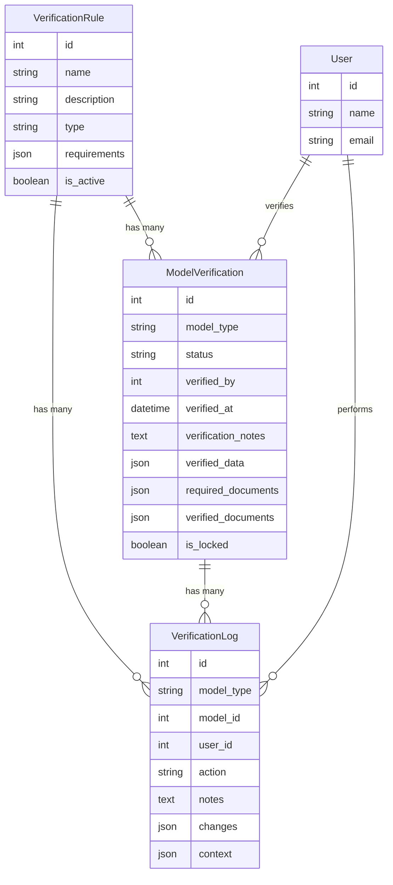

# Data Verification System Documentation

## Update Log

### 2024-03-26 10:00 AM - Initial Implementation

Created a robust and future-proof verification system with the following components:

#### Database Structure

1. **verification_rules** table

    - Stores verification requirements
    - Fields:
        - id (primary key)
        - name (unique)
        - description
        - type (document, data, etc.)
        - requirements (JSON)
        - is_active
        - timestamps
        - soft deletes

2. **model_verifications** table

    - Tracks verification status and data
    - Fields:
        - id (primary key)
        - model_type
        - status (pending, verified, rejected, unlocked)
        - verified_by (user_id)
        - verified_at
        - verification_notes
        - verified_data (JSON)
        - required_documents (JSON)
        - verified_documents (JSON)
        - is_locked
        - timestamps
        - soft deletes

3. **verification_logs** table
    - Tracks verification history
    - Fields:
        - id (primary key)
        - model_type
        - model_id
        - user_id
        - action (verify, reject, unlock)
        - notes
        - changes (JSON)
        - context (JSON)
        - timestamps

#### Models

1. **VerificationRule**

    - Manages verification requirements
    - Relationships:
        - Has many ModelVerifications
        - Has many VerificationLogs

2. **ModelVerification**

    - Tracks verification status
    - Relationships:
        - Belongs to User (verifier)
        - Has many VerificationLogs
    - Features:
        - Status tracking
        - Data locking
        - Document verification

3. **VerificationLog**
    - Tracks verification history
    - Relationships:
        - Belongs to User
    - Features:
        - Action tracking
        - Change logging
        - Context preservation

### 2024-03-26 10:30 AM - Service Implementation

Added verification service implementation:

1. **VerificationService**
    - Core verification logic
    - Features:
        - Model verification
        - Document verification
        - Status management
        - Data locking
        - History logging

## System Architecture



## Features

1. **Data Verification**

    - Document verification
    - Data completeness check
    - Status tracking
    - Data locking

2. **Security**

    - User-based verification
    - Action logging
    - Data protection
    - Access control

3. **Audit Trail**

    - Complete verification history
    - Change tracking
    - User accountability
    - Context preservation

4. **Flexibility**
    - Multiple verification types
    - Custom requirements
    - Status management
    - Document handling

## Usage Examples

1. **Verifying Data**

```php
$verificationService->verify($model, $user, [
    'documents' => [
        'invoice' => 'path/to/invoice.pdf',
        'contract' => 'path/to/contract.pdf'
    ]
], 'All documents verified');
```

2. **Rejecting Verification**

````php
    - Stores reusable validation rules
    - Fields:
        - id (primary key)
        - name (unique)
        - description
        - type (validation type)
        - parameters (JSON)
        - is_active
        - timestamps
        - soft deletes

2. **model_validations** table

    - Maps validation rules to specific model fields
    - Fields:
        - id (primary key)
        - model_type
        - field_name
        - validation_rule_id (foreign key)
        - custom_message (JSON)
        - order
        - is_active
        - timestamps
        - soft deletes

3. **validation_logs** table
    - Tracks validation attempts and results
    - Fields:
        - id (primary key)
        - model_type
        - model_id
        - field_name
        - validation_rule_id (foreign key)
        - is_valid
        - error_message
        - context (JSON)
        - timestamps

#### Models

1. **ValidationRule**

    - Manages validation rules
    - Relationships:
        - Has many ModelValidations
        - Has many ValidationLogs

2. **ModelValidation**

    - Maps rules to model fields
    - Relationships:
        - Belongs to ValidationRule
        - Has many ValidationLogs

3. **ValidationLog**
    - Tracks validation history
    - Relationships:
        - Belongs to ValidationRule

### 2024-03-26 10:30 AM - Service Implementation

Added validation service and trait implementation:

1. **ValidationService**

    - Core validation logic
    - Features:
        - Model validation
        - Field validation
        - Custom error messages
        - Validation logging
        - Support for various validation types

2. **HasValidation Trait**

    - Easy model integration
    - Features:
        - Model validation method
        - Validation rules relationship
        - Context support

### 2024-03-26 11:00 AM - LivestockPurchase Integration

Implemented validation in LivestockPurchase process:

1. **Purchase Validation**

    - Validates main purchase data
    - Validates purchase items
    - Validates kandang capacity
    - Status change validation

2. **Status-Specific Logic**

    - Approved status:
        - Generates livestock records
        - Creates livestock batches
        - Updates current livestock
    - Other statuses:
        - Updates purchase status
        - Maintains audit trail

## System Architecture

```mermaid
erDiagram
    ValidationRule ||--o{ ModelValidation : "has many"
    ValidationRule ||--o{ ValidationLog : "has many"
    ModelValidation ||--o{ ValidationLog : "has many"
    LivestockPurchase ||--o{ LivestockPurchaseItem : "has many"
    LivestockPurchase ||--o{ Livestock : "has many"
    LivestockPurchase ||--o{ LivestockBatch : "has many"

    ValidationRule {
        int id
        string name
        string description
        string type
        json parameters
        boolean is_active
    }

    ModelValidation {
        int id
        string model_type
        string field_name
        int validation_rule_id
        json custom_message
        int order
        boolean is_active
    }

    ValidationLog {
        int id
        string model_type
        int model_id
        string field_name
        int validation_rule_id
        boolean is_valid
        text error_message
        json context
    }

    LivestockPurchase {
        int id
        int farm_id
        int kandang_id
        string status
        text notes
    }

    LivestockPurchaseItem {
        int id
        int purchase_id
        int breed_id
        int quantity
        decimal price
    }

    Livestock {
        int id
        int purchase_id
        int breed_id
        int batch_id
        string status
    }

    LivestockBatch {
        int id
        int purchase_id
        int breed_id
        int quantity
        string status
    }
````

## Features

1. **Reusable Validation Rules**

    - Store common validation rules
    - Support for custom parameters
    - Enable/disable rules as needed

2. **Model-Specific Validations**

    - Map rules to specific model fields
    - Custom error messages per field
    - Order validation rules
    - Enable/disable validations per field

3. **Validation History**

    - Track all validation attempts
    - Store validation results
    - Maintain context for debugging
    - Audit trail for compliance

4. **LivestockPurchase Integration**

    - Comprehensive purchase validation
    - Item-level validation
    - Capacity validation
    - Status change validation
    - Automatic livestock generation
    - Batch management
    - Current livestock updates

## Future Considerations

1. **Extensibility**

    - Easy to add new validation types
    - Support for custom validation logic
    - Integration with existing validation systems

2. **Performance**

    - Indexed fields for faster queries
    - Soft deletes for data retention
    - JSON fields for flexible data storage

3. **Maintenance**

    - Clear documentation
    - Modular design
    - Easy to update and modify

4. **LivestockPurchase Enhancements**

    - Additional status validations
    - More complex capacity rules
    - Batch tracking improvements
    - Performance optimizations
